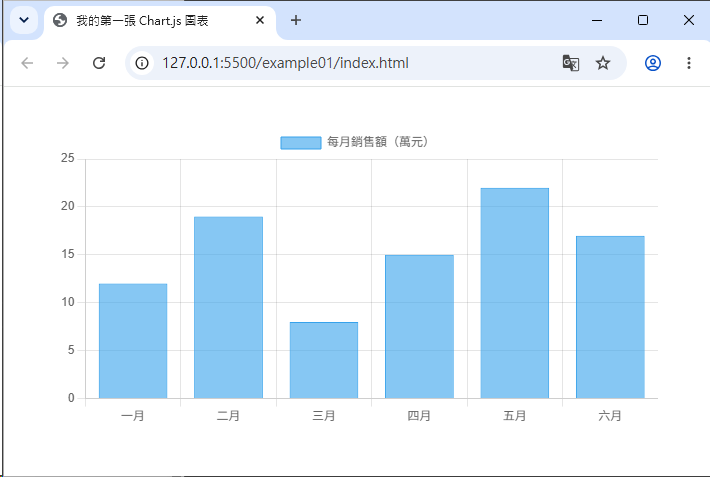

# Day 01 - 30 天手把手學會 Chart.js v4｜認識 Chart.js

> 本篇是「手把手學會 Chart.js」的第一天，目標是讓完全沒接觸過 Chart.js 的初學者，理解它是什麼、能做什麼、如何安裝，並且動手畫出人生中第一張圖表。

## 一、Chart.js 是什麼？

[Chart.js](https://www.chartjs.org/) 是一套使用 **HTML5 `<canvas>`** 元素繪製圖表的開源 JavaScript 函式庫。它的設計理念是「簡單、輕量、易上手」，讓開發者只要準備好資料與少量的設定物件（`config`），就能快速畫出各種常見的統計圖表，例如折線圖、長條圖、圓餅圖、雷達圖等。

Chart.js 目前由社群積極維護（本教學以 **v4.x** 為主要版本），並且完全免費、採用 MIT 授權，可以放心用在個人與商業專案中。

### 核心特色

- **輕量、免依賴**：不需要 jQuery 或其他函式庫，單一檔案就能運作。
- **內建 8 種主要圖表類型**：Line、Bar、Pie、Doughnut、Radar、Polar Area、Bubble、Scatter，並且可以混合使用（Mixed Chart）。
- **Responsive（響應式）**：預設就能隨容器大小自動縮放，適應 RWD 版面。
- **以 Canvas 繪製**：效能較 SVG 方案佳，尤其在資料點數量較多時更明顯。
- **高度可客製化**：顏色、動畫、座標軸、圖例、提示框（Tooltip）幾乎都能透過 `options` 調整。
- **支援 Plugin 外掛機制**：可擴充資料標籤、縮放、時間軸格式化等進階功能。
- **良好的框架整合**：官方或社群提供 `react-chartjs-2`（React）、`vue-chartjs`（Vue）、`ng2-charts`（Angular）等封裝套件。

### 適合的應用場景

- 後台管理系統的資料儀表板（Dashboard）
- 業績報表、銷售分析
- 感測器 / 即時監控資料視覺化
- 個人專案的資料呈現（例如記帳、健身紀錄

簡單來說：**只要你需要「用圖表呈現數值資料」，Chart.js 幾乎都能勝任，而且學習曲線非常平緩。**

## 二、與其他圖表庫的比較

在動手學習之前，先了解 Chart.js 與市面上其他熱門圖表庫(library)的差異，有助於未來依專案需求做選擇。

| 項目 | Chart.js | ECharts | D3.js | Highcharts |
|------|----------|---------|-------|------------|
| 繪製方式 | Canvas | Canvas / SVG | SVG（手動控制） | SVG |
| 學習難度 | 低，容易上手 | 中，設定項目多 | 高，需要理解資料綁定與底層繪圖邏輯 | 低～中 |
| 授權 | MIT（免費） | Apache-2.0（免費） | ISC（免費） | 商業授權（個人/非營利可免費） |
| 客製化彈性 | 中～高（透過 options、plugin） | 高，選項豐富 | 極高，幾乎無限制 | 高，但部分進階功能需付費 |
| 內建圖表種類 | 8 種基礎圖表 + 混合圖表 | 非常多元（地圖、關聯圖等） | 無內建圖表，需自行組合 | 種類豐富 |
| 適合對象 | 初學者、中小型專案、快速開發 | 需要豐富視覺化與大數據呈現 | 需要高度自訂、獨特視覺設計 | 企業級、需要完整售後支援 |

**簡單結論：**

- 如果你是初學者，或專案只需要「常見、標準」的統計圖表，**Chart.js 是 CP 值最高的選擇**。
- 如果需要地圖、關聯圖、3D 等複雜視覺化，可以考慮 **ECharts**。
- 如果你想要「畫布上任意形狀、完全自訂的資料視覺化」，**D3.js** 給你最大的自由度，但也需要花更多時間學習。
- 如果是企業級專案，預算充足且需要商用技術支援，可評估 **Highcharts**。

本系列教學會聚焦在 Chart.js，因為它最適合「30 天內從零基礎到能獨立完成專案」的學習節奏。

## 三、安裝方式

Chart.js 提供三種常見的引入方式，依照你的專案型態選擇即可。

### 方式 1：CDN 引入（最快速，適合練習、demo）

不需要任何安裝步驟，只要在 HTML 中加入一行 `<script>` 即可使用：

```html
<script src="https://cdn.jsdelivr.net/npm/chart.js@4.5.1"></script>
```

引入後，全域會多一個 `Chart` 建構函式可直接使用。這種方式最適合**快速練習、寫 demo、或是不使用打包工具（bundler）的靜態網頁**。

> 💡 小提醒：CDN 版本（`chart.js` 完整版）已經內建自動註冊所有元件（等同於使用 `chart.js/auto`），初學階段不需要額外處理註冊問題，之後 Day 2 會再深入說明「元件註冊」的概念。

### 方式 2：npm 安裝（適合有建置工具的專案）

如果你的專案使用 Webpack、Vite 等打包工具，建議透過 npm 安裝：

```bash
npm install chart.js@4.5.1
```

安裝完成後，可以用 ES Module 的方式匯入使用：

```js
// 方式 A：自動註冊所有元件（最簡單，檔案體積較大）
import Chart from 'chart.js/auto';

// 方式 B：手動註冊所需元件（進階，可搭配 Tree-shaking 減少檔案體積）
import { Chart, registerables } from 'chart.js';
Chart.register(...registerables);
```

- 初學階段建議先使用 `chart.js/auto`，不用煩惱「要註冊哪些元件」，先專注在畫出圖表。
- Day 2 會詳細說明為什麼「手動註冊」可以有效減少打包後的檔案大小（Tree-shaking 的概念）。

### 方式 3：ES Module 直接匯入（不需打包工具）

現代瀏覽器都支援原生 ES Module，你也可以透過 `<script type="module">` 搭配 CDN 上的 ESM 版本，不需要安裝任何套件：

```html
<script type="module">
  import { Chart, registerables } from 'https://cdn.jsdelivr.net/npm/chart.js@4.5.1';
  Chart.register(...registerables);

  // 接下來就可以使用 new Chart(...) 建立圖表
</script>
```

這種方式適合想要體驗「模組化寫法」，但又不想架設打包工具環境的學習情境。

## 四、建立第一個 HTML 頁面 + `<canvas>` 元素

理論說明告一段落，現在動手做出你的第一張 Chart.js 圖表！

### 步驟 1：建立 HTML 檔案

新增一個 `index.html`，準備一個 `<canvas>` 元素作為圖表的畫布。建議替 canvas 包上一層容器 `<div>`，方便之後控制圖表的響應式尺寸（後續會深入討論）：

```html
<!DOCTYPE html>
<html lang="zh-Hant">
<head>
  <meta charset="UTF-8" />
  <title>我的第一張 Chart.js 圖表</title>
</head>
<body>
  <div style="width: 600px; margin: 40px auto;">
    <canvas id="myChart"></canvas>
  </div>

  <!-- 透過 CDN 引入 Chart.js -->
  <script src="https://cdn.jsdelivr.net/npm/chart.js@4.5.1"></script>

  <script>
    // 取得 canvas 元素
    const ctx = document.getElementById('myChart');

    // 建立圖表
    new Chart(ctx, {
      type: 'bar', // 圖表類型：長條圖
      data: {
        labels: ['一月', '二月', '三月', '四月', '五月', '六月'],
        datasets: [{
          label: '每月銷售額（萬元）',
          data: [12, 19, 8, 15, 22, 17],
          backgroundColor: 'rgba(54, 162, 235, 0.6)',
          borderColor: 'rgba(54, 162, 235, 1)',
          borderWidth: 1
        }]
      },
      options: {
        responsive: true,
        scales: {
          y: {
            beginAtZero: true
          }
        }
      }
    });
  </script>
</body>
</html>
```



### 步驟 2：在瀏覽器開啟

將檔案存檔後，直接用瀏覽器開啟 `index.html`（或使用 VS Code 的 Live Server 擴充功能），就能看到一張藍色的長條圖，呈現六個月份的銷售資料。

### 程式碼快速拆解

- `<canvas id="myChart">`：Chart.js 一定要畫在 canvas 上，這是它與 D3.js（使用 SVG）最大的差異之一。
- `document.getElementById('myChart')`：取得 canvas 元素（或其 2D context），作為建立圖表時的第一個參數。
- `new Chart(ctx, config)`：Chart.js 的核心 API，第一個參數是畫布，第二個參數是設定物件，內含 `type`（圖表類型）、`data`（資料）、`options`（外觀與行為設定）。
- `labels`：X 軸（或圖例）顯示的類別名稱。
- `datasets`：實際的資料陣列，可以有多組資料集（例如同時顯示「今年」與「去年」的銷售額）。

> 這三大核心設定 `type`、`data`、`options` 就是 Chart.js 的靈魂，Day 2 會針對這個結構做更完整深入的介紹。

## 參考資源

- [Chart.js 官方文件 - Getting Started](https://www.chartjs.org/docs/latest/getting-started/)
- [Chart.js 官方文件 - Installation](https://www.chartjs.org/docs/latest/getting-started/installation.html)
- [Chart.js GitHub](https://github.com/chartjs/Chart.js)
