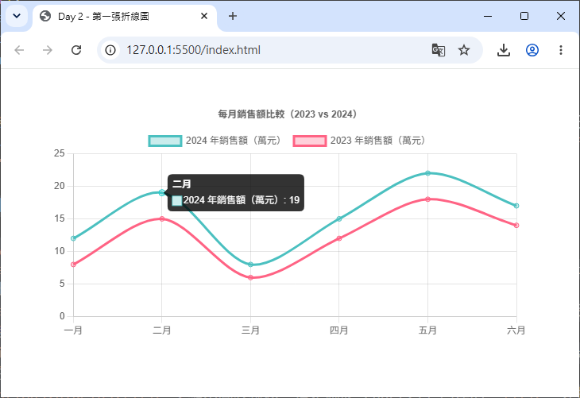

# Day 02 - 30 天手把手學會 Chart.js｜Chart.js 基本結構

> 昨天（Day 1）我們認識了 Chart.js 是什麼、如何安裝，也動手畫出了人生中第一張長條圖。今天要更深入地拆解 Chart.js 的「骨架」：`new Chart(ctx, config)` 這行程式碼背後到底發生了什麼事？三大核心設定 `type`、`data`、`options` 各自負責什麼？為什麼有些寫法需要「註冊元件」？最後我們會動手畫出第一張折線圖（Line Chart）。

## 一、`new Chart(ctx, config)` 三大核心設定

Chart.js 的所有圖表，不管是折線圖、長條圖、圓餅圖，建立方式都長得一樣：

```js
const myChart = new Chart(ctx, config);
```

- **`ctx`**：畫布來源。可以是 `<canvas>` 元素本身、它的 2D 繪圖環境（`canvas.getContext('2d')`），甚至直接傳入 `id` 字串也可以（Chart.js 會自動幫你找到對應的 canvas）。
- **`config`**：一個 JavaScript 物件，用來描述「要畫什麼圖」、「用什麼資料」、「長什麼樣子」。這個物件的結構，就是我們今天要拆解的重點。

`config` 物件主要由三大區塊組成：

```js
const config = {
  type: 'line',       // 圖表類型
  data: { /* ... */ }, // 資料
  options: { /* ... */ } // 選項（外觀、行為）
};
```

### 1. `type`：圖表類型

`type` 是一個字串，用來告訴 Chart.js「我要畫哪一種圖表」。Chart.js 內建支援以下常見類型（之後的天數會逐一深入介紹）：

| `type` 值 | 圖表名稱 |
|-----------|----------|
| `'line'` | 折線圖 |
| `'bar'` | 長條圖 |
| `'pie'` | 圓餅圖 |
| `'doughnut'` | 環狀圖 |
| `'radar'` | 雷達圖 |
| `'polarArea'` | 極座標圖 |
| `'bubble'` | 氣泡圖 |
| `'scatter'` | 散佈圖 |

> 💡 小知識：`type` 只是決定「預設的繪圖邏輯與座標軸」，實際上 Chart.js 內部是根據這個字串去找對應的 **Controller**（例如 `LineController`、`BarController`）。這也是為什麼待會會提到「元件註冊」的原因——每種 `type` 背後都對應著一組需要被註冊的元件。

### 2. `data`：資料

`data` 物件負責提供圖表要呈現的實際數值，結構固定包含兩個欄位：`labels` 與 `datasets`。這部分我們會在下一節詳細說明。

### 3. `options`：選項

`options` 物件用來控制圖表的「外觀」與「行為」，例如：

- 是否要響應式（`responsive`）
- 座標軸設定（`scales`）
- 圖例顯示位置（`plugins.legend`）
- 提示框內容（`plugins.tooltip`）
- 動畫效果（`animation`）
- 滑鼠互動事件（`onClick`、`onHover`）

`options` 是三大設定中內容最豐富、也最常被調整的一塊。初學階段不需要一次記住所有選項，之後每一天都會陸續介紹對應主題的 `options` 用法。現階段只要記得：**外觀與互動行為，幾乎都是透過 `options` 去客製化**。

## 二、認識 `labels` 與 `datasets`

`data` 是 Chart.js 中最核心的資料結構，幾乎每一種圖表類型都遵循同樣的格式：

```js
data: {
  labels: ['一月', '二月', '三月', '四月', '五月', '六月'],
  datasets: [
    {
      label: '2024 年銷售額',
      data: [12, 19, 8, 15, 22, 17],
      borderColor: 'rgb(75, 192, 192)',
      backgroundColor: 'rgba(75, 192, 192, 0.5)'
    }
  ]
}
```

### `labels`：類別標籤

`labels` 是一個陣列，通常對應圖表的 X 軸（在折線圖、長條圖中），或是圓餅圖／環狀圖中每一塊扇形的名稱。陣列中每一個元素，會依照順序對應到 `datasets` 中每一筆資料的相同索引位置。

以上面範例來說：`labels[0]` 是 `'一月'`，會對應到 `datasets[0].data[0]` 的值 `12`。

### `datasets`：資料集陣列

`datasets` 是一個**陣列**，代表 Chart.js 支援同時顯示多組資料（例如「今年 vs 去年」、「三個分店的業績比較」）。陣列中每一個物件就是一組「資料集」，常見欄位包括：

| 欄位 | 說明 |
|------|------|
| `label` | 這組資料集的名稱，會顯示在圖例（Legend）與提示框（Tooltip）中 |
| `data` | 實際的數值陣列，長度應與 `labels` 一致 |
| `backgroundColor` | 填色（長條圖的柱子顏色、折線圖下方填色區域等） |
| `borderColor` | 邊框／線條顏色 |
| `borderWidth` | 邊框／線條寬度 |

當有多組資料集時，只要在 `datasets` 陣列中多加一個物件即可：

```js
data: {
  labels: ['一月', '二月', '三月', '四月', '五月', '六月'],
  datasets: [
    {
      label: '2024 年銷售額',
      data: [12, 19, 8, 15, 22, 17],
      borderColor: 'rgb(75, 192, 192)'
    },
    {
      label: '2023 年銷售額',
      data: [8, 15, 6, 12, 18, 14],
      borderColor: 'rgb(255, 99, 132)'
    }
  ]
}
```

（若未指定顏色時）Chart.js 會自動用不同顏色區分每組資料集，並且在圖例中列出對應名稱，方便使用者比較。

## 三、Tree-shaking 與元件註冊

這是今天的重點觀念，也是初學者常常感到困惑的地方：**為什麼有時候 `import Chart from 'chart.js'` 建立圖表會失敗，畫面卻空白一片，Console 還跳出錯誤？**

### 為什麼需要「註冊」？

Chart.js 從 v3 版本開始，內部被拆分成許多獨立的小模組，這種架構稱為 **Tree-shaking**（樹搖優化）：打包工具（如 Webpack、Vite、Rollup）可以自動移除「你沒有用到」的程式碼，讓最終輸出的 JavaScript 檔案體積更小。

但這也代表：**Chart.js 不會自動幫你載入全部功能**，你必須明確告訴它「我這次要用到哪些元件」，這個動作就叫做**註冊（Register）**。

Chart.js 的元件大致分成四大類：

| 類別 | 說明 | 範例 |
|------|------|------|
| **Controller** | 決定某種圖表類型如何繪製 | `LineController`、`BarController`、`PieController` |
| **Element** | 圖表中實際被畫出來的圖形元素 | `PointElement`（資料點）、`LineElement`（線條）、`BarElement`（柱狀）、`ArcElement`（扇形） |
| **Scale** | 座標軸系統 | `CategoryScale`、`LinearScale`、`RadialLinearScale` |
| **Plugin** | 額外功能，例如圖例、提示框、標題 | `Legend`、`Tooltip`、`Title`、`Filler` |

每一種圖表類型，都有屬於自己的「最低需求元件組合」。例如折線圖（Line Chart）需要：

- `LineController`（控制器）
- `LineElement`（線條元素）
- `PointElement`（資料點元素）
- `CategoryScale`（X 軸，預設為類別軸）
- `LinearScale`（Y 軸，預設為數值軸）

如果少註冊了任何一項，畫面就會出現空白或是 Console 出現類似 `"line" is not a registered controller` 的錯誤訊息。

### 兩種寫法：`chart.js/auto` vs 手動註冊

**寫法 A：`chart.js/auto`（自動註冊全部元件）**

```js
import Chart from 'chart.js/auto';

new Chart(ctx, {
  type: 'line',
  data: { /* ... */ }
});
```

這個寫法內部已經幫你把 `Chart.register(...registerables)` 執行過一次，等於「全部功能都載入」，不需要煩惱要註冊哪些元件，**非常適合初學者與練習階段**。缺點是：即使你只用到折線圖，最終打包出來的檔案也會包含長條圖、圓餅圖等你根本沒用到的程式碼，造成檔案體積較大。

**寫法 B：手動註冊需要的元件（適合正式專案，做 Bundle 優化）**

```js
import {
  Chart,
  LineController,
  LineElement,
  PointElement,
  CategoryScale,
  LinearScale,
  Legend,
  Tooltip
} from 'chart.js';

// 只註冊折線圖需要用到的元件
Chart.register(
  LineController,
  LineElement,
  PointElement,
  CategoryScale,
  LinearScale,
  Legend,
  Tooltip
);

new Chart(ctx, {
  type: 'line',
  data: { /* ... */ }
});
```

這種寫法需要開發者清楚知道「這張圖表需要哪些元件」，但換來的好處是：打包工具可以把用不到的程式碼「搖掉」（Tree-shaking），有效減少最終檔案大小，對於正式上線、重視載入效能的專案來說非常重要。

**寫法 C：`registerables`（一次註冊全部，但明確寫在程式碼中）**

```js
import { Chart, registerables } from 'chart.js';
Chart.register(...registerables);
```

這種寫法效果跟 `chart.js/auto` 幾乎相同（同樣是全部註冊、無法 Tree-shaking），差別只在於寫法上更明確地表達「這裡有執行註冊」的動作，方便日後想要優化時，能清楚知道要從這裡下手改成手動註冊個別元件。

### 該選哪一種？

| 情境 | 建議寫法 |
|------|----------|
| 剛開始學習、寫練習 Demo | `chart.js/auto` |
| 使用 CDN 完整版（`chart.js` 而非 ESM 版本） | 不需處理，CDN 完整版已內建自動註冊 |
| 正式專案、重視打包體積 | 手動註冊個別元件（寫法 B） |
| 想先求有再優化 | 先用 `registerables`，之後再逐步替換成手動註冊 |

> 💡 本系列教學前期範例會以使用 CDN 完整版 `chart.js` 為主，方便專注在圖表功能本身；之後在談到外掛開發與框架整合時，會再示範手動註冊的實務做法。

## 四、畫出第一張折線圖（Line Chart）

理解了整體結構後，現在動手把 Day 1 的長條圖範例，改寫成折線圖，並且加入第二組資料集做比較。

### 完整程式碼

```html
<!DOCTYPE html>
<html lang="zh-Hant">
<head>
  <meta charset="UTF-8" />
  <title>Day 2 - 第一張折線圖</title>
</head>
<body>
  <div style="width: 600px; margin: 40px auto;">
    <canvas id="lineChart"></canvas>
  </div>

  <script src="https://cdn.jsdelivr.net/npm/chart.js@4.5.1"></script>
  <script>
    const ctx = document.getElementById('lineChart');

    new Chart(ctx, {
      type: 'line', // 圖表類型：折線圖
      data: {
        labels: ['一月', '二月', '三月', '四月', '五月', '六月'],
        datasets: [
          {
            label: '2024 年銷售額（萬元）',
            data: [12, 19, 8, 15, 22, 17],
            borderColor: 'rgb(75, 192, 192)',
            backgroundColor: 'rgba(75, 192, 192, 0.3)',
            tension: 0.3,   // 線條平滑度
            fill: false
          },
          {
            label: '2023 年銷售額（萬元）',
            data: [8, 15, 6, 12, 18, 14],
            borderColor: 'rgb(255, 99, 132)',
            backgroundColor: 'rgba(255, 99, 132, 0.3)',
            tension: 0.3,
            fill: false
          }
        ]
      },
      options: {
        responsive: true,
        plugins: {
          title: {
            display: true,
            text: '每月銷售額比較（2023 vs 2024）'
          }
        },
        scales: {
          y: {
            beginAtZero: true
          }
        }
      }
    });
  </script>
</body>
</html>
```

> 這裡示範使用 CDN 完整版 `chart.js`，功能上等同於 `chart.js/auto`，會自動註冊所有元件，不需要額外呼叫 `Chart.register(...)`。若使用 npm 安裝，也可以直接改成 `import Chart from 'chart.js/auto';`。



### 程式碼重點說明

- `type: 'line'`：切換成折線圖，Chart.js 會使用 `LineController` 來繪製。
- `datasets` 陣列中放入**兩組資料**，分別代表 2024 年與 2023 年的銷售額，Chart.js 會自動用不同顏色畫出兩條線，並在圖例中列出兩個標籤。
- `tension`：數值介於 0 到 1 之間，控制線條的彎曲平滑程度，`0` 代表完全直線連接（折線），數字越大線條越圓滑。
- `fill: false`：不要填滿線條下方的區域（若改成 `true`，會變成類似「區域圖 Area Chart」的效果）。
- `options.plugins.title`：顯示圖表標題，這是屬於 Chart.js 內建的 `Title` 外掛功能。
- `options.scales.y.beginAtZero`：讓 Y 軸從 0 開始繪製，避免資料落差被視覺放大而造成誤導。

打開瀏覽器後，你應該會看到兩條顏色不同的曲線，分別代表 2023 與 2024 年每月銷售額的走勢，並且滑鼠移到任一資料點時會跳出 Tooltip 顯示詳細數值。

---

明天（Day 3）我們將進入長條圖（Bar Chart）的世界，學習單一與多資料集長條圖、水平長條圖的做法，以及顏色、邊框、圓角等樣式設定。

## 參考資源

- [Chart.js](https://www.chartjs.org/)
- [Chart.js GitHub](https://github.com/chartjs/Chart.js)
