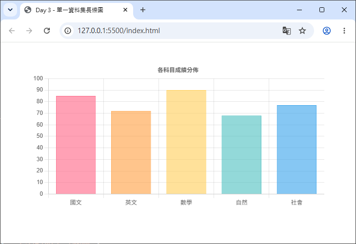
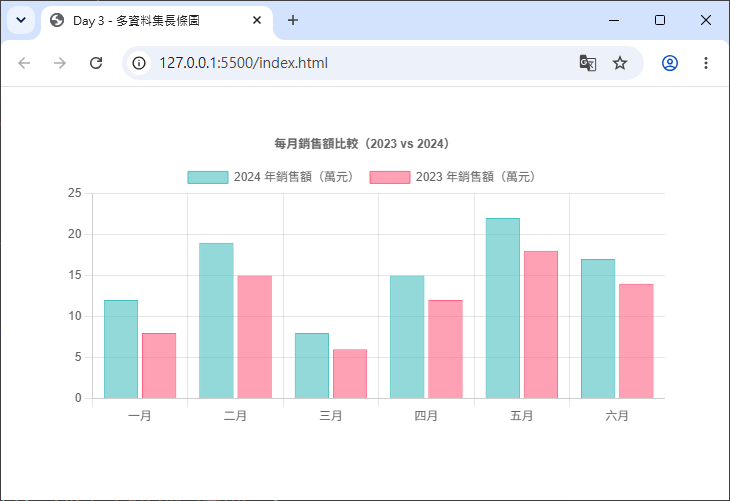
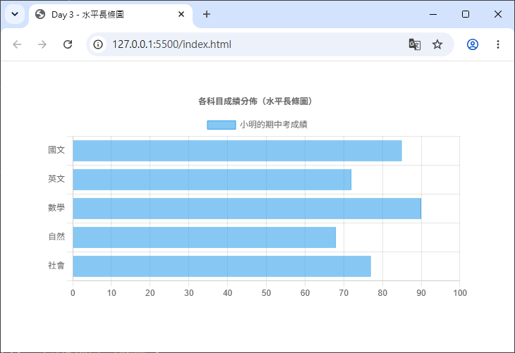
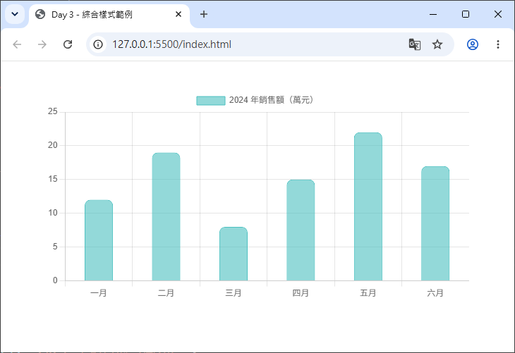

# Day 03 - 30 天手把手學會 Chart.js｜長條圖(Bar Chart)

> 前兩天我們認識了 Chart.js 的整體架構、`config` 三大區塊（`type`、`data`、`options`），也畫出了第一張折線圖。今天要專注在另一個超常用的圖表類型：**長條圖（Bar Chart）**。內容包含單一資料集與多資料集長條圖的畫法、如何切換成水平長條圖（`indexAxis`），以及柱子的顏色、邊框、圓角等樣式細節。

## 一、長條圖的基本結構

長條圖的建立方式，跟折線圖幾乎一模一樣，唯一的差別只有 `type` 要改成 `'bar'`：

```js
const config = {
  type: 'bar', // 圖表類型：長條圖
  data: {
    labels: ['一月', '二月', '三月', '四月', '五月', '六月'],
    datasets: [
      {
        label: '2024 年銷售額（萬元）',
        data: [12, 19, 8, 15, 22, 17],
        backgroundColor: 'rgba(75, 192, 192, 0.5)',
        borderColor: 'rgb(75, 192, 192)',
        borderWidth: 1
      }
    ]
  },
  options: {
    responsive: true,
    scales: {
      y: {
        beginAtZero: true
      }
    }
  }
};
```

跟折線圖的 `data.datasets` 相比，長條圖多了一些專屬於「柱子外觀」的欄位，例如 `borderRadius`（圓角）、`borderSkipped`（跳過某個邊框）、`barPercentage`（柱子寬度佔比）等，稍後會逐一介紹。

由於長條圖背後是由 `BarController` 負責繪製，若你使用手動註冊的寫法（Day 2 提到的「寫法 B」），至少需要註冊：

- `BarController`（控制器）
- `BarElement`（柱狀元素）
- `CategoryScale`（X 軸，類別軸）
- `LinearScale`（Y 軸，數值軸）

若使用 `chart.js/auto` 或 CDN 完整版，則不需要額外處理，直接使用即可。

## 二、單一資料集長條圖

先從最單純的情境開始：只有一組資料。這是長條圖最常見的入門用法，例如「各科目成績」、「各分店業績」等情境。

### 完整程式碼

```js
const ctx = document.getElementById('barChart');

new Chart(ctx, {
  type: 'bar',
  data: {
    labels: ['國文', '英文', '數學', '自然', '社會'],
    datasets: [
      {
        label: '小明的期中考成績',
        data: [85, 72, 90, 68, 77],
        backgroundColor: [
          'rgba(255, 99, 132, 0.6)',
          'rgba(255, 159, 64, 0.6)',
          'rgba(255, 205, 86, 0.6)',
          'rgba(75, 192, 192, 0.6)',
          'rgba(54, 162, 235, 0.6)'
        ],
        borderColor: [
          'rgb(255, 99, 132)',
          'rgb(255, 159, 64)',
          'rgb(255, 205, 86)',
          'rgb(75, 192, 192)',
          'rgb(54, 162, 235)'
        ],
        borderWidth: 1
      }
    ]
  },
  options: {
    responsive: true,
    plugins: {
      title: {
        display: true,
        text: '各科目成績分佈'
      },
      legend: {
        display: false // 只有一組資料集時，通常會關閉圖例
      }
    },
    scales: {
      y: {
        beginAtZero: true,
        max: 100
      }
    }
  }
});
```



### 重點說明

- `backgroundColor` 與 `borderColor` 都可以傳入**陣列**，讓每一根柱子有各自不同的顏色（陣列的索引會依序對應到 `data` 陣列相同索引的柱子）。如果只傳入單一顏色字串，則所有柱子會套用同一種顏色。
- 因為只有一組資料集，圖例（Legend）只會顯示一個項目，意義不大，範例中透過 `options.plugins.legend.display: false` 關閉圖例顯示。
- `options.scales.y.max: 100`：由於是成績資料，手動將 Y 軸最大值鎖定在 100，讓圖表更符合情境（若不設定，Chart.js 會依資料自動計算適合的刻度上限）。

## 三、多資料集長條圖（分組長條圖）

當需要比較「多組資料」時（例如「今年 vs 去年」、「多個分店」），只要在 `datasets` 陣列中新增多個物件即可，Chart.js 會自動把同一個類別（`labels`）下的柱子並排顯示，這種形式也常被稱為**分組長條圖（Grouped Bar Chart）**。

### 完整程式碼

```js
new Chart(ctx, {
  type: 'bar',
  data: {
    labels: ['一月', '二月', '三月', '四月', '五月', '六月'],
    datasets: [
      {
        label: '2024 年銷售額（萬元）',
        data: [12, 19, 8, 15, 22, 17],
        backgroundColor: 'rgba(75, 192, 192, 0.6)',
        borderColor: 'rgb(75, 192, 192)',
        borderWidth: 1
      },
      {
        label: '2023 年銷售額（萬元）',
        data: [8, 15, 6, 12, 18, 14],
        backgroundColor: 'rgba(255, 99, 132, 0.6)',
        borderColor: 'rgb(255, 99, 132)',
        borderWidth: 1
      }
    ]
  },
  options: {
    responsive: true,
    plugins: {
      title: {
        display: true,
        text: '每月銷售額比較（2023 vs 2024）'
      }
    },
    scales: {
      y: {
        beginAtZero: true
      }
    }
  }
});
```



打開瀏覽器後，會看到每個月份底下並排出現兩根柱子，分別代表 2023 與 2024 年的資料，並且圖例會自動列出「2024 年銷售額」與「2023 年銷售額」兩個項目，方便使用者辨識。

> 💡 小提醒：多資料集長條圖預設是「並排顯示」，若想改成「堆疊」在一起（Stacked Bar Chart），需要額外在 `options.scales.x` 與 `options.scales.y` 加上 `stacked: true`。這個進階用法會在之後的章節（座標軸相關主題）詳細說明，今天先專注在基礎的並排長條圖。

## 四、水平長條圖（Horizontal Bar Chart）

在 Chart.js v2 的年代，水平長條圖有自己專屬的 `type: 'horizontalBar'`；但從 **Chart.js v3 開始，`horizontalBar` 已經被移除**，改用更彈性的做法：只要在 `options` 中加入 `indexAxis: 'y'`，就能把原本垂直的長條圖轉成水平方向。

### 什麼是 `indexAxis`？

`indexAxis` 用來指定「資料的索引軸（也就是 `labels` 對應的軸）」是 `x` 軸還是 `y` 軸：

- `indexAxis: 'x'`（預設值）：`labels` 對應 X 軸，柱子垂直往上長 → **垂直長條圖**
- `indexAxis: 'y'`：`labels` 對應 Y 軸，柱子水平往右長 → **水平長條圖**

### 完整程式碼

```js
new Chart(ctx, {
  type: 'bar',
  data: {
    labels: ['國文', '英文', '數學', '自然', '社會'],
    datasets: [
      {
        label: '小明的期中考成績',
        data: [85, 72, 90, 68, 77],
        backgroundColor: 'rgba(54, 162, 235, 0.6)',
        borderColor: 'rgb(54, 162, 235)',
        borderWidth: 1
      }
    ]
  },
  options: {
    indexAxis: 'y', // 切換成水平長條圖
    responsive: true,
    plugins: {
      title: {
        display: true,
        text: '各科目成績分佈（水平長條圖）'
      }
    },
    scales: {
      x: {
        beginAtZero: true,
        max: 100
      }
    }
  }
});
```



### 重點說明

- 切換成水平長條圖後，原本設定在 `scales.y` 上的選項（例如 `beginAtZero`、`max`）要改設定在 `scales.x` 上，因為此時**數值軸變成 X 軸**，**類別軸變成 Y 軸**。這是初學者最容易搞混的地方，務必記得：**`indexAxis` 只是決定「哪一軸是類別軸」，但數值相關的座標軸設定要跟著轉移到另一個軸上**。
- 水平長條圖很適合用在「類別名稱較長」或「類別數量較多」的情境，例如各國家的人口排名、各商品的銷售排行榜等，因為水平方向可以容納較長的文字標籤，不會互相擠壓重疊。

## 五、柱子樣式：顏色、邊框、圓角

Chart.js 的長條圖提供了豐富的樣式選項，讓柱子可以呈現各種視覺效果。以下介紹幾個最常用的設定。

### 1. `backgroundColor` 與 `borderColor`：填色與邊框顏色

前面範例已經看過，這兩個屬性可以是**單一顏色字串**（套用到所有柱子），也可以是**顏色陣列**（每根柱子套用不同顏色）：

```js
{
  data: [10, 20, 30],
  backgroundColor: 'rgba(75, 192, 192, 0.5)', // 單一顏色
  borderColor: 'rgb(75, 192, 192)',
  borderWidth: 2
}
```

```js
{
  data: [10, 20, 30],
  backgroundColor: [ // 每根柱子不同顏色
    'rgba(255, 99, 132, 0.5)',
    'rgba(54, 162, 235, 0.5)',
    'rgba(255, 205, 86, 0.5)'
  ]
}
```

### 2. `borderWidth`：邊框寬度

數字(Number)型別，單位是像素（px），代表柱子邊框的粗細。若設定為 `0`，則不會顯示邊框，只會呈現填色效果。

### 3. `borderRadius`：圓角

`borderRadius` 讓柱子的角變成圓角，數值單位同樣是像素，讓長條圖看起來更現代、柔和：

```js
{
  data: [10, 20, 30],
  backgroundColor: 'rgba(75, 192, 192, 0.6)',
  borderRadius: 8 // 四個角都套用 8px 圓角
}
```

`borderRadius` 也可以傳入物件，個別設定四個角落的圓角大小：

```js
{
  borderRadius: {
    topLeft: 10,
    topRight: 10,
    bottomLeft: 0,
    bottomRight: 0
  }
}
```

上面這種寫法很常見於「只想讓柱子頂部呈現圓角，底部維持直角」的視覺效果（貼近柱子底座）。

### 4. `borderSkipped`：跳過邊框

`borderSkipped` 用來指定「柱子的哪一邊不繪製邊框」，預設值是 `'start'`（也就是柱子靠近座標軸原點的那一邊）。這是因為柱子與座標軸相接的那一側，通常不需要畫邊框線，畫了反而會顯得多餘。

常見選項：`'start'`、`'end'`、`'top'`、`'bottom'`、`'left'`、`'right'`、`true`（跳過全部邊框）、`false`（不跳過，全部邊框都畫出來）。

> ⚠️ 注意：`borderSkipped` 也會影響 `borderRadius` 的顯示——被跳過邊框的那個角，圓角也會一併被跳過，不會顯示出來。

### 5. `barPercentage` 與 `categoryPercentage`：柱子寬度與間距

這兩個選項控制柱子的「胖瘦」與「柱子之間的間距」：

- `barPercentage`（預設 `0.9`）：單一柱子在其所屬類別空間中所佔的寬度比例。
- `categoryPercentage`（預設 `0.8`）：整個類別（可能包含多組資料集並排的柱子）在可用樣本空間中所佔的寬度比例。

簡單來說：**兩個數值都調大（接近 1.0），柱子會變胖、間距變小；調小則柱子變瘦、間距變大**。

```js
{
  data: [10, 20, 30],
  barPercentage: 0.5,
  categoryPercentage: 0.7
}
```

### 綜合樣式範例

把上述樣式選項整合起來，做出一個圓角、有間距、顏色柔和的長條圖：

```js
new Chart(ctx, {
  type: 'bar',
  data: {
    labels: ['一月', '二月', '三月', '四月', '五月', '六月'],
    datasets: [
      {
        label: '2024 年銷售額（萬元）',
        data: [12, 19, 8, 15, 22, 17],
        backgroundColor: 'rgba(75, 192, 192, 0.6)',
        borderColor: 'rgb(75, 192, 192)',
        borderWidth: 1,
        borderRadius: {
          topLeft: 8,
          topRight: 8,
          bottomLeft: 0,
          bottomRight: 0
        },
        borderSkipped: 'bottom', // 底部不畫邊框，符合圓角只在頂部的視覺效果
        barPercentage: 0.6,
        categoryPercentage: 0.7
      }
    ]
  },
  options: {
    responsive: true,
    scales: {
      y: {
        beginAtZero: true
      }
    }
  }
});
```



呈現效果會是：柱子頂部呈現圓角，底部貼齊 X 軸呈現直角，柱子之間留有適當間距，視覺上更加精緻美觀。

---

明天（Day 4）我們將認識圓餅圖（Pie Chart）與環狀圖（Doughnut Chart）的差異，學習 `cutout` 屬性的應用，以及如何呈現資料佔比與圖例顯示。

## 參考資源

- [Chart.js](https://www.chartjs.org/)
- [Chart.js GitHub](https://github.com/chartjs/Chart.js)
