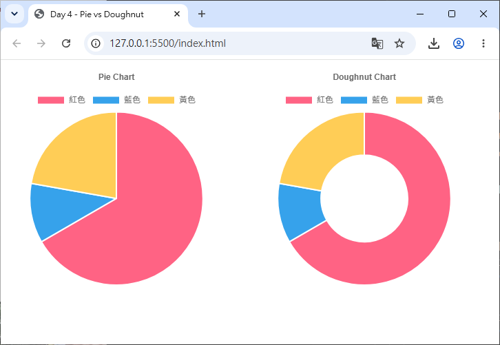
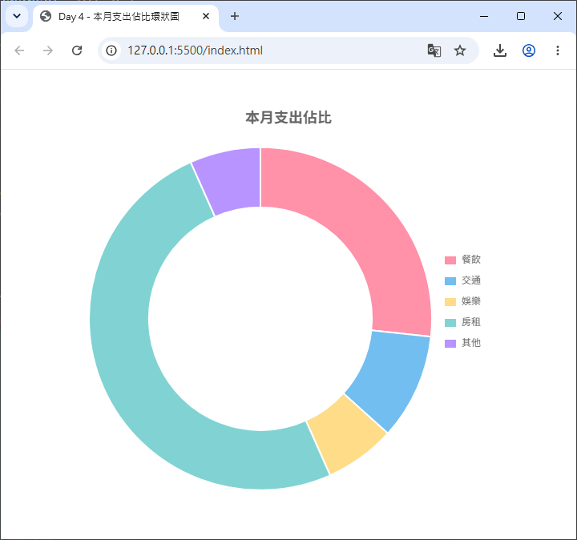

# Day 04 - 30 天手把手學會 Chart.js｜圓餅圖與環狀圖（Pie / Doughnut）

> 前三天我們認識了 Chart.js 的整體架構，也練習了折線圖與長條圖這兩種「以座標軸為基礎」的圖表。今天要介紹另一種完全不需要座標軸、專門用來呈現「佔比關係」的圖表：**圓餅圖（Pie Chart）**與**環狀圖（Doughnut Chart）**。內容包含兩者的差異、`cutout` 屬性的應用，以及資料佔比與圖例（Legend）的顯示方式。

## 一、圓餅圖／環狀圖是什麼？適合什麼情境？

圓餅圖與環狀圖是資料視覺化中最常見、也最容易被一般人理解的圖表類型。它們把一個圓形切割成好幾個扇形區塊（segment / arc），**每個區塊的角度大小，代表該筆資料在總和中所佔的比例**。

這類圖表非常適合用來呈現「**部分與整體的關係**」，例如：

- 各科目分數佔總分的比例
- 某個月份中，各項支出（餐飲、交通、娛樂……）佔總支出的比例
- 網站流量來源分佈（自然搜尋、社群、廣告、直接訪問……）
- 各瀏覽器市佔率

> ⚠️ 提醒：圓餅圖／環狀圖**不適合**用來呈現「隨時間變化的趨勢」或「精確數值比較」。人眼對於「角度大小」的判斷力，遠不如對「長度」（長條圖）敏感，尤其當資料筆數超過 5～6 筆、或是各筆數值很接近時，圓餅圖會變得很難分辨誰大誰小。這種情況建議改用長條圖呈現。

## 二、Pie Chart 與 Doughnut Chart 差異

好消息是：在 Chart.js 中，**Pie Chart 與 Doughnut Chart 其實是完全相同的底層實作**，兩者共用同一份繪圖邏輯，差別只有兩個地方：

1. **`type` 名稱不同**：一個是 `'pie'`，一個是 `'doughnut'`。
2. **`cutout`（中空比例）的預設值不同**：
   - `type: 'pie'` => `cutout` 預設為 `0`（完全實心，沒有中空）
   - `type: 'doughnut'` => `cutout` 預設為 `'50%'`（中間挖空一半，形成環狀）

換句話說，**環狀圖其實就是「中間被挖空的圓餅圖」**。只要你願意，也可以把 Pie Chart 手動加上 `cutout` 選項，讓它變成環狀圖；反之亦然。

### 最小範例：兩者並排比較

```html
<div style="display: flex; gap: 40px;">
  <div style="width: 320px;">
    <canvas id="pieChart"></canvas>
  </div>
  <div style="width: 320px;">
    <canvas id="doughnutChart"></canvas>
  </div>
</div>
```

```js
// 兩張圖共用同一份資料
const data = {
  labels: ['紅色', '藍色', '黃色'],
  datasets: [
    {
      label: '票數統計',
      data: [300, 50, 100],
      backgroundColor: [
        'rgb(255, 99, 132)',
        'rgb(54, 162, 235)',
        'rgb(255, 205, 86)'
      ],
      hoverOffset: 4 // 滑鼠 hover 時，該區塊會向外突出的像素距離
    }
  ]
};

new Chart(document.getElementById('pieChart'), {
  type: 'pie', // 圓餅圖：cutout 預設為 0
  data,
  options: {
    plugins: {
      title: { display: true, text: 'Pie Chart' }
    }
  }
});

new Chart(document.getElementById('doughnutChart'), {
  type: 'doughnut', // 環狀圖：cutout 預設為 '50%'
  data,
  options: {
    plugins: {
      title: { display: true, text: 'Doughnut Chart' }
    }
  }
});
```



執行後可以觀察到：兩張圖使用完全相同的 `data`，唯一差別就是中間是否挖空。

> 💡 小提醒：由於 Pie／Doughnut 圖不需要座標軸，繪製時 Chart.js 不會註冊 `CategoryScale`、`LinearScale` 這類座標軸元件。若你是採用 Day 2 提到的「手動註冊」寫法，只需要註冊 `PieController`（同時支援 `pie` 與 `doughnut` 兩種 `type`）與 `ArcElement` 即可，不需要額外註冊任何 Scale。

## 三、`cutout` 屬性應用

`cutout` 決定「圖表中央要挖空多少比例」，是 Pie／Doughnut 圖表最重要的專屬設定，設定在 `options` 這一層（跟 `data` 平行，不是寫在 `dataset` 裡）。

`cutout` 可以接受兩種型別的數值：

- **字串（百分比）**：例如 `'60%'`，代表挖空的半徑佔整個圖表半徑的 60%。
- **數字（像素）**：例如 `60`，代表挖空的半徑固定為 60px，不會隨圖表大小縮放。

```js
new Chart(ctx, {
  type: 'doughnut',
  data: data,
  options: {
    cutout: '70%' // 中空比例加大，環狀變得更細
  }
});
```

`cutout` 數值愈大，中間挖空的範圍愈大，環狀的「圈」就會愈細；數值愈小（愈接近 0），則愈接近實心的圓餅圖。這個屬性很適合拿來做「圖表中央顯示自訂文字」的設計（例如在環狀圖正中央顯示總計數字），因為挖空的空間剛好可以疊加其他 HTML 元素或透過自訂 plugin 繪製文字（這個進階技巧會在後續「外掛開發」章節詳細介紹）。

### 搭配 `radius`：控制整個圖表的外圈大小

除了 `cutout` 控制「內圈」，`radius` 選項則是控制「外圈」的大小，同樣支援百分比字串或像素數字，預設為 `'100%'`（佔滿容器可用空間）。把 `cutout` 與 `radius` 搭配使用，可以做出「甜甜圈只佔畫布中間一部分、四周留白」的效果：

```js
options: {
  cutout: '60%',
  radius: '80%' // 整個圖表縮小到容器的 80% 大小，四周留白
}
```

### `rotation` 與 `circumference`：起始角度與掃描範圍

這兩個選項可以讓圓餅圖／環狀圖不畫滿整個 360 度，做出「半圓儀表板」風格的圖表：

- `rotation`：圖表從幾度開始繪製（預設 `0`，也就是從正上方 12 點鐘方向開始）
- `circumference`：圖表總共要繪製的掃描角度（預設 `360`，也就是完整一圈）

```js
options: {
  rotation: -90,      // 從左側 9 點鐘方向開始
  circumference: 180  // 只畫半圓（180 度）
}
```

這種「半圓環狀圖」的做法，常被用來做進度指標或儀表板風格的視覺化，未來章節在做「業績儀表板」小專案時會再用到。

## 四、資料佔比與圖例（Legend）顯示

### 1. 資料如何轉換成佔比？

Pie／Doughnut 圖表的資料結構跟折線圖、長條圖一樣，都是 `labels` + `datasets`，但這裡的 `datasets[0].data` 是一個**單純的數字陣列**（不像折線圖／長條圖那樣，一個 dataset 對應一條線或一組柱子；Pie 圖表整個 `dataset.data` 陣列，就對應整張圖的所有扇形）：

```js
const data = {
  labels: ['餐飲', '交通', '娛樂', '房租', '其他'],
  datasets: [
    {
      label: '本月支出佔比',
      data: [8000, 3000, 2000, 15000, 2000],
      backgroundColor: [
        'rgba(255, 99, 132, 0.7)',
        'rgba(54, 162, 235, 0.7)',
        'rgba(255, 205, 86, 0.7)',
        'rgba(75, 192, 192, 0.7)',
        'rgba(153, 102, 255, 0.7)'
      ]
    }
  ]
};
```

**Chart.js 會自動把 `data` 陣列中的每個數字加總，並計算每個數字佔總和的比例**，藉此決定每個扇形所佔的角度。以上面的例子來說：

- 總和：8000 + 3000 + 2000 + 15000 + 2000 = 30000
- 「房租」佔比：15000 / 30000 = 50%，因此該扇形會佔滿整個圓的一半（180 度）

你完全不需要自己手動計算百分比，只要給 Chart.js 原始數字即可。

> 💡 若想在 Tooltip 中顯示「實際百分比」而非原始數值（例如顯示「房租：50%」而不是「房租：15000」），需要透過 `options.plugins.tooltip.callbacks.label` 自訂回呼函式來計算並格式化文字，這個進階用法會在「圖例與提示框」章節詳細示範。

### 2. 圖例（Legend）自動顯示

Pie／Doughnut 圖表因為只有**一組** `dataset`，圖例的顯示方式跟長條圖／折線圖不太一樣：**折線圖／長條圖的圖例，一個項目對應「一個 dataset」；而 Pie／Doughnut 圖表的圖例，一個項目對應「`labels` 陣列中的一筆資料」**（也就是一個扇形對應一個圖例項目）。

預設情況下，Chart.js 會自動在圖表上方顯示圖例，列出每個 `labels` 名稱與對應的顏色色塊：

```js
new Chart(ctx, {
  type: 'doughnut',
  data: data,
  options: {
    plugins: {
      legend: {
        display: true,   // 是否顯示圖例（預設就是 true）
        position: 'right' // 圖例位置：'top'（預設）、'bottom'、'left'、'right'
      }
    }
  }
});
```

### 3. 圖例常用設定

| 設定項 | 說明 |
| --- | --- |
| `position` | 圖例顯示位置，可選 `'top'`、`'bottom'`、`'left'`、`'right'` |
| `align` | 圖例在該位置上的對齊方式，可選 `'start'`、`'center'`（預設）、`'end'` |
| `labels.boxWidth` | 圖例色塊的寬度（預設 `40`） |
| `labels.padding` | 每個圖例項目之間的間距 |
| `labels.font` | 圖例文字的字型設定（`size`、`family`、`weight` 等） |
| `onClick` | 點擊圖例項目時觸發的事件（預設行為是切換該筆資料的顯示／隱藏） |

```js
options: {
  plugins: {
    legend: {
      position: 'right',
      align: 'center',
      labels: {
        boxWidth: 16,
        padding: 12,
        font: { size: 13 }
      }
    }
  }
}
```

> 💡 小提醒：點擊圖例中的某個項目（例如「娛樂」），預設就會把該扇形隱藏起來，並自動重新計算剩餘資料的佔比與角度，圖表會自動重繪動畫過渡。這是 Chart.js 內建就有的互動效果，不需要額外寫程式碼。

## 五、完整綜合範例

以下範例整合本篇教學重點，做出一張「本月支出佔比」環狀圖：中空比例、圖例位置、hover 突出效果、資料標籤全部到位。

```html
<div style="width: 500px; margin: 40px auto;">
  <canvas id="expenseChart"></canvas>
</div>
<script src="https://cdn.jsdelivr.net/npm/chart.js@4.5.1"></script>
```

```js
const ctx = document.getElementById('expenseChart');

new Chart(ctx, {
  type: 'doughnut',
  data: {
    labels: ['餐飲', '交通', '娛樂', '房租', '其他'],
    datasets: [
      {
        label: '本月支出（元）',
        data: [8000, 3000, 2000, 15000, 2000],
        backgroundColor: [
          'rgba(255, 99, 132, 0.7)',
          'rgba(54, 162, 235, 0.7)',
          'rgba(255, 205, 86, 0.7)',
          'rgba(75, 192, 192, 0.7)',
          'rgba(153, 102, 255, 0.7)'
        ],
        borderColor: '#fff',
        borderWidth: 2,
        hoverOffset: 12 // 滑鼠移入時，該扇形往外突出 12px，強調焦點
      }
    ]
  },
  options: {
    responsive: true,
    cutout: '65%', // 中空比例，環狀較細
    plugins: {
      title: {
        display: true,
        text: '本月支出佔比',
        font: { size: 18 }
      },
      legend: {
        position: 'right',
        labels: {
          boxWidth: 16,
          padding: 14
        }
      },
      tooltip: {
        callbacks: {
          // 自訂 Tooltip 內容：同時顯示金額與百分比
          label: (context) => {
            const value = context.raw;
            const total = context.dataset.data.reduce((sum, n) => sum + n, 0);
            const percentage = ((value / total) * 100).toFixed(1);
            return `${context.label}：${value} 元（${percentage}%）`;
          }
        }
      }
    }
  }
});
```



執行後會看到：右側顯示圖例，中央呈現環狀（65% 中空），滑鼠移到某個扇形上時該扇形會向外突出並顯示「金額 + 百分比」的提示框。

---

明天（Day 5）我們將回到折線圖，學習更進階的用法：多條線資料比較、`fill` 填色區域圖（Area Chart），以及曲線平滑度（`tension`）與虛線樣式的設定。

## 參考資源

- [Chart.js](https://www.chartjs.org/)
- [Chart.js GitHub](https://github.com/chartjs/Chart.js)
