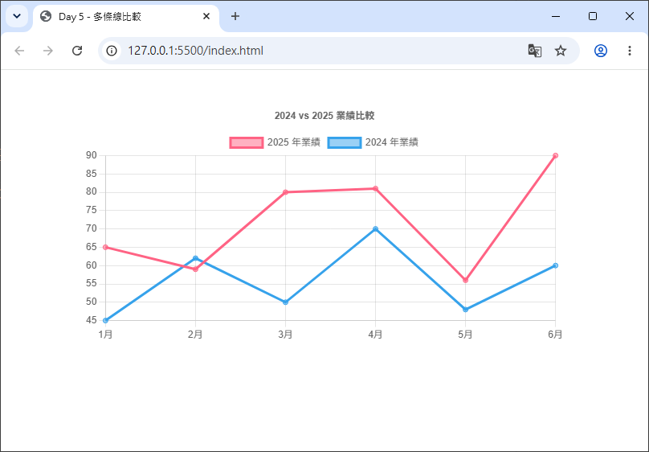
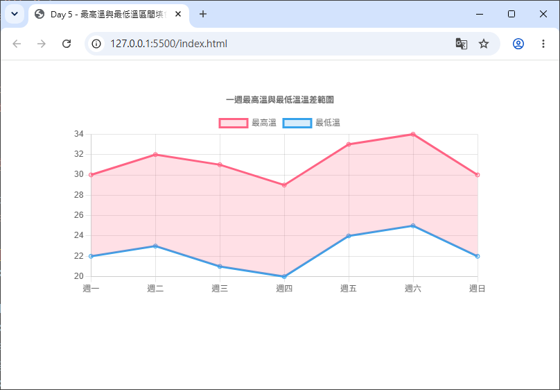
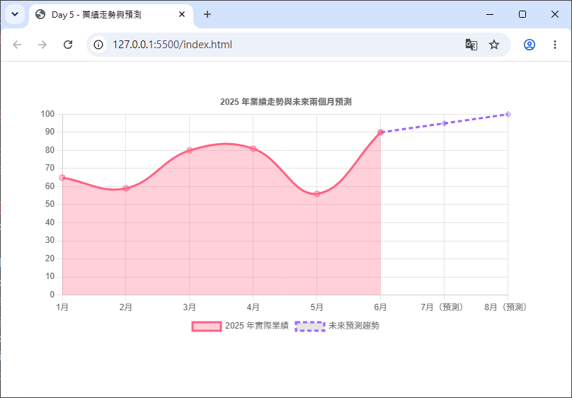

# Day 05 - 30 天手把手學會 Chart.js｜折線圖（Line Chart）進階

> Day 2 我們畫出了第一張折線圖，Day 4 則學會了圓餅圖／環狀圖這類「無座標軸」的圖表。今天要回到折線圖本身，把它的進階功能一次補齊：如何在同一張圖上比較「多條線」、如何做出常見的**區域圖（Area Chart）**填色效果、以及如何透過 `tension` 調整曲線平滑度、用 `borderDash` 做出虛線樣式。學完今天的內容，你就能做出媲美股價走勢圖、業績趨勢圖等級的折線圖表。

## 一、多條線資料比較

實務上很少只畫一條線，例如「今年 vs 去年業績」「三個分店的每月來客數」，都需要在同一張圖表上同時呈現多組資料，方便互相比較。

在 Chart.js 中做法很簡單：`data.datasets` 本來就是一個**陣列（Array）**，只要放入多個 dataset 物件，Chart.js 就會自動把每一組資料畫成一條獨立的折線，並自動產生對應的圖例（Legend）。

```html
<div style="width: 600px; margin: 40px auto;">
  <canvas id="multiLineChart"></canvas>
</div>
```

```js
new Chart(document.getElementById('multiLineChart'), {
  type: 'line',
  data: {
    labels: ['1月', '2月', '3月', '4月', '5月', '6月'],
    datasets: [
      {
        label: '2025 年業績',
        data: [65, 59, 80, 81, 56, 90],
        borderColor: 'rgb(255, 99, 132)',
        backgroundColor: 'rgba(255, 99, 132, 0.5)'
      },
      {
        label: '2024 年業績',
        data: [45, 62, 50, 70, 48, 60],
        borderColor: 'rgb(54, 162, 235)',
        backgroundColor: 'rgba(54, 162, 235, 0.5)'
      }
    ]
  },
  options: {
    responsive: true,
    plugins: {
      title: { display: true, text: '2024 vs 2025 業績比較' }
    }
  }
});
```



執行後可以看到兩條顏色不同的線各自呈現一組資料，圖表上方也會自動顯示圖例，讓使用者知道哪條線代表哪一組資料。

> 💡 每個 dataset 都是各自獨立的物件，因此 `borderColor`、`pointStyle`、`tension`……等等，本篇後面要介紹的所有樣式屬性，都可以「每一條線分別設定」，不需要整張圖表統一樣式。

### 小技巧：讓每條線的顏色自動產生

如果資料集數量很多（例如 10 個分店），一個個手動指定顏色會很麻煩。Chart.js 內建了 `Colors` 這個 plugin，只要 `registerables` 有註冊、且**沒有**手動設定 `backgroundColor` / `borderColor`，就會自動套用一組預設配色，非常適合快速原型開發。

## 二、`fill` 填色區域圖（Area Chart）

「區域圖」其實就是折線圖再加上「線與某個邊界之間塗上顏色」的效果，這個功能由 Chart.js 內建的 **`Filler` plugin** 負責處理。若採用手動註冊元件的寫法（Day 2 提過的 tree-shaking），別忘了額外註冊 `Filler`：

```js
import { Filler } from 'chart.js';
Chart.register(Filler);
```

若你是使用 `import { Chart, registerables } from 'chart.js'; Chart.register(...registerables);` 這種「全部註冊」的寫法，則不需要額外處理，`Filler` 已經包含在內。

### 1. `fill` 的基本用法：`true` / `false`

`fill` 是設定在每個 **dataset** 裡的屬性：

```js
{
  label: '每日訪客數',
  data: [30, 45, 28, 60, 52, 75, 68],
  borderColor: 'rgb(75, 192, 192)',
  backgroundColor: 'rgba(75, 192, 192, 0.3)', // 填色會使用這個顏色
  fill: true // 等同於 fill: 'origin'，填滿線到 x 軸（origin）之間的區域
}
```

- `fill: false`（預設值）：不填色，維持單純的折線。
- `fill: true`：把線與圖表的「原點（origin，通常是 y = 0 的位置）」之間的區域填滿顏色，也就是最常見的區域圖效果。
- 填色使用的顏色來自該 dataset 的 `backgroundColor`，因此**要有填色效果，`backgroundColor` 通常需要設定成半透明色**（例如 `rgba(75, 192, 192, 0.3)`），這樣才不會整片顏色太過搶眼、遮住格線。

### 2. 進階填色模式：填到指定邊界或其他資料集

`fill` 除了布林值，還可以接受字串或數字，指定要「填到哪裡」：

| 填色目標 | 寫法 | 說明 |
| --- | --- | --- |
| 圖表原點 | `'origin'` | 填到 y = 0（等同 `fill: true`） |
| 圖表頂部 | `'start'` | 填到圖表可視範圍的起始邊界 |
| 圖表底部 | `'end'` | 填到圖表可視範圍的結束邊界 |
| 指定資料集（絕對索引） | `1`、`2` … | 填到第幾個 dataset（從 0 算起） |
| 指定資料集（相對索引） | `'-1'`、`'+1'` | 填到「前一個」或「後一個」dataset |
| 不填色 | `false` | 明確關閉填色 |

這個特性最常見的用法，是做出「兩條線之間的區域填色」，例如「最高溫、最低溫之間的溫差範圍」：

```html
<div style="width: 700px; margin: 40px auto;">
  <canvas id="tempRangeChart"></canvas>
</div>
```

```js
new Chart(document.getElementById('tempRangeChart'), {
  type: 'line',
  data: {
    labels: ['週一', '週二', '週三', '週四', '週五', '週六', '週日'],
    datasets: [
      {
        label: '最高溫',
        data: [30, 32, 31, 29, 33, 34, 30],
        borderColor: 'rgba(255, 99, 132, 1)',
        backgroundColor: 'rgba(255, 99, 132, 0.2)',
        fill: '+1' // 填到「下一個」dataset（也就是最低溫）之間的區域
      },
      {
        label: '最低溫',
        data: [22, 23, 21, 20, 24, 25, 22],
        borderColor: 'rgba(54, 162, 235, 1)',
        backgroundColor: 'rgba(54, 162, 235, 0.2)',
        fill: false
      }
    ]
  },
  options: {
    responsive: true,
    plugins: {
      title: { display: true, text: '一週最高溫與最低溫溫差範圍' }
    }
  }
});
```



> 💡 提醒：只需要在「上面那條線」設定 `fill`，指定要填到哪個 dataset 即可；被填色的那個目標 dataset 本身通常設定 `fill: false`，避免重複填色。

### 3. `stack`：多個 Area 疊加成堆疊區域圖

如果想做出「總量隨堆疊層層相加」的堆疊區域圖（Stacked Area Chart），除了每個 dataset 都設定 `fill: 'origin'` 或使用 `fill: 'stack'`，還需要在 y 軸開啟 `stacked: true`：

```js
options: {
  scales: {
    y: { stacked: true }
  }
}
```

這種圖表很適合呈現「各項目佔總量的變化趨勢」，例如「各產品線每月銷售額，疊加後呈現公司總營收成長」。

## 三、曲線平滑度（`tension`）與虛線樣式

### 1. `tension`：讓折線變平滑曲線

預設情況下，Chart.js 的折線圖是「直線相連」——每兩個資料點之間用一條直線段連接。但只要設定 `tension`，就能讓線條變成平滑的貝茲曲線（Bezier curve），視覺上更柔和。

```js
{
  label: '平滑趨勢線',
  data: [65, 59, 80, 81, 56, 55, 40],
  borderColor: 'rgb(75, 192, 192)',
  tension: 0.4 // 數值介於 0 ~ 1，愈大愈平滑
}
```

- `tension: 0`（預設值）：完全的直線連接，沒有任何弧度。
- `tension` 數值愈大（最大建議不超過 `1`），線條的弧度愈明顯、愈平滑。實務上 `0.3` ～ `0.4` 是最常見、視覺效果最自然的區間；數值太大（例如接近 `1`）容易讓曲線出現不合理的「甩尾」或超出資料點範圍的彎曲，反而失真。

> ⚠️ 注意：`tension` 對於 `stepped`（階梯線）圖表無效——如果同時設定了 `stepped: true`，`tension` 會被忽略。

### 2. `borderDash`：虛線樣式

`borderDash` 可以把線條從實線變成虛線，常用來區隔「預測值」「參考線」或和其他實線資料做視覺區分。

```js
{
  label: '預測趨勢（虛線）',
  data: [56, 60, 65, 70, 75, 80],
  borderColor: 'rgb(153, 102, 255)',
  borderDash: [6, 4] // [實線長度, 間隔長度]，單位為像素（px）
}
```

`borderDash` 是一個數字陣列，對應瀏覽器原生 Canvas API 的 `setLineDash()`：

- `[6, 4]`：畫 6px 的線段，接著留白 4px，重複循環。
- `[10, 5, 2, 5]`：可以組合出「一長一短」交錯的點劃線效果（dash-dot）。
- 空陣列 `[]`（預設值）：實線，沒有虛線效果。

搭配 `borderDashOffset` 可以微調虛線的起始偏移量，讓多條虛線的間隔對齊，這裡先了解即可，屬於較少用到的細節設定。

## 四、完整綜合範例

以下範例整合本篇所有重點：兩條實際業績線（其中一條為平滑曲線並填色）+ 一條虛線預測趨勢，做出一張完整的「業績走勢與預測」折線圖。

```html
<div style="width: 700px; margin: 40px auto;">
  <canvas id="trendChart"></canvas>
</div>
<script src="https://cdn.jsdelivr.net/npm/chart.js@4.5.1"></script>
```

```js
new Chart(document.getElementById('trendChart'), {
  type: 'line',
  data: {
    labels: ['1月', '2月', '3月', '4月', '5月', '6月', '7月（預測）', '8月（預測）'],
    datasets: [
      {
        label: '2025 年實際業績',
        data: [65, 59, 80, 81, 56, 90, null, null],
        borderColor: 'rgb(255, 99, 132)',
        backgroundColor: 'rgba(255, 99, 132, 0.3)',
        fill: true,     // 填色到 origin（區域圖效果）
        tension: 0.4,   // 平滑曲線
        pointRadius: 4
      },
      {
        label: '未來預測趨勢',
        // 前面補 null，只在最後幾個月呈現，並與實際業績最後一點銜接
        data: [null, null, null, null, null, 90, 95, 100],
        borderColor: 'rgb(153, 102, 255)',
        borderDash: [6, 4], // 虛線
        fill: false,
        tension: 0.4,
        pointRadius: 4,
        pointStyle: 'rectRot'
      }
    ]
  },
  options: {
    responsive: true,
    plugins: {
      title: { display: true, text: '2025 年業績走勢與未來兩個月預測' },
      legend: { position: 'bottom' }
    },
    scales: {
      y: { beginAtZero: true }
    }
  }
});
```



執行後會看到：實際業績呈現平滑的填色區域圖，未來兩個月則用紫色虛線呈現預測趨勢，兩者在銜接處自然相連，一眼就能分辨「已發生」與「預測」的資料。

> 💡 小技巧：範例中用 `null` 讓資料在特定月份「留白」，這是同一張圖表呈現「實際值」與「預測值」分屬不同 dataset、又能視覺上無縫銜接的常見手法。若不希望 `null` 造成線段中斷，可搭配 `spanGaps: true` 選項，讓 Chart.js 忽略中間的空值，直接把有值的點連起來。

---

明天（Day 6）我們要進入座標軸（Scales）的世界：認識 x 軸、y 軸的基礎設定（`linear`、`category`、`time`），學習軸標題與刻度格式化，並挑戰雙 Y 軸圖表；進階部分還會介紹如何使用 `chartjs-adapter-date-fns` 處理時間軸格式化，以及搭配 `chartjs-plugin-zoom` 做圖表的區間縮放與平移。

## 參考資源

- [Chart.js](https://www.chartjs.org/)
- [Chart.js GitHub](https://github.com/chartjs/Chart.js)
