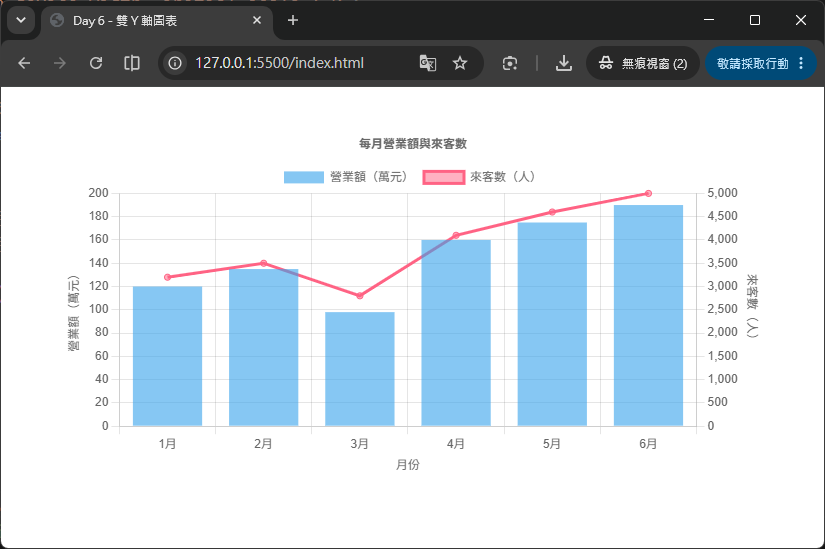
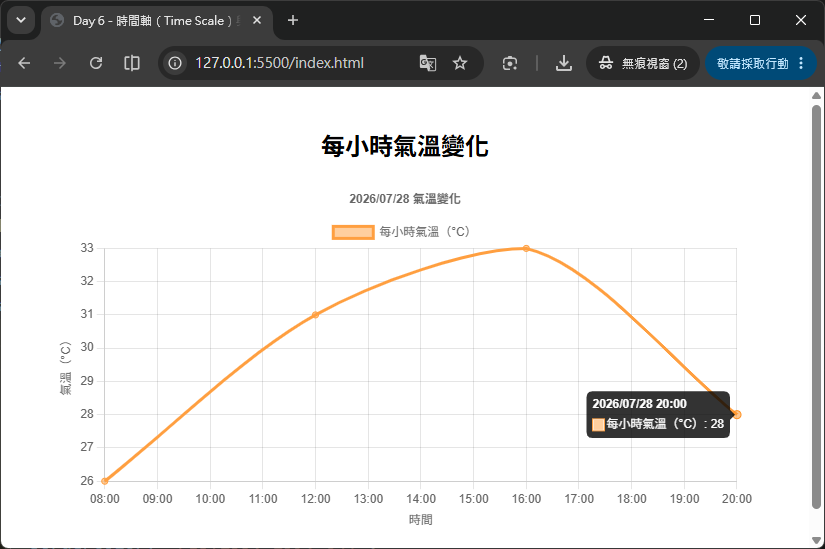
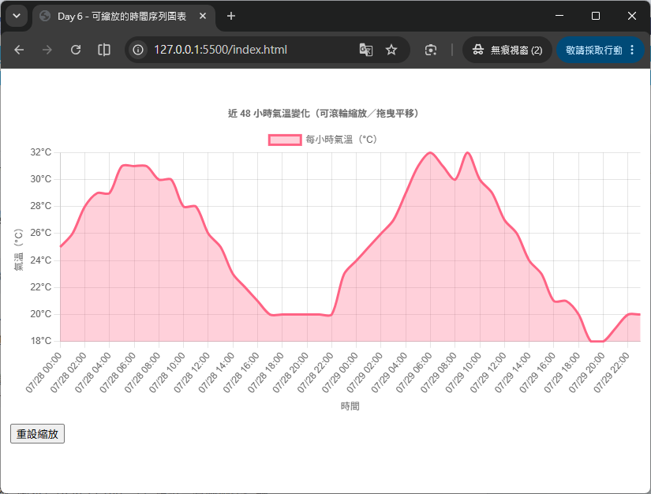

# Day 06 - 30 天手把手學會 Chart.js｜座標軸（Scales）基礎與時間序列進階

> 前幾天我們陸續學會了折線圖、長條圖、圓餅圖／環狀圖，但都還沒有正面認識 Chart.js 最核心的基礎建設——**座標軸（Scales）**。座標軸負責把「資料」轉換成畫布上的「像素位置」，決定了圖表看起來是「一格一格的類別」還是「連續的數值」，甚至是「有意義的日期時間」。今天我們會 systematic 地認識 x 軸、y 軸的種類，學習軸標題與刻度格式化，挑戰「雙 Y 軸」圖表，最後進入進階主題：使用 `chartjs-adapter-date-fns` 讓時間軸正確顯示日期格式，並搭配 `chartjs-plugin-zoom` 做出可以縮放、平移的互動圖表。

## 一、認識座標軸（Scales）：類型與基本觀念

在 Chart.js 的世界裡，「直角座標圖表」（Bar、Line 等）預設會有兩個座標軸：

- **x 軸**：預設 ID 為 `'x'`，通常放「類別」或「時間」。
- **y 軸**：預設 ID 為 `'y'`，通常放「數值」。

座標軸的設定放在 `options.scales` 底下，用軸的 **ID** 當作 key：

```js
options: {
  scales: {
    x: { /* x 軸設定 */ },
    y: { /* y 軸設定 */ }
  }
}
```

Chart.js 內建了幾種常見的座標軸類型，透過 `type` 屬性指定：

| 軸類型 | `type` 值 | 內部資料格式 | 適合情境 |
| --- | --- | --- | --- |
| 類別軸 | `'category'` | 標籤的索引值 | 折線圖／長條圖預設 x 軸，例如「一月、二月、三月」 |
| 線性軸 | `'linear'` | 數值 | 折線圖／長條圖預設 y 軸，散佈圖／氣泡圖的 x 軸 |
| 對數軸 | `'logarithmic'` | 數值（對數刻度） | 資料範圍差距極大（如 1 ～ 100,000）時使用 |
| 時間軸 | `'time'` | 毫秒時間戳（timestamp） | 資料點的時間「間距不固定」，如感測器每隔幾秒回傳一次 |
| 時間序列軸 | `'timeseries'` | 毫秒時間戳，但**等距**排列 | 資料點的時間「間距不固定」，但希望畫面上呈現「等距」排列，避免資料稀疏處被過度拉伸 |

> 💡 大部分情況下，你不需要手動指定 `type`：折線圖／長條圖若只提供 `data.labels`（字串陣列），x 軸會自動被視為 `'category'`；y 軸則預設為 `'linear'`。只有在特殊情境（例如時間軸、對數軸、雙 y 軸）才需要手動設定。

## 二、x 軸與 y 軸基礎設定

### 1. 類別軸（Category）：最常見的 x 軸

當 `data.labels` 是一組字串陣列時，Chart.js 會自動把 x 軸視為類別軸，每個標籤各自佔一格：

```js
new Chart(ctx, {
  type: 'bar',
  data: {
    labels: ['一月', '二月', '三月', '四月', '五月'],
    datasets: [{ label: '銷售額', data: [12, 19, 8, 15, 22] }]
  },
  options: {
    scales: {
      x: { type: 'category' } // 其實可以省略，Chart.js 會自動判斷
    }
  }
});
```

也可以不透過 `data.labels`，直接在軸設定裡給 `labels`（適合想要「軸的標籤」與「資料本身」分開管理的情境）：

```js
options: {
  scales: {
    x: {
      type: 'category',
      labels: ['一月', '二月', '三月', '四月', '五月']
    }
  }
}
```

### 2. 線性軸（Linear）：最常見的 y 軸

線性軸負責顯示連續數值，最實用的屬性是 `beginAtZero`：

```js
options: {
  scales: {
    y: {
      type: 'linear',
      beginAtZero: true, // 強制讓 y 軸從 0 開始，避免長條圖因為軸不從 0 開始而造成視覺誤導
      min: 0,             // 明確指定最小值（會截斷超出範圍的資料）
      max: 100            // 明確指定最大值
    }
  }
}
```

- `beginAtZero: true`：如果資料的最小值本身就大於 0，這個選項可以強迫 y 軸的起點仍然是 0。這在長條圖尤其重要——長條圖的長度代表數值大小，若 y 軸不是從 0 開始，長條之間的視覺比例就會失真，容易誤導讀者。
- `min` / `max`：明確指定座標軸顯示的上下限，適合想要固定圖表刻度範圍的情境（例如「體溫圖表固定顯示 35°C ～ 42°C」）。
- `suggestedMin` / `suggestedMax`：與 `min`/`max` 不同，這兩個選項只是「建議」，並不會截斷資料——如果實際資料超出建議範圍，Chart.js 仍會自動擴大顯示範圍以容納所有資料點。適合「想留一點視覺空間、但不希望資料被截斷」的情境。

## 三、軸標題與刻度格式化

### 1. 軸標題（Scale Title）

沒有標題的座標軸，讀者常常無法一眼看出「這條軸代表什麼」。透過 `scales[scaleId].title` 可以幫每個軸加上說明文字：

```js
options: {
  scales: {
    x: {
      title: { display: true, text: '月份' }
    },
    y: {
      title: { display: true, text: '銷售額（萬元）' }
    }
  }
}
```

`title` 常用屬性：

| 屬性 | 說明 |
| --- | --- |
| `display` | 是否顯示標題，預設 `false`，一定要設成 `true` 才會出現 |
| `text` | 標題文字，也可以傳入字串陣列做多行標題 |
| `align` | 標題對齊方式：`'start'`、`'center'`（預設）、`'end'` |
| `color` / `font` | 標題文字顏色、字型 |

### 2. 刻度格式化（`ticks.callback`）

預設情況下，Chart.js 只會把數值原封不動地顯示在刻度上。但實務上常常需要「加上單位」，例如金額前面加 `$`、百分比後面加 `%`。這時候可以透過 `ticks.callback` 自訂刻度顯示的文字：

```js
options: {
  scales: {
    y: {
      ticks: {
        callback: function(value, index, ticks) {
          // value：目前刻度在該軸「內部資料格式」下的數值（線性軸就是數字本身）
          return '$' + value.toLocaleString(); // 加上千分位與貨幣符號
        }
      }
    }
  }
}
```

`callback` 函式接收三個參數：

- `value`：刻度的內部數值（線性軸是數字；類別軸則是標籤的索引，需搭配 `this.getLabelForValue(value)` 取得對應文字；時間軸則是毫秒時間戳）。
- `index`：這個刻度在整個刻度陣列中的索引。
- `ticks`：所有刻度物件組成的陣列。

> ⚠️ 一旦覆寫 `ticks.callback`，就代表你要「完全自己負責」這個刻度顯示什麼文字，Chart.js 不會再幫你做預設的數字格式化（例如千分位）。如果只是想在預設格式化的結果前後加點文字，記得手動呼叫 `Chart.Ticks.formatters.numeric` 取得原本的格式化字串，再自行加工。

## 四、多 Y 軸應用（雙軸圖表）

實務上常遇到「兩組資料單位差距很大」的情境，例如「營業額（萬元）」與「來客數（人）」放在同一張圖，如果共用一個 y 軸，數值小的那組資料線就會被壓在圖表底部，幾乎看不出變化。這時候就需要**雙 Y 軸**：讓每個 dataset 各自對應不同的 y 軸。

作法分兩步驟：

1. 在 `options.scales` 定義多個 y 軸，用不同的 ID（例如 `y` 與 `y1`），並各自指定 `position`（`'left'` 或 `'right'`）。
2. 在對應的 dataset 上，透過 `yAxisID` 指定要使用哪一個 y 軸。

```html
<div style="width: 700px; margin: 40px auto;">
  <canvas id="dualAxisChart"></canvas>
</div>

<script src="https://cdn.jsdelivr.net/npm/chart.js@4.5.1"></script>
<script src="https://cdn.jsdelivr.net/npm/chartjs-adapter-date-fns@3.0.0"></script>
```

```js
new Chart(document.getElementById('dualAxisChart'), {
  data: {
    labels: ['1月', '2月', '3月', '4月', '5月', '6月'],
    datasets: [
      {
        type: 'bar',
        label: '營業額（萬元）',
        data: [120, 135, 98, 160, 175, 190],
        backgroundColor: 'rgba(54, 162, 235, 0.6)',
        yAxisID: 'y'      // 對應左側 y 軸
      },
      {
        type: 'line',
        label: '來客數（人）',
        data: [3200, 3500, 2800, 4100, 4600, 5000],
        borderColor: 'rgb(255, 99, 132)',
        backgroundColor: 'rgba(255, 99, 132, 0.5)',
        yAxisID: 'y1'     // 對應右側 y 軸
      }
    ]
  },
  options: {
    responsive: true,
    plugins: {
      title: { display: true, text: '每月營業額與來客數' }
    },
    scales: {
      x: { title: { display: true, text: '月份' } },
      y: {
        type: 'linear',
        position: 'left',
        title: { display: true, text: '營業額（萬元）' },
        beginAtZero: true
      },
      y1: {
        type: 'linear',
        position: 'right',
        title: { display: true, text: '來客數（人）' },
        beginAtZero: true,
        grid: {
          drawOnChartArea: false // 避免右側軸的格線和左側軸重疊，畫面更乾淨
        }
      }
    }
  }
});
```



重點整理：
- 兩個 y 軸的 ID 可以自由命名（`y`、`y1`、`ySales`……），只要 dataset 的 `yAxisID` 對應得上即可；若 dataset 沒有指定 `yAxisID`，會自動使用第一個找到的 y 軸。
- `position: 'left'` / `'right'` 決定軸要顯示在圖表的左邊還是右邊。
- 建議把其中一個軸的 `grid.drawOnChartArea` 設為 `false`，避免兩組格線互相交錯造成視覺混亂。

## 五、進階：時間軸（Time Scale）與 `chartjs-adapter-date-fns`

### 1. 為什麼需要「時間軸」而不是「類別軸」？

如果你的資料是「日期＋數值」，很直覺會想直接把日期字串當成 `labels` 丟進類別軸——但這樣做有個嚴重缺點：類別軸只知道「這是第幾個標籤」，並不理解「日期與日期之間實際相差多少時間」。假設資料是 `1/1、1/2、1/5、1/10`，類別軸會把它們畫成**等距**的四個點，但實際上 1/2 到 1/5 中間相差 3 天、1/5 到 1/10 相差 5 天，時間間距完全被忽略了。

**時間軸（`type: 'time'`）** 就是為了解決這個問題而生：它會把每個資料點的時間換算成時間戳，並依照「實際經過的時間長短」決定資料點在畫面上的相對位置，同時還能自動判斷該用「小時」、「日」、「月」還是「年」當作刻度單位。

### 2. 安裝與註冊 `chartjs-adapter-date-fns`

時間軸**必須**搭配一個「日期轉換套件（date adapter）」才能運作，Chart.js 本身不內建任何日期處理邏輯，這是為了避免強迫使用者引入不需要的日期函式庫（減少打包體積）。這裡我們選用輕量、tree-shaking 友善的 [date-fns](https://date-fns.org/) 搭配官方提供的 `chartjs-adapter-date-fns`。

```bash
npm install chart.js@4.5.1 date-fns@4.4.0 chartjs-adapter-date-fns@3.0.0
```

```js
import { Chart, registerables } from 'chart.js';
import 'chartjs-adapter-date-fns'; // 引入後會自動掛載時間軸所需的日期轉換邏輯，副作用式註冊，不需要額外呼叫 Chart.register()

Chart.register(...registerables);
```

> 💡 若使用 CDN 方式（不透過 npm/bundler），記得依序載入 `chart.js` → `chartjs-adapter-date-fns`，順序不能顛倒，因為 adapter 需要偵測到 Chart.js 已經存在才能掛載自己。

### 3. 時間軸的基本設定

```js
new Chart(ctx, {
  type: 'line',
  data: {
    datasets: [
      {
        label: '每小時氣溫（°C）',
        data: [
          { x: '2026-07-28 08:00', y: 26 },
          { x: '2026-07-28 12:00', y: 31 },
          { x: '2026-07-28 16:00', y: 33 },
          { x: '2026-07-28 20:00', y: 28 }
        ],
        borderColor: 'rgb(255, 159, 64)',
        backgroundColor: 'rgba(255, 159, 64, 0.5)',
        tension: 0.3
      }
    ]
  },
  options: {
    responsive: true,
    plugins: {
      title: { display: true, text: '2026/07/28 氣溫變化' }
    },
    scales: {
      x: {
        type: 'time',
        time: {
          unit: 'hour',                       // 強制以「小時」為刻度單位
          displayFormats: {
            hour: 'HH:mm'                      // 刻度顯示格式，格式字串來自 date-fns 的 format tokens
          },
          tooltipFormat: 'yyyy/MM/dd HH:mm'    // 滑鼠移到資料點時，tooltip 顯示的日期格式
        },
        title: { display: true, text: '時間' }
      },
      y: {
        title: { display: true, text: '氣溫（°C）' },
        beginAtZero: false
      }
    }
  }
});
```



重點屬性說明：

| 屬性 | 說明 |
| --- | --- |
| `time.unit` | 強制指定刻度單位，可選 `'millisecond'`、`'second'`、`'minute'`、`'hour'`、`'day'`、`'week'`、`'month'`、`'quarter'`、`'year'`。不設定時 Chart.js 會依照資料範圍與圖表寬度自動挑選「最舒適」的單位。 |
| `time.displayFormats` | 針對不同單位設定刻度顯示的日期格式字串（格式規則依你使用的 date adapter 而定，`date-fns` 使用其 [format tokens](https://date-fns.org/docs/format)，例如 `yyyy`、`MM`、`dd`、`HH:mm`）。 |
| `time.tooltipFormat` | Tooltip 顯示時使用的日期格式，通常會比刻度顯示更完整（例如包含年份）。 |
| `ticks.source` | 刻度產生方式：`'auto'`（預設，依範圍自動產生）、`'data'`（只用資料中出現過的時間點）、`'labels'`（只用 `data.labels` 裡的時間點）。 |

### 4. `time` vs `timeseries`：資料間距不均勻時的差異

假設資料是「工作日的股價」，週末沒有資料——如果用 `type: 'time'`，週五到週一之間會被畫出一段「空白的週末區域」，因為時間軸是按照「實際經過的時間長度」等比例分配位置。但很多時候我們反而希望「不管日期實際間隔多久，每個資料點之間的視覺間距都一樣」，這時候就該改用 **`type: 'timeseries'`**：

```js
options: {
  scales: {
    x: { type: 'timeseries' } // 資料點在視覺上永遠等距排列，不受實際時間間隔影響
  }
}
```

簡單記法：**`time` 尊重真實時間比例，`timeseries` 讓資料點永遠等距**。兩者其他設定（`unit`、`displayFormats`、`tooltipFormat` 等）完全共用，選擇哪一種純粹取決於你想呈現「真實時間比例」還是「資料點分布的等距美觀」。

## 六、進階：`chartjs-plugin-zoom` 區間縮放與平移

資料點一多，圖表很容易變得擁擠、難以閱讀局部細節。`chartjs-plugin-zoom` 這款官方外掛，讓使用者可以透過滑鼠滾輪、拖曳或觸控手勢，自由縮放、平移圖表，很適合搭配時間軸做「長時間趨勢圖」。

### 1. 安裝與註冊

```bash
npm install chart.js@4.5.1 chartjs-plugin-zoom@2.2.0
```

```js
import { Chart, registerables } from 'chart.js';
import zoomPlugin from 'chartjs-plugin-zoom';

Chart.register(...registerables, zoomPlugin);
```

> 💡 若透過 `<script>` 標籤以 CDN 方式載入，`chartjs-plugin-zoom` 依賴 [Hammer.js](https://hammerjs.github.io/) 來處理觸控／拖曳手勢，記得在載入外掛「之前」先載入 `hammerjs`。

### 2. 基本設定：滾輪縮放 + 拖曳平移

外掛的所有設定都放在 `options.plugins.zoom` 底下，分成 `zoom`（縮放）與 `pan`（平移）兩大類：

```js
options: {
  plugins: {
    zoom: {
      pan: {
        enabled: true,     // 開啟平移功能
        mode: 'x'          // 只允許沿 x 軸方向平移（時間序列圖表最常用）
      },
      zoom: {
        wheel: { enabled: true },   // 滑鼠滾輪縮放
        pinch: { enabled: true },   // 觸控裝置雙指縮放
        mode: 'x'                   // 只允許沿 x 軸方向縮放
      }
    }
  }
}
```

- `mode: 'x'`：只沿 x 軸（時間軸）縮放／平移，適合「觀察某一段時間區間」的場景；如果想要 x、y 軸都能自由縮放，改成 `mode: 'xy'`。
- `pan.enabled` / `zoom.wheel.enabled` / `zoom.pinch.enabled`：分別控制「拖曳平移」「滑鼠滾輪縮放」「觸控雙指縮放」是否開啟，可依需求各自開關。
- 除了滾輪縮放，也可以用 `zoom.drag.enabled: true` 開啟「拖曳框選區域來縮放」的互動方式，兩者可以同時啟用。

### 3. 重設縮放（Reset Zoom）

使用者放大檢視後，通常也需要一個「恢復原始檢視範圍」的按鈕。Chart.js 實例本身內建了 `resetZoom()` 方法，外掛註冊後即可直接呼叫：

```html
<button id="resetZoomBtn">重設縮放</button>
<canvas id="zoomChart"></canvas>

<script type="module">
  // ...（Chart 建立過程略）
  document.getElementById('resetZoomBtn').addEventListener('click', () => {
    myChart.resetZoom();
  });
</script>
```

### 4. 限制縮放／平移範圍

實務上通常不希望使用者無限縮放或平移到資料範圍以外，可以透過 `limits` 設定邊界：

```js
options: {
  plugins: {
    zoom: {
      limits: {
        x: { min: 'original', max: 'original' } // 平移／縮放範圍不能超出資料最初顯示的範圍
      },
      pan: { enabled: true, mode: 'x' },
      zoom: { wheel: { enabled: true }, mode: 'x' }
    }
  }
}
```

`'original'` 是個很方便的關鍵字，代表「圖表第一次顯示時的範圍」，不需要自己手動計算資料的最小、最大時間。

> ⚠️ 有個容易踩到的坑：`limits.x` 設成 `'original'` 之後，「原始範圍」指的是**圖表第一次顯示時的可視範圍**，而不是資料本身的最小、最大值。如果一開始就用 `scales.x` 顯示了全部資料，代表可視範圍與資料範圍完全重疊，此時畫面已經頂到 `'original'` 邊界，拖曳平移會看起來「完全沒有反應」。要讓平移有可移動的空間，記得在 `scales.x` 只設定顯示一部分資料（例如 `min`／`max` 設為前半段的標籤），縮放後再平移才看得出效果。

## 七、完整綜合範例：可縮放的時間序列氣溫圖

整合本篇重點：`time` 軸 + `chartjs-adapter-date-fns` 格式化 + `chartjs-plugin-zoom` 縮放平移，做出一張「近一週每小時氣溫」的互動趨勢圖。

```html
<div style="width: 800px; margin: 40px auto;">
  <canvas id="timeZoomChart"></canvas>
  <button id="resetBtn" style="margin-top: 10px;">重設縮放</button>
</div>

<script src="https://cdn.jsdelivr.net/npm/chart.js@4.5.1"></script>
<script src="https://cdn.jsdelivr.net/npm/hammerjs@2.0.8"></script>
<script src="https://cdn.jsdelivr.net/npm/chartjs-adapter-date-fns@3.0.0"></script>
<script src="https://cdn.jsdelivr.net/npm/chartjs-plugin-zoom@2.2.0"></script>
```

```js
// 模擬「近 48 小時、每小時一筆」的氣溫資料
const now = new Date('2026-07-28T00:00:00');
const data = Array.from({ length: 48 }, (_, i) => ({
  x: new Date(now.getTime() + i * 60 * 60 * 1000),
  y: Math.round(24 + Math.sin(i / 4) * 6 + Math.random() * 2)
}));

const myChart = new Chart(document.getElementById('timeZoomChart'), {
  type: 'line',
  data: {
    datasets: [{
      label: '每小時氣溫（°C）',
      data,
      borderColor: 'rgb(255, 99, 132)',
      backgroundColor: 'rgba(255, 99, 132, 0.3)',
      fill: true,
      tension: 0.3,
      pointRadius: 0 // 資料點多時先隱藏圓點，畫面比較清爽
    }]
  },
  options: {
    responsive: true,
    plugins: {
      title: { display: true, text: '近 48 小時氣溫變化（可滾輪縮放／拖曳平移）' },
      zoom: {
        pan: { enabled: true, mode: 'x' },
        zoom: {
          wheel: { enabled: true },
          pinch: { enabled: true },
          mode: 'x'
        },
        limits: {
          x: { min: 'original', max: 'original' }
        }
      }
    },
    scales: {
      x: {
        type: 'time',
        time: {
          unit: 'hour',
          displayFormats: { hour: 'MM/dd HH:mm' },
          tooltipFormat: 'yyyy/MM/dd HH:mm'
        },
        title: { display: true, text: '時間' }
      },
      y: {
        title: { display: true, text: '氣溫（°C）' },
        ticks: {
          callback: (value) => `${value}°C` // 刻度加上溫度單位
        }
      }
    }
  }
});

document.getElementById('resetBtn').addEventListener('click', () => {
  myChart.resetZoom();
});
```



執行後可以看到：x 軸依照真實時間比例顯示「月/日 時:分」，滑鼠滾輪可以放大檢視某個時段的細節，拖曳可以左右平移，點擊「重設縮放」按鈕則會回到最初的完整檢視範圍。

---

明天（Day 7）是第一週的總複習：我們會綜合運用前六天所學的 config 結構、資料綁定、樣式設定與座標軸技巧，動手做出「每週天氣溫度」折線圖與「各科成績」長條圖兩個小專案，把這一週零散的知識點串成完整的實作能力。

## 參考資源

- [Chart.js](https://www.chartjs.org/)
- [Chart.js GitHub](https://github.com/chartjs/Chart.js)
