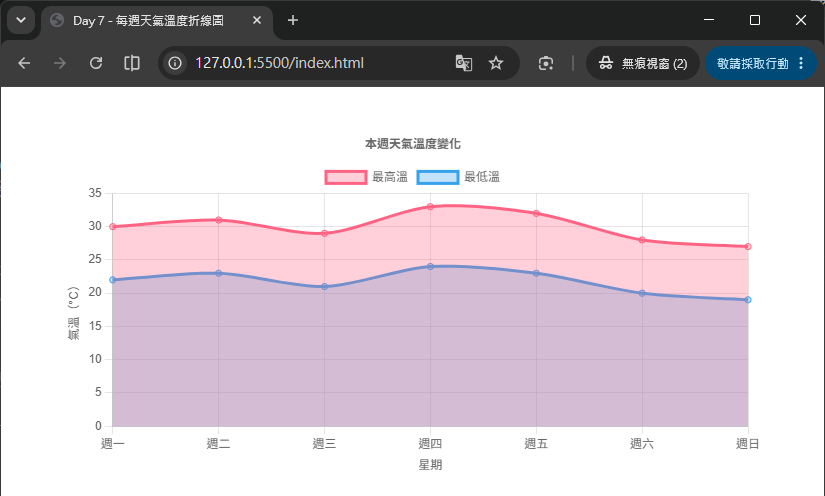
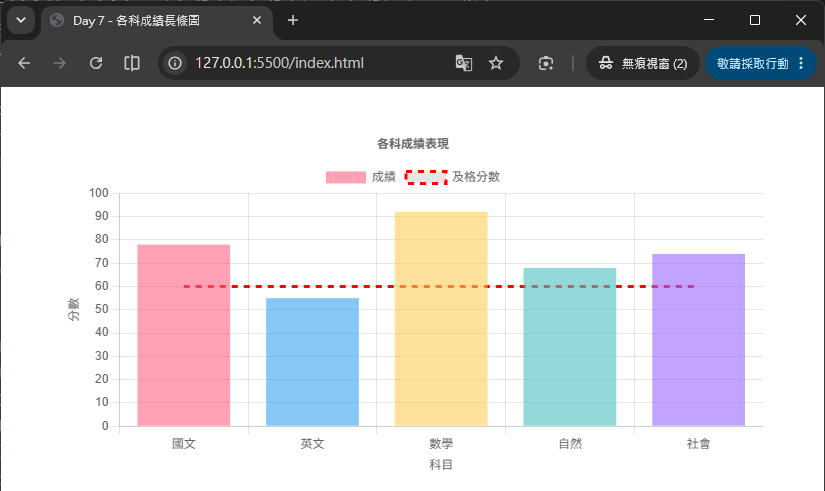

# Day 07 - 30 天手把手學會 Chart.js｜第一週總複習與小專案

> 一週過去了，我們從「認識 Chart.js」開始，陸續學會了折線圖、長條圖、圓餅圖／環狀圖、折線圖進階技巧，以及座標軸（Scales）的完整觀念。今天不學新的圖表類型，而是把前六天零散的知識點「串成一條線」：重新梳理 Chart.js 的核心 config 結構、資料綁定方式、樣式設定與座標軸設定，並透過兩個貼近生活的小專案——「每週天氣溫度」折線圖與「各科成績」長條圖——把所學知識真正動手實作出來。完成今天的內容後，你應該已經具備獨立畫出一張「有模有樣」的圖表的能力。

## 一、第一週學了什麼？快速回顧

在動手做小專案之前，先用一張表回顧這六天的重點，確認每個觀念都還記得：

| Day | 主題 | 核心重點 |
| --- | --- | --- |
| Day 1 | 認識 Chart.js | Chart.js 是什麼、能做什麼圖表、如何透過 CDN／npm 安裝、畫出第一張圖表 |
| Day 2 | Chart.js 基本結構 | `new Chart(ctx, config)` 的三大區塊：`type`、`data`、`options` |
| Day 3 | 長條圖 | `data.labels` + `datasets`、`backgroundColor`／`borderColor`、水平長條圖（`indexAxis: 'y'`） |
| Day 4 | 圓餅圖與環狀圖 | 無座標軸圖表、`Pie` 與 `Doughnut` 的差異、`cutout` 設定環狀圖的內圈大小 |
| Day 5 | 折線圖進階 | 多條線比較、區域圖（`fill`）、`tension` 曲線平滑度、`borderDash` 虛線樣式 |
| Day 6 | 座標軸 | `scales.x`／`scales.y`、`category`／`linear`／`time` 軸類型、雙 Y 軸、`chartjs-adapter-date-fns`、`chartjs-plugin-zoom` |

如果上面的表格中有任何一項你覺得「好像有點模糊」，建議先回頭翻閱對應的 Day 內容，再繼續往下閱讀，這樣今天的總複習與實作才會更有感覺。

## 二、總複習一：Chart.js 的 config 結構

每一張 Chart.js 圖表，本質上都是透過同一份「配置物件」（config）建立出來的：

```js
new Chart(ctx, {
  type: 'line',      // 圖表類型
  data: { /* ... */ }, // 資料本體
  options: { /* ... */ } // 各種外觀與行為設定
});
```

- **`ctx`**：畫布的繪圖上下文，通常是 `<canvas>` 元素或它的 2D context，Chart.js 會在這個畫布裡繪製圖表。
- **`type`**：決定圖表的種類，例如 `'line'`、`'bar'`、`'pie'`、`'doughnut'`。同一份 `data` 結構，換一個 `type` 常常就能換一種圖表呈現方式。
- **`data`**：圖表的資料本體，由 `labels`（座標軸標籤）與 `datasets`（一組或多組資料集）組成。
- **`options`**：控制圖表「長什麼樣子」與「怎麼互動」，例如標題、圖例、Tooltip、座標軸、動畫、是否 `responsive` 等。

記住這個「三大區塊」的心智模型，之後不管遇到哪一種圖表類型、多複雜的設定，都可以先問自己：「這個設定該放在 `data` 還是 `options`？」

## 三、總複習二：資料綁定（labels 與 datasets）

`data` 底下的兩個屬性搭配起來，決定了圖表要畫出「哪些資料」：

```js
data: {
  labels: ['一月', '二月', '三月', '四月', '五月'],
  datasets: [
    {
      label: '2025 年銷售額',
      data: [12, 19, 8, 15, 22],
      backgroundColor: 'rgba(54, 162, 235, 0.6)'
    }
  ]
}
```

- **`labels`**：座標軸上的類別標籤，長度應與每個 dataset 的 `data` 陣列長度一致，兩者是「一一對應」的關係（第一個標籤對應每個 dataset 的第一筆資料，以此類推）。
- **`datasets`**：一個陣列，陣列中每個物件代表「一組資料」。放入多個 dataset 物件，就能在同一張圖表上比較多組資料（例如 Day 5 學過的多條線比較）。
- 每個 dataset 除了 `data` 之外，也可以各自設定樣式（顏色、線條粗細……），彼此互不影響。

> 💡 小技巧：如果畫出來的圖表「資料對不上標籤」，八成是 `labels` 與 `data` 陣列的長度或順序沒有對齊，這是初學者最常犯的錯誤之一。

## 四、總複習三：基本樣式設定

樣式設定大致可以分成「dataset 層級」與「options 層級」兩種：

**dataset 層級**（只影響單一組資料）：

```js
{
  label: '平均氣溫',
  data: [18, 20, 25, 28, 24],
  borderColor: 'rgb(255, 99, 132)',
  backgroundColor: 'rgba(255, 99, 132, 0.5)',
  borderWidth: 2,
  tension: 0.3,      // 曲線平滑度（折線圖）
  fill: true          // 是否填色成區域圖（折線圖）
}
```

**options 層級**（影響整張圖表的外觀與互動）：

```js
options: {
  responsive: true,
  plugins: {
    title: { display: true, text: '本週氣溫變化' },
    legend: { display: true, position: 'top' },
    tooltip: { enabled: true }
  }
}
```

- `plugins.title`：圖表標題。
- `plugins.legend`：圖例的顯示與位置。
- `plugins.tooltip`：滑鼠移到資料點上顯示的提示框。
- `responsive: true`：讓圖表隨容器（父元素）大小自動縮放，是幾乎每張圖表都會加上的設定。

## 五、總複習四：座標軸（Scales）

Day 6 學到，直角座標圖表（Line、Bar）預設會有 `x` 軸與 `y` 軸，設定放在 `options.scales`：

```js
options: {
  scales: {
    x: {
      title: { display: true, text: '星期' }
    },
    y: {
      beginAtZero: true,          // 讓 y 軸從 0 開始，避免視覺誤導
      title: { display: true, text: '氣溫（°C）' }
    }
  }
}
```

- `beginAtZero: true`：強制軸從 0 開始，長條圖幾乎一定要加，避免長條高度比例失真。
- `title`：替軸加上說明文字，讓讀圖的人一眼就知道這條軸代表什麼單位。
- 圓餅圖、環狀圖這類「無座標軸」圖表不需要 `scales` 設定，這也是它們與 Line／Bar 圖表最大的結構差異。

有了以上四個總複習，我們已經具備動手做小專案所需的全部知識，接下來就開始實作！

## 六、小專案一：每週天氣溫度折線圖

### 需求說明

畫出一張折線圖，呈現「本週一到週日」的每日最高溫與最低溫，並且：

- x 軸顯示星期，y 軸顯示溫度（°C），y 軸從 0 開始。
- 用兩條不同顏色的線分別代表「最高溫」與「最低溫」，並填色成淡淡的區域圖。
- 圖表要有標題，並且滑鼠移到資料點上時，Tooltip 要顯示「XX°C」。

### 完整程式碼

HTML 版面內容如下：
```html
<div style="width: 700px; margin: 40px auto;">
  <canvas id="weatherChart"></canvas>
</div>
<script src="https://cdn.jsdelivr.net/npm/chart.js@4.5.1"></script>
```

JavaScript 程式碼內容如下：
```js
new Chart(document.getElementById('weatherChart'), {
  type: 'line',
  data: {
    labels: ['週一', '週二', '週三', '週四', '週五', '週六', '週日'],
    datasets: [
      {
        label: '最高溫',
        data: [30, 31, 29, 33, 32, 28, 27],
        borderColor: 'rgb(255, 99, 132)',
        backgroundColor: 'rgba(255, 99, 132, 0.3)',
        tension: 0.3,
        fill: true
      },
      {
        label: '最低溫',
        data: [22, 23, 21, 24, 23, 20, 19],
        borderColor: 'rgb(54, 162, 235)',
        backgroundColor: 'rgba(54, 162, 235, 0.3)',
        tension: 0.3,
        fill: true
      }
    ]
  },
  options: {
    responsive: true,
    plugins: {
      title: { display: true, text: '本週天氣溫度變化' },
      legend: { position: 'top' },
      tooltip: {
        callbacks: {
          label: (context) => `${context.dataset.label}：${context.parsed.y}°C`
        }
      }
    },
    scales: {
      x: {
        title: { display: true, text: '星期' }
      },
      y: {
        beginAtZero: true,
        title: { display: true, text: '氣溫（°C）' }
      }
    }
  }
});
```



## 七、小專案二：各科成績長條圖

### 需求說明

畫出一張長條圖，呈現某位學生「國文、英文、數學、自然、社會」五科的期末成績，並且：

- 加入一條「及格分數（60 分）」的參考資訊，讓人一眼判斷哪幾科不及格。
- y 軸從 0 開始，最高到 100 分。
- 不同科目使用不同顏色，方便視覺區分。

> 💡 Chart.js 沒有內建「參考線」這種圖層，最簡單的作法是額外建立一組 `type: 'line'` 的 dataset，資料值全部設成 60，畫出一條水平的及格線。

HTML 版面內容如下：
```html
<div style="width: 700px; margin: 40px auto;">
  <canvas id="scoreChart"></canvas>
</div>
<script src="https://cdn.jsdelivr.net/npm/chart.js@4.5.1"></script>
```

JavaScript 程式碼內容如下：
```js
new Chart(document.getElementById('scoreChart'), {
  data: {
    labels: ['國文', '英文', '數學', '自然', '社會'],
    datasets: [
      {
        type: 'bar',
        label: '成績',
        data: [78, 55, 92, 68, 74],
        backgroundColor: [
          'rgba(255, 99, 132, 0.6)',
          'rgba(54, 162, 235, 0.6)',
          'rgba(255, 206, 86, 0.6)',
          'rgba(75, 192, 192, 0.6)',
          'rgba(153, 102, 255, 0.6)'
        ]
      },
      {
        type: 'line',
        label: '及格分數',
        data: [60, 60, 60, 60, 60],
        borderColor: 'rgb(255, 0, 0)',
        borderDash: [6, 6],
        pointRadius: 0,
        fill: false
      }
    ]
  },
  options: {
    responsive: true,
    plugins: {
      title: { display: true, text: '各科成績表現' },
      legend: { position: 'top' }
    },
    scales: {
      y: {
        beginAtZero: true,
        max: 100,
        title: { display: true, text: '分數' }
      },
      x: {
        title: { display: true, text: '科目' }
      }
    }
  }
});
```



### 重點對照

- **config 結構**：這裡把 `type` 拿掉放在最外層，改為在每個 dataset 內個別指定 `type: 'bar'` / `type: 'line'`——這是「混合圖表」的雛形，讓長條圖與參考線同時出現在同一張畫布上。
- **資料綁定**：兩組 `datasets` 共用同一組 `labels`（五個科目），因此彼此的資料點會對齊在同一個科目位置上。
- **樣式設定**：`backgroundColor` 陣列讓每個長條有不同顏色；及格線用 `borderDash` 做出虛線、`pointRadius: 0` 隱藏資料點圓點，讓它看起來像一條參考線而非一般折線。
- **座標軸**：`y.max: 100` 搭配 `beginAtZero: true`，讓分數軸固定在 0～100 的合理範圍。

---

明天（Day 8）進入第二週：我們將學習**雷達圖（Radar Chart）**，用來呈現「多維度資料比較」，例如角色能力值分析、產品多面向評比等情境，並學習如何調整 `angleLines`、`pointLabels` 等雷達圖專屬的座標軸樣式設定。
