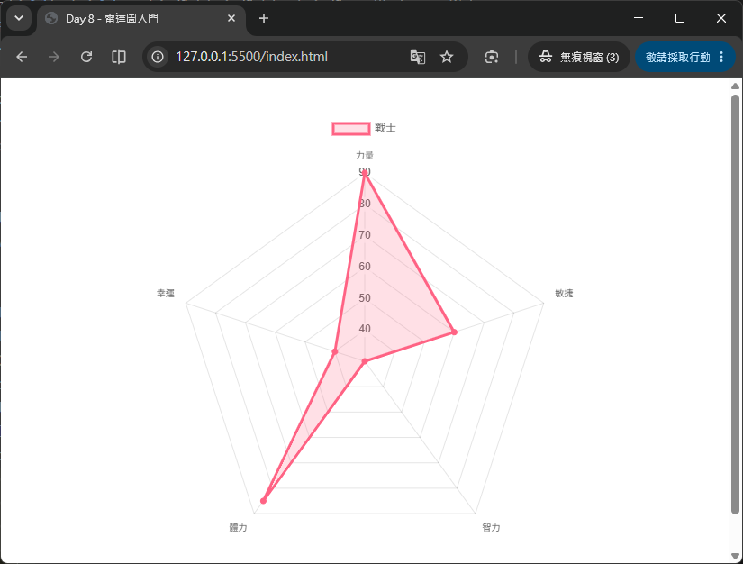
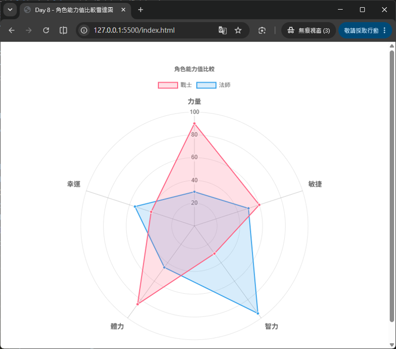

# Day 08 - 30 天手把手學會 Chart.js｜雷達圖（Radar Chart）

> 從今天開始，我們進入第二週：「常用圖表類型深入」。前一週學到的折線圖、長條圖、圓餅圖／環狀圖，都是拿「單一數值」去比較「不同類別」或「不同時間點」。但如果我們想比較的是「同一個對象在多個面向上的表現」——例如一位遊戲角色的「力量、敏捷、智力、體力、幸運」五項能力值，或是一款產品在「價格、品質、外觀、續航、售後服務」五個構面上的評比——這種「多維度資料比較」就是雷達圖（Radar Chart）最擅長的場景。今天我們會學會雷達圖的資料結構、專屬座標軸設定，並實作一個「角色能力值比較」的完整範例。

## 一、什麼是雷達圖？

雷達圖（Radar Chart，也常被稱為 Spider Chart 蜘蛛圖或 Star Chart 星狀圖）是一種以「中心點」為原點，向外輻射出多條軸線（每條軸線代表一個評比項目），並將每個項目的數值畫在對應軸線上、再把這些點依序連接起來，形成一個多邊形的圖表。

雷達圖最大的特色是：

- **多維度比較**：可以一次呈現 3 個以上的評比構面（軸線數量等於構面數量），比單純的長條圖更能呈現「整體輪廓」。
- **形狀即意義**：畫出來的多邊形形狀，可以直覺地看出這個對象「哪裡強、哪裡弱」——形狀越往外凸的軸，代表該項目數值越高。
- **適合多組資料疊圖比較**：把兩、三組資料的雷達圖疊在同一張圖上，可以很快比較出彼此在各構面的優劣差異（就像 Day 5 學過的「多條線比較」，只是換成了輻射狀的座標系）。

常見的應用情境包括：

- 遊戲角色 / 選手能力值分析（力量、敏捷、智力、體力、幸運）
- 產品多面向評比（價格、品質、外觀、續航力、售後服務）
- 員工績效考核（專業能力、溝通協調、團隊合作、抗壓性、創新力）
- 學生五育評量（德、智、體、群、美）

> 💡 小提醒：雷達圖的軸線數量建議至少 3 條以上才有意義（少於 3 條畫出來會失去多邊形的比較感），也不建議放太多軸線（超過 8～10 條容易讓圖表變得雜亂難讀）。

## 二、雷達圖與前面學過的圖表有什麼不同？

回顧一下 Day 2 學過的 Chart.js 三大 config 區塊：`type` + `data` + `options`。雷達圖同樣遵守這套結構，只是有兩個地方跟 Line／Bar 圖表不一樣：

| 項目 | Line / Bar 圖表 | Radar 圖表 |
| --- | --- | --- |
| 座標系 | 直角座標系（x 軸、y 軸） | 輻射座標系（以中心點向外放射） |
| 座標軸設定位置 | `options.scales.x`、`options.scales.y` | `options.scales.r`（只有一個座標軸，代號固定為 `r`） |
| labels 的意義 | 通常代表時間或類別（如星期、月份） | 代表每一個「評比構面」，會顯示在多邊形的每個頂點外側 |
| 資料呈現方式 | 用長條高度或折線位置表示數值 | 用「距離中心點的遠近」表示數值，數值越高離中心越遠 |

也就是說，雷達圖仍然是 `type: 'radar'` + `data`（`labels` + `datasets`）+ `options` 的組合，唯一需要特別學習的新觀念，就是專屬於雷達圖的座標軸 `scales.r`。

## 三、雷達圖的資料結構

雷達圖的 `data` 結構和折線圖、長條圖非常相似，一樣是 `labels` 對應 `datasets`：

```js
data: {
  labels: ['力量', '敏捷', '智力', '體力', '幸運'],
  datasets: [
    {
      label: '戰士',
      data: [90, 60, 30, 85, 40]
    }
  ]
}
```

- **`labels`**：這裡不再是時間軸或類別軸的刻度，而是雷達圖每一個「頂點」所代表的評比項目，會顯示在多邊形頂點外側（也就是稍後會學到的 `pointLabels`）。
- **`datasets[].data`**：每一筆資料對應同一索引位置的 `label`。例如 `data[0] = 90` 對應 `labels[0] = '力量'`，代表「力量」這個構面的數值是 90。
- 和折線圖一樣，`datasets` 是陣列，可以放入多組資料，讓多個雷達圖形狀疊加在同一張圖上做比較（例如「戰士」vs.「法師」）。

## 四、最小可執行範例

先來看一個最簡單的雷達圖範例，感受一下整體結構：

HTML 版面內容如下：
```html
<div style="width: 500px; margin: 40px auto;">
  <canvas id="basicRadar"></canvas>
</div>
<script src="https://cdn.jsdelivr.net/npm/chart.js@4.5.1"></script>
```

JavaScript 程式碼內容如下：
```js
new Chart(document.getElementById('basicRadar'), {
  type: 'radar',
  data: {
    labels: ['力量', '敏捷', '智力', '體力', '幸運'],
    datasets: [
      {
        label: '戰士',
        data: [90, 60, 30, 85, 40],
        backgroundColor: 'rgba(255, 99, 132, 0.2)',
        borderColor: 'rgb(255, 99, 132)',
        pointBackgroundColor: 'rgb(255, 99, 132)'
      }
    ]
  }
});
```



只要把 `type` 設成 `'radar'`，並準備好 `labels`（評比項目）與 `datasets`（各項目的數值），Chart.js 就會自動幫我們畫出一個五邊形的雷達圖，並且預設就會有格線與頂點標籤，非常方便。

## 五、雷達圖專屬座標軸：`scales.r`

雷達圖只有一個座標軸，慣例上代號固定為 `r`（radial，徑向的意思），所有跟座標軸相關的設定都寫在 `options.scales.r` 裡面：

```js
options: {
  scales: {
    r: {
      // 各種雷達圖座標軸設定都寫在這裡
    }
  }
}
```

`scales.r` 底下常用的設定可以分成三大類：整體座標軸設定、角度線（`angleLines`）、頂點標籤（`pointLabels`），以下逐一介紹。

### 5-1 整體座標軸設定

```js
scales: {
  r: {
    beginAtZero: true,     // 數值軸從 0 開始
    min: 0,                // 座標軸最小值
    max: 100,              // 座標軸最大值
    suggestedMin: 0,       // 建議最小值（不強制，會依資料自動微調）
    suggestedMax: 100,     // 建議最大值
    ticks: {
      stepSize: 20         // 每隔 20 畫一個刻度圈
    }
  }
}
```

- **`beginAtZero`**：和長條圖、折線圖的用法一樣，確保數值軸從 0 開始，避免圖形比例失真。
- **`min` / `max`**：直接指定座標軸的最小、最大值，設定後即使資料超出範圍也不會顯示（可能會被裁切）。
- **`suggestedMin` / `suggestedMax`**：只是「建議」範圍，Chart.js 仍會依照實際資料自動調整，比 `min`／`max` 更有彈性，通常用來確保軸線至少涵蓋某個範圍（例如能力值滿分是 100，就算資料最高只有 90，也希望軸線畫到 100）。
- **`ticks.stepSize`**：控制每隔多少數值畫一個同心圓刻度線，數字越小，同心圓越密集。

### 5-2 角度線設定：`angleLines`

「角度線」指的是從中心點放射到每個頂點的那幾條直線（就像蜘蛛網的輻射線）：

```js
scales: {
  r: {
    angleLines: {
      display: true,           // 是否顯示角度線，預設 true
      color: 'rgba(0, 0, 0, 0.2)',
      lineWidth: 1
    }
  }
}
```

- `display: false` 可以把角度線隱藏，讓圖表看起來更簡潔（只留下同心圓的格線與多邊形本身）。
- `color`／`lineWidth` 可以調整角度線的顏色與粗細，讓它跟資料本身的顏色有所區隔。

### 5-3 頂點標籤設定：`pointLabels`

「頂點標籤」就是顯示在每個角度線末端的文字（也就是 `labels` 陣列裡的內容，例如「力量」「敏捷」）：

```js
scales: {
  r: {
    pointLabels: {
      display: true,
      font: {
        size: 14,
        weight: 'bold'
      },
      color: '#333'
    }
  }
}
```

- `font.size`／`font.weight`：調整標籤文字的大小與粗細，項目名稱較長時可以適度縮小字級避免重疊。
- `color`：標籤文字顏色。
- `display: 'auto'`：當標籤彼此重疊時，Chart.js 會自動隱藏部分標籤，避免畫面雜亂（適合軸線數量較多的情境）。

### 5-4 格線設定：`grid`

同心圓格線（代表數值刻度）的樣式則寫在 `scales.r.grid`：

```js
scales: {
  r: {
    grid: {
      color: 'rgba(0, 0, 0, 0.1)',
      circular: true   // 讓格線畫成正圓形，而不是多邊形
    }
  }
}
```

- `circular: true` 是雷達圖很常用的美化技巧：預設格線會依照軸線數量畫成多邊形（例如 5 條軸線就是五邊形格線），設定 `circular: true` 後會改成畫成正圓形，視覺上更接近傳統「雷達」的樣子。

## 六、完整範例：角色能力值比較雷達圖

接下來做一個更完整的練習：比較「戰士」與「法師」兩個角色在「力量、敏捷、智力、體力、幸運」五項能力值上的差異。

HTML 版面內容如下：
```html
<div style="width: 600px; margin: 40px auto;">
  <canvas id="characterRadar"></canvas>
</div>
<script src="https://cdn.jsdelivr.net/npm/chart.js@4.5.1"></script>
```

JavaScript 程式碼內容如下：
```js
new Chart(document.getElementById('characterRadar'), {
  type: 'radar',
  data: {
    labels: ['力量', '敏捷', '智力', '體力', '幸運'],
    datasets: [
      {
        label: '戰士',
        data: [90, 60, 30, 85, 40],
        backgroundColor: 'rgba(255, 99, 132, 0.2)',
        borderColor: 'rgb(255, 99, 132)',
        pointBackgroundColor: 'rgb(255, 99, 132)',
        pointBorderColor: '#fff',
        pointHoverBackgroundColor: '#fff',
        pointHoverBorderColor: 'rgb(255, 99, 132)'
      },
      {
        label: '法師',
        data: [30, 50, 95, 45, 55],
        backgroundColor: 'rgba(54, 162, 235, 0.2)',
        borderColor: 'rgb(54, 162, 235)',
        pointBackgroundColor: 'rgb(54, 162, 235)',
        pointBorderColor: '#fff',
        pointHoverBackgroundColor: '#fff',
        pointHoverBorderColor: 'rgb(54, 162, 235)'
      }
    ]
  },
  options: {
    responsive: true,
    plugins: {
      title: {
        display: true,
        text: '角色能力值比較'
      },
      legend: {
        position: 'top'
      }
    },
    scales: {
      r: {
        beginAtZero: true,
        min: 0,
        max: 100,
        ticks: {
          stepSize: 20
        },
        angleLines: {
          color: 'rgba(0, 0, 0, 0.2)'
        },
        grid: {
          circular: true
        },
        pointLabels: {
          font: {
            size: 14,
            weight: 'bold'
          }
        }
      }
    },
    elements: {
      line: {
        borderWidth: 2
      }
    }
  }
});
```



### 重點解說

- **`fill` 沒有特別關掉**：雷達圖 dataset 的 `backgroundColor` 預設就會把多邊形內部填上半透明顏色，讓「戰士」跟「法師」的形狀範圍能一眼區分，如果不想要填色效果，可以在 dataset 加上 `fill: false`。
- **兩組資料共用同一組 `labels`**：這是多組雷達圖疊圖比較的前提，`labels` 陣列的順序與數量必須完全一致，兩個角色的能力值才能對齊在同樣的軸線上。
- **`scales.r.grid.circular: true`**：讓格線變成正圓形，是雷達圖很常見的美化做法。
- **`elements.line.borderWidth`**：這是 `options` 層級的全域設定，會套用到所有 dataset 的線條寬度，如果 dataset 本身有指定 `borderWidth`，則以 dataset 的設定為優先。

畫出來的結果會呈現兩個顏色不同、部分重疊的多邊形：「戰士」的形狀會在「力量」「體力」方向明顯外凸，而「法師」則會在「智力」方向外凸，一眼就能看出兩個角色的能力分佈差異。

## 七、Point 樣式客製化

雷達圖的每個頂點資料點，也可以像折線圖一樣客製化樣式，讓圖表更活潑：

```js
{
  label: '弓箭手',
  data: [55, 95, 40, 60, 50],
  pointStyle: 'rectRot',   // 頂點形狀：菱形
  pointRadius: 6,          // 頂點大小
  pointHoverRadius: 9,     // 滑鼠移過時的頂點大小
  borderDash: [5, 5]       // 虛線邊框
}
```

- `pointStyle`：支援 `'circle'`、`'triangle'`、`'rect'`、`'rectRot'`（旋轉矩形／菱形）、`'star'` 等多種形狀，方便在多組資料疊圖時，即使色盲或黑白列印也能靠形狀區分。
- `borderDash`：和折線圖一樣可以做出虛線邊框效果，用來凸顯「預測值」或「平均基準線」等特殊資料集。

---

明天（Day 9）我們將學習**極座標圖（Polar Area Chart）**，同樣屬於「輻射狀」座標系的圖表家族，會比較它與圓餅圖（Pie Chart）、雷達圖之間的差異，並探討各自最適合呈現的資料情境。

## 參考資源

- [Chart.js](https://www.chartjs.org/)
- [Chart.js GitHub](https://github.com/chartjs/Chart.js)
