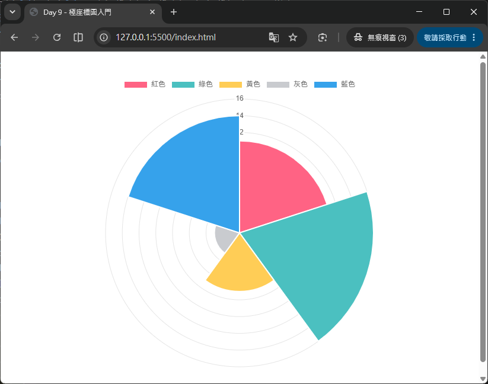
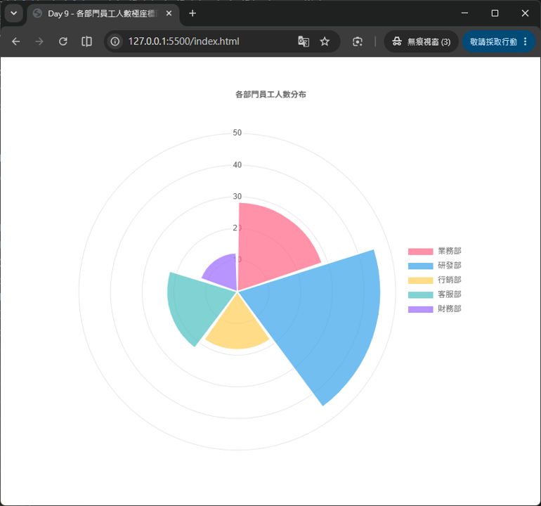

# Day 09 - 30 天手把手學會 Chart.js｜極座標圖（Polar Area Chart）

> 昨天（Day 8）我們學會了雷達圖（Radar Chart），用「輻射狀座標系」來比較「同一個對象在多個構面上的表現」。今天要介紹的極座標圖（Polar Area Chart），同樣是輻射狀座標系的圖表家族成員，但它要解決的問題卻更接近圓餅圖（Pie Chart）——呈現「各類別佔整體的比例」。差別在於，極座標圖多了一個「半徑代表數值大小」的維度，讓圖表除了比例之外，還能同時傳達「數值高低」的資訊。今天我們會釐清極座標圖與圓餅圖、雷達圖的差異，並實作一個完整的「各類別數值比較」範例。

## 一、什麼是極座標圖？

極座標圖（Polar Area Chart）是一種每個資料項目都佔「相同角度」、但用「半徑長短」來表示數值大小的圖表。想像把一個圓餅圖的每一片都切成「相同角度的扇形」（例如 5 筆資料，每片固定佔 72 度），然後讓每一片扇形依照自己的數值，往外延伸出不同的半徑長度——半徑越長，代表數值越大。

Chart.js 官方文件對極座標圖的定義非常精準：

> Polar area charts are similar to pie charts, but each segment has the same angle - the radius of the segment differs depending on the value.

用白話來說，極座標圖的特色是：

- **每一片扇形的「角度」都相同**：不像圓餅圖是用角度大小來表示比例，極座標圖的角度是固定平分的（例如 5 筆資料就是 360° ÷ 5 = 72° 一片）。
- **每一片扇形的「半徑」代表數值大小**：數值越大，扇形就往外延伸得越遠，數值越小則越靠近中心點。
- **同時具備「分類比較」與「數值刻度」兩種資訊**：圓餅圖只能看出「佔比」，極座標圖因為有半徑座標軸（就像雷達圖的 `scales.r`），還能搭配格線刻度，讓使用者一眼看出實際數值的大致範圍。

常見的應用情境包括：

- 各類別的統計數量比較（如：各部門員工人數、各產品類別銷售件數）
- 需要同時呈現「類別分佈」與「數值刻度感」的場景（例如問卷調查中各選項的得票數）
- 風向玫瑰圖、雷達訊號強度等具有「方向 + 強度」概念的資料視覺化

> 💡 小提醒：極座標圖並不是拿來取代圓餅圖或雷達圖，而是介於兩者之間的一種呈現方式——想強調「精確佔比」用圓餅圖／環狀圖，想強調「多維度輪廓」用雷達圖，想同時看到「類別比較」又想保留「數值刻度」的直覺感，就適合用極座標圖。

## 二、極座標圖 vs. 圓餅圖：差異在哪裡？

回顧一下 Day 4 學過的圓餅圖（Pie Chart）與環狀圖（Doughnut Chart），兩者都是用「角度大小」代表資料佔比，資料總和會被視為 360 度圓周，數值越大、切出來的那一片角度就越大。

極座標圖則完全不是這個邏輯，兩者的差異可以整理成下表：

| 項目 | 圓餅圖（Pie Chart） | 極座標圖（Polar Area Chart） |
| --- | --- | --- |
| 角度（每一片扇形所佔的角度） | 依數值比例分配，數值越大角度越大 | 固定平分，每片角度都相同 |
| 半徑（每一片扇形延伸的長度） | 固定不變，所有扇形半徑一樣長 | 依數值大小決定，數值越大半徑越長 |
| 座標軸 | 沒有座標軸概念 | 有徑向座標軸 `scales.r`（與雷達圖相同代號），可顯示刻度格線 |
| 視覺重點 | 強調「佔整體的比例」 | 同時強調「類別」與「數值大小」，並保留刻度參考 |
| `type` 設定 | `'pie'` / `'doughnut'` | `'polarArea'` |

簡單說：圓餅圖是「用角度說故事」，極座標圖是「用半徑說故事」，而且極座標圖因為保留了座標軸刻度，資料的「絕對數值」比圓餅圖更容易被讀者感知到（圓餅圖只能感受相對比例，很難直接看出兩片之間差了多少數值）。

## 三、極座標圖 vs. 雷達圖：差異在哪裡？

極座標圖和雷達圖（Day 8）同樣都使用輻射狀座標系、同樣都有 `scales.r` 這個徑向座標軸，非常容易搞混，這裡整理兩者的核心差異：

| 項目 | 雷達圖（Radar Chart） | 極座標圖（Polar Area Chart） |
| --- | --- | --- |
| 圖形呈現方式 | 把各軸上的數值點連接成一個多邊形外框（線條圖形） | 每個類別各自畫成一片獨立的扇形（面積圖形） |
| 資料集數量 | 通常會疊加多組 `datasets` 比較（如：戰士 vs. 法師） | 通常只有**一組** `dataset`，`data` 陣列中的每個數值各自對應一個扇形 |
| `backgroundColor` 的用途 | 整個多邊形共用一種底色（半透明填色） | 每一片扇形可以各自指定不同顏色（陣列形式，類似圓餅圖） |
| 視覺焦點 | 強調「整體輪廓形狀」的比較 | 強調「各類別彼此之間」的數值差異 |

也就是說，雷達圖適合「多組對象、跨多個構面」的比較（例如多個角色的能力值），極座標圖則更接近「單一組資料、跨多個類別」的比較（例如單一份問卷中各選項的票數），在資料結構的使用習慣上與圓餅圖更相似。

## 四、極座標圖的資料結構

極座標圖的 `data` 結構跟圓餅圖幾乎一模一樣，一樣是 `labels` 搭配 `datasets`，而且通常只需要**一組** dataset：

```js
data: {
  labels: ['紅色', '綠色', '黃色', '灰色', '藍色'],
  datasets: [
    {
      label: '票數統計',
      data: [11, 16, 7, 3, 14],
      backgroundColor: [
        'rgb(255, 99, 132)',
        'rgb(75, 192, 192)',
        'rgb(255, 205, 86)',
        'rgb(201, 203, 207)',
        'rgb(54, 162, 235)'
      ]
    }
  ]
}
```

- **`labels`**：每一個類別的名稱，會顯示在圖例（legend）以及滑鼠移過扇形時的提示框（tooltip）中。
- **`datasets[].data`**：一組數字陣列，Chart.js 會依照這些數字決定每一片扇形延伸的半徑長度（數值本身不需要總和為 100 或任何固定值，Chart.js 只是依照座標軸範圍畫出對應長度）。
- **`backgroundColor`**：這裡要注意跟雷達圖不同——雷達圖的 `backgroundColor` 通常是「一組資料集一個顏色」，但極座標圖因為每一片扇形代表不同類別，`backgroundColor` 通常會傳入一個「顏色陣列」，讓每一片扇形有各自的顏色（用法上更接近圓餅圖）。

## 五、最小可執行範例

先來看一個最簡單的極座標圖範例，感受一下整體結構：

HTML 版面內容如下：
```html
<div style="width: 500px; margin: 40px auto;">
  <canvas id="basicPolarArea"></canvas>
</div>
<script src="https://cdn.jsdelivr.net/npm/chart.js@4.5.1"></script>
```

JavaScript 程式碼內容如下：
```js
new Chart(document.getElementById('basicPolarArea'), {
  type: 'polarArea',
  data: {
    labels: ['紅色', '綠色', '黃色', '灰色', '藍色'],
    datasets: [
      {
        label: '票數統計',
        data: [11, 16, 7, 3, 14],
        backgroundColor: [
          'rgb(255, 99, 132)',
          'rgb(75, 192, 192)',
          'rgb(255, 205, 86)',
          'rgb(201, 203, 207)',
          'rgb(54, 162, 235)'
        ]
      }
    ]
  }
});
```



只要把 `type` 設成 `'polarArea'`，並準備好 `labels`（類別名稱）與 `datasets`（每個類別的數值），Chart.js 就會自動幫我們畫出固定角度、依數值延伸半徑的扇形圖，並且預設就會有徑向格線可供對照。

## 六、極座標圖專屬座標軸：`scales.r`（Radial Linear Scale）

和雷達圖一樣，極座標圖也只有一個座標軸，代號同樣是 `r`，這個座標軸的類型稱為 `radialLinear`（徑向線性座標軸）：

```js
options: {
  scales: {
    r: {
      // 各種極座標圖座標軸設定都寫在這裡
    }
  }
}
```

常用設定與雷達圖非常相似，這裡列出極座標圖最實用的幾項：

### 6-1 數值範圍設定

```js
scales: {
  r: {
    beginAtZero: true,   // 數值軸從 0 開始（強烈建議開啟，否則半徑比例會失真）
    min: 0,
    max: 20,
    ticks: {
      stepSize: 5,        // 每隔 5 畫一個刻度圈
      backdropColor: 'rgba(255, 255, 255, 0.8)' // 刻度文字底色，避免被格線蓋住看不清楚
    }
  }
}
```

- `beginAtZero`：極座標圖是用「半徑長度」表達數值大小，如果座標軸沒有從 0 開始，半徑比例會失真，讓讀者誤判數值差異，因此極座標圖幾乎都會搭配 `beginAtZero: true` 使用。
- `ticks.backdropColor`：因為扇形會直接畫在刻度文字上面，預設 Chart.js 會幫刻度文字加上一層底色墊底，讓文字不會被扇形顏色蓋過去看不清楚。

### 6-2 格線與角度線

```js
scales: {
  r: {
    grid: {
      color: 'rgba(0, 0, 0, 0.1)'
    },
    angleLines: {
      display: true,
      color: 'rgba(0, 0, 0, 0.15)'
    }
  }
}
```

- `grid`：同心圓格線樣式，用法與雷達圖相同。
- `angleLines`：每一片扇形交界處放射出去的分隔線，`display: false` 可以隱藏它，讓扇形之間的界線更依賴顏色本身區分。

> 💡 極座標圖的 `scales.r` 不需要設定 `pointLabels`（雷達圖用來顯示頂點文字），因為極座標圖的類別名稱是顯示在圖例與 tooltip 裡，而不是顯示在座標軸頂點上。

## 七、資料集層級的樣式設定

除了座標軸，極座標圖的 dataset 本身也有幾個專屬設定值得認識：

```js
{
  label: '票數統計',
  data: [11, 16, 7, 3, 14],
  backgroundColor: [
    'rgb(255, 99, 132)',
    'rgb(75, 192, 192)',
    'rgb(255, 205, 86)',
    'rgb(201, 203, 207)',
    'rgb(54, 162, 235)'
  ],
  borderColor: '#fff',
  borderWidth: 2,
  borderAlign: 'center',   // 'center'（預設）或 'inner'
  spacing: 2,              // 扇形之間的間距（像素）
  circular: true           // 每片扇形的外緣是否為弧形（false 則畫成直線的多邊形切片）
}
```

- **`borderAlign`**：控制扇形邊框的對齊方式。預設 `'center'` 時，相鄰扇形的邊框會互相重疊；設為 `'inner'` 則可以確保邊框都畫在扇形內側，彼此不重疊，畫面看起來更乾淨。
- **`spacing`**：讓每片扇形之間留出一點間隙（單位是像素），適合想要「甜甜圈式分離」視覺效果的情境。
- **`circular`**：預設為 `true`，扇形外緣會依照半徑畫成弧形；設為 `false` 則外緣會畫成直線，讓整個圖表看起來像是多邊形切片組合而成。
- **`borderDash`／`borderDashOffset`**：和其他圖表一樣，可以讓扇形邊框變成虛線樣式。

## 八、完整範例：各部門員工人數極座標圖

接下來做一個更完整的練習：呈現公司內「業務部、研發部、行銷部、客服部、財務部」五個部門的員工人數。

HTML 版面內容如下：
```html
<div style="width: 600px; margin: 40px auto;">
  <canvas id="departmentPolarArea"></canvas>
</div>
<script src="https://cdn.jsdelivr.net/npm/chart.js@4.5.1"></script>
```

JavaScript 程式碼內容如下：
```js
new Chart(document.getElementById('departmentPolarArea'), {
  type: 'polarArea',
  data: {
    labels: ['業務部', '研發部', '行銷部', '客服部', '財務部'],
    datasets: [
      {
        label: '員工人數',
        data: [28, 45, 18, 22, 12],
        backgroundColor: [
          'rgba(255, 99, 132, 0.7)',
          'rgba(54, 162, 235, 0.7)',
          'rgba(255, 205, 86, 0.7)',
          'rgba(75, 192, 192, 0.7)',
          'rgba(153, 102, 255, 0.7)'
        ],
        borderColor: '#fff',
        borderWidth: 2,
        spacing: 3
      }
    ]
  },
  options: {
    responsive: true,
    plugins: {
      title: {
        display: true,
        text: '各部門員工人數分布'
      },
      legend: {
        position: 'right'
      }
    },
    scales: {
      r: {
        beginAtZero: true,
        ticks: {
          stepSize: 10,
          backdropColor: 'rgba(255, 255, 255, 0.75)'
        },
        angleLines: {
          color: 'rgba(0, 0, 0, 0.15)'
        }
      }
    },
    animation: {
      animateRotate: true,
      animateScale: true
    }
  }
});
```



### 重點解說

- **只有一組 `dataset`**：和圓餅圖一樣，極座標圖通常只需要一組 `data` 陣列，每個數值各自對應一片扇形，不像雷達圖常常需要疊加多組資料集比較。
- **`backgroundColor` 是陣列**：五個部門要有五種不同顏色，所以 `backgroundColor` 要傳入對應數量的顏色陣列，這點與雷達圖（一組 dataset 通常只用一種顏色）明顯不同。
- **`scales.r.beginAtZero: true`**：務必開啟，確保「研發部 45 人」的扇形半徑，看起來真的是「財務部 12 人」扇形半徑的合理倍數關係，不會失真。
- **`legend.position: 'right'`**：極座標圖通常搭配圖例來標示每片扇形對應的類別名稱，位置可依版面需求調整（`'top'`／`'bottom'`／`'left'`／`'right'`）。
- **`animation.animateRotate` 與 `animation.animateScale`**：這是極座標圖（與圓餅圖、雷達圖）專屬的兩個動畫選項：`animateRotate` 讓圖表進場時有「旋轉展開」的動畫效果，`animateScale` 讓圖表從中心點「由小放大」展開，兩者預設都是 `true`，可依需求關閉其中一項做出不同的進場效果。

畫出來的結果會是五片角度相同、但半徑各不相同的扇形，研發部（45 人）的扇形會明顯延伸得比財務部（12 人）更遠，讀者可以同時感受到「五個部門的人數差異」以及「大致的實際數值範圍」。

---

明天（Day 10）我們將學習**氣泡圖與散佈圖（Bubble / Scatter）**，這兩種圖表會回到直角座標系，並且引入 `(x, y)` 甚至 `(x, y, r)` 三維資料的呈現方式，特別適合用來觀察資料的相關性與分布情形。

## 參考資源

- [Chart.js - Polar Area Chart](https://www.chartjs.org/docs/latest/charts/polar.html)
- [Chart.js GitHub](https://github.com/chartjs/Chart.js)
