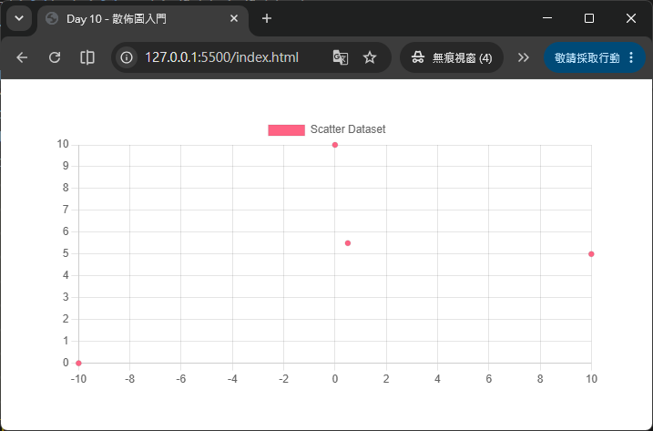
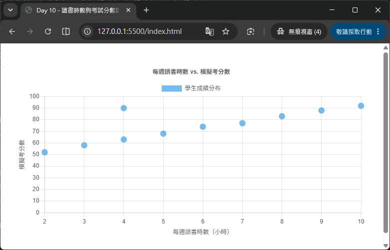
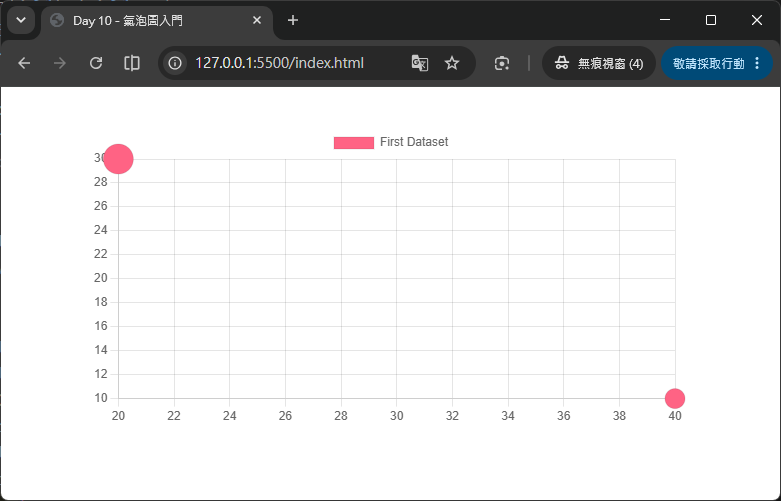
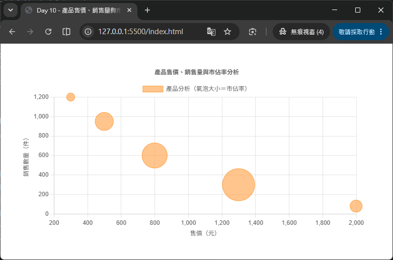

# Day 10 - 30 天手把手學會 Chart.js｜氣泡圖與散佈圖（Bubble / Scatter）

> 昨天（Day 9）我們認識了極座標圖，它跟雷達圖一樣屬於「輻射狀座標系」的圖表家族。今天要切回大家最熟悉的「直角座標系」（跟長條圖、折線圖一樣有 x 軸、y 軸），介紹兩種專門用來呈現「數值對數值」關係的圖表：散佈圖（Scatter Chart）與氣泡圖（Bubble Chart）。這兩種圖表不再像折線圖、長條圖那樣以「類別」作為 x 軸，而是讓 x 軸也變成「數值座標軸」，非常適合用來觀察兩組數值資料之間的相關性，甚至進一步用「點的大小」表達第三個維度的資訊。

## 一、為什麼需要散佈圖與氣泡圖？

回想一下前面幾天學過的圖表，長條圖、折線圖、雷達圖……它們的 x 軸幾乎都是「類別資料」（categories），例如月份、部門名稱、產品名稱。這種圖表適合回答「不同類別之間，某個數值誰高誰低」的問題。

但有些資料的本質，並不是「類別 vs. 數值」，而是「數值 vs. 數值」。例如：

- 學生的「讀書時數」與「考試分數」之間有沒有關聯？
- 商品的「售價」與「銷售數量」之間是不是負相關？
- 使用者的「年齡」「月消費金額」「消費頻率」三者之間的關係？

這類「觀察兩組（甚至三組）數值資料彼此關聯性」的需求，就是散佈圖與氣泡圖擅長的場景：

- **散佈圖（Scatter Chart）**：呈現「兩個數值維度」（x, y）之間的關係，畫面上每一個點就是一筆資料，適合用來觀察資料的分布趨勢、群聚情形、有沒有離群值（outlier）。
- **氣泡圖（Bubble Chart）**：在散佈圖的基礎上，再加入「第三個數值維度」（r，也就是半徑），讓每個點除了位置之外，還能用「圓圈大小」表達額外的資訊，適合呈現三維資料（x, y, r）。

> 💡 小提醒：散佈圖和氣泡圖都不再使用 `labels` 來標示 x 軸的類別，因為 x 軸本身就是數值座標軸（linear scale），資料點的位置完全由數值決定。

## 二、散佈圖 vs. 氣泡圖：差異在哪裡？

散佈圖與氣泡圖的關係，很像 Day 8 雷達圖與 Day 9 極座標圖的關係——氣泡圖可以看成是散佈圖「多了一個維度」的進化版。兩者的差異整理如下：

| 項目 | 散佈圖（Scatter Chart） | 氣泡圖（Bubble Chart） |
| --- | --- | --- |
| 資料維度 | 二維：`(x, y)` | 三維：`(x, y, r)` |
| 每筆資料格式 | `{ x: number, y: number }` | `{ x: number, y: number, r: number }` |
| 點的大小 | 固定大小（由 `radius` 統一設定） | 依照 `r` 值各自決定大小 |
| `type` 設定 | `'scatter'` | `'bubble'` |
| 底層實作 | 由折線圖（Line Chart）衍生而來，`showLine` 預設為 `false` | 獨立的圖表控制器（`BubbleController`） |
| 常見情境 | 相關性分析、迴歸分析、分布觀察 | 需要額外呈現「權重」「規模」「重要程度」等第三維度時 |

Chart.js 官方文件對散佈圖的定義相當直白：

> Scatter charts are based on basic line charts with the x-axis changed to a linear axis.

也就是說，散佈圖其實是折線圖的變形——把 x 軸從類別軸換成數值軸，並且預設不畫連接線（`showLine: false`），只畫出一個一個獨立的點。而氣泡圖則是完全獨立的圖表類型，多了半徑 `r` 這個屬性。

## 三、散佈圖的資料結構

散佈圖不使用 `labels`，`data` 陣列裡的每一筆資料都必須是一個包含 `x`、`y` 屬性的物件：

```js
data: {
  datasets: [
    {
      label: '讀書時數 vs. 考試分數',
      data: [
        { x: 1, y: 55 },
        { x: 2, y: 60 },
        { x: 3, y: 68 },
        { x: 4, y: 72 },
        { x: 5, y: 80 },
        { x: 6, y: 88 }
      ],
      backgroundColor: 'rgb(255, 99, 132)'
    }
  ]
}
```

- **不需要 `labels`**：因為 x 軸本身就是數值座標軸，每個點的 x 座標就是資料本身的一部分，不需要另外用文字標籤標示類別。
- **`data` 是物件陣列**：每個物件至少要有 `x` 與 `y` 兩個數值屬性，Chart.js 會依照這兩個數值，把每個點畫在對應的座標位置上。
- **x 軸必須是 `linear`（或 `time`）類型**：因為散佈圖的 x 軸不是類別軸，所以要在 `options.scales.x.type` 明確指定為 `'linear'`（如果 x 是日期資料，則可以用 Day 5 學過的 `'time'` 類型，並搭配 `chartjs-adapter-date-fns`）。

## 四、最小可執行範例：散佈圖

HTML 版面內容如下：
```html
<div style="width: 600px; margin: 40px auto;">
  <canvas id="basicScatter"></canvas>
</div>
<script src="https://cdn.jsdelivr.net/npm/chart.js@4.5.1"></script>
```

JavaScript 程式碼內容如下：
```js
new Chart(document.getElementById('basicScatter'), {
  type: 'scatter',
  data: {
    datasets: [
      {
        label: 'Scatter Dataset',
        data: [
          { x: -10, y: 0 },
          { x: 0, y: 10 },
          { x: 10, y: 5 },
          { x: 0.5, y: 5.5 }
        ],
        backgroundColor: 'rgb(255, 99, 132)'
      }
    ]
  },
  options: {
    scales: {
      x: {
        type: 'linear',
        position: 'bottom'
      }
    }
  }
});
```



`type: 'scatter'` 搭配「物件陣列」格式的 `data`，再加上 `scales.x.type: 'linear'`，就能畫出最基本的散佈圖。畫面上只會看到一個個獨立的圓點，彼此之間不會用線條連接。

## 五、完整範例：讀書時數與考試分數的相關性分析

接下來做一個更貼近實務的練習：觀察「每週讀書時數」與「模擬考分數」之間是否存在正相關。

HTML 版面內容如下：
```html
<div style="width: 700px; margin: 40px auto;">
  <canvas id="studyScoreScatter"></canvas>
</div>
<script src="https://cdn.jsdelivr.net/npm/chart.js@4.5.1"></script>
```

JavaScript 程式碼內容如下：
```js
new Chart(document.getElementById('studyScoreScatter'), {
  type: 'scatter',
  data: {
    datasets: [
      {
        label: '學生成績分布',
        data: [
          { x: 2, y: 52 },
          { x: 3, y: 58 },
          { x: 4, y: 63 },
          { x: 5, y: 68 },
          { x: 6, y: 74 },
          { x: 7, y: 77 },
          { x: 8, y: 83 },
          { x: 9, y: 88 },
          { x: 10, y: 92 },
          { x: 4, y: 90 }  // 故意放一個離群值（讀書時數少，但分數很高）
        ],
        backgroundColor: 'rgba(54, 162, 235, 0.7)',
        pointRadius: 6,
        pointHoverRadius: 9
      }
    ]
  },
  options: {
    responsive: true,
    plugins: {
      title: {
        display: true,
        text: '每週讀書時數 vs. 模擬考分數'
      },
      tooltip: {
        callbacks: {
          label: (context) => {
            const { x, y } = context.raw;
            return `讀書時數：${x} 小時，分數：${y} 分`;
          }
        }
      }
    },
    scales: {
      x: {
        type: 'linear',
        position: 'bottom',
        title: {
          display: true,
          text: '每週讀書時數（小時）'
        }
      },
      y: {
        title: {
          display: true,
          text: '模擬考分數'
        },
        suggestedMin: 0,
        suggestedMax: 100
      }
    }
  }
});
```



### 重點解說

- **`pointRadius` / `pointHoverRadius`**：散佈圖的每個點其實就是折線圖的「點元素」（point element），所以折線圖能用的 `pointRadius`（點的大小）、`pointHoverRadius`（滑鼠移過時的大小）在散佈圖上一樣適用。
- **離群值（outlier）一眼可見**：這正是散佈圖最大的優勢——只要有一筆資料偏離整體趨勢（例如上面故意放的「讀書 4 小時卻考 90 分」），在散佈圖上會非常明顯，這是長條圖、折線圖很難直接看出來的。
- **`tooltip.callbacks.label`**：自訂提示框內容，把原始資料 `context.raw`（也就是 `{x, y}` 物件）取出來，組合成更好讀的文字，這個技巧會在 Day 12（圖例與提示框）更深入介紹。
- **`scales.x.title` / `scales.y.title`**：因為散佈圖的兩軸都是數值，強烈建議加上座標軸標題，明確告訴讀者 x 軸、y 軸各自代表什麼意義，否則讀者只會看到一堆數字，搞不清楚在比較什麼。

## 六、散佈圖搭配趨勢線的概念（線性迴歸示意）

散佈圖經常會搭配一條「趨勢線」（trend line）來輔助說明資料的相關性走向。Chart.js 核心並沒有內建自動計算迴歸線的功能，但我們可以手動計算一條簡單的線性迴歸線，並用**折線圖資料集**疊加在散佈圖上面：

```js
// 使用最小平方法，簡單計算出迴歸線的斜率與截距（僅示意用）
function linearRegression(points) {
  const n = points.length;
  const sumX = points.reduce((sum, p) => sum + p.x, 0);
  const sumY = points.reduce((sum, p) => sum + p.y, 0);
  const sumXY = points.reduce((sum, p) => sum + p.x * p.y, 0);
  const sumXX = points.reduce((sum, p) => sum + p.x * p.x, 0);

  const slope = (n * sumXY - sumX * sumY) / (n * sumXX - sumX * sumX);
  const intercept = (sumY - slope * sumX) / n;

  return { slope, intercept };
}
```

有了斜率與截距之後，就能計算出趨勢線的起點與終點，再放進一組 `type: 'line'` 的 dataset 疊加在散佈圖的 dataset 之上。

## 七、氣泡圖的資料結構

氣泡圖的資料格式，是在散佈圖的 `{x, y}` 基礎上，再加入一個 `r` 屬性（radius，半徑）：

```js
data: {
  datasets: [
    {
      label: '產品分析',
      data: [
        { x: 20, y: 30, r: 15 },
        { x: 40, y: 10, r: 10 }
      ],
      backgroundColor: 'rgb(255, 99, 132)'
    }
  ]
}
```

- **`x`、`y`**：跟散佈圖一樣，決定氣泡在圖表上的座標位置。
- **`r`**：氣泡的半徑，**注意這裡是「畫在畫布上的實際像素大小」，並不會受到 x 軸或 y 軸的數值範圍縮放**。也就是說，`r: 15` 代表這顆氣泡的半徑就是 15 像素，不會因為 y 軸的刻度是 0～1000 還是 0～10 而有所不同。

> ⚠️ 這是初學者很容易誤解的地方：很多人會以為 `r` 也跟 `x`、`y` 一樣是「資料座標軸上的數值」，但其實 `r` 是「畫布上的像素半徑」，這代表：
> 1. 如果你的第三維度資料數值差異很大（例如從 1 到 10000），需要自行做一層轉換（例如開根號或取對數）壓縮到合理的像素範圍（例如 5～40 像素），否則氣泡會大小懸殊到畫面失衡，甚至有些氣泡大到超出圖表範圍。
> 2. 圖表縮放（例如改變 canvas 寬高）不會讓氣泡等比例放大縮小，`r` 是固定像素值。

## 八、最小可執行範例：氣泡圖

HTML 版面內容如下：
```html
<div style="width: 600px; margin: 40px auto;">
  <canvas id="basicBubble"></canvas>
</div>
<script src="https://cdn.jsdelivr.net/npm/chart.js@4.5.1"></script>
```

JavaScript 程式碼內容如下：
```js
new Chart(document.getElementById('basicBubble'), {
  type: 'bubble',
  data: {
    datasets: [
      {
        label: 'First Dataset',
        data: [
          { x: 20, y: 30, r: 15 },
          { x: 40, y: 10, r: 10 }
        ],
        backgroundColor: 'rgb(255, 99, 132)'
      }
    ]
  },
  options: {}
});
```



只要把 `type` 設成 `'bubble'`，並且 `data` 陣列裡的每個物件都包含 `x`、`y`、`r` 三個屬性，Chart.js 就會自動畫出「位置 + 大小」都有意義的氣泡圖，而且氣泡圖的 x 軸、y 軸預設就是數值座標軸（`linear`），不需要像散佈圖一樣額外指定 `scales.x.type`。

## 九、完整範例：產品「售價、銷售量、市場佔有率」三維分析

接下來做一個更完整的實務練習：某公司想要同時觀察旗下五項產品的「售價（x）」「銷售數量（y）」「市場佔有率（r，用氣泡大小表示）」。

HTML 版面內容如下：
```html
<div style="width: 700px; margin: 40px auto;">
  <canvas id="productBubble"></canvas>
</div>
<script src="https://cdn.jsdelivr.net/npm/chart.js@4.5.1"></script>
```

JavaScript 程式碼內容如下：
```js
// 原始市佔率資料（單位：%），數值差異不大，直接當作半徑使用
const products = [
  { name: '入門款', price: 299, sales: 1200, marketShare: 8 },
  { name: '標準款', price: 499, sales: 950, marketShare: 18 },
  { name: '進階款', price: 799, sales: 600, marketShare: 25 },
  { name: '旗艦款', price: 1299, sales: 300, marketShare: 32 },
  { name: '限量款', price: 1999, sales: 80, marketShare: 12 }
];

new Chart(document.getElementById('productBubble'), {
  type: 'bubble',
  data: {
    datasets: [
      {
        label: '產品分析（氣泡大小＝市佔率）',
        data: products.map((p) => ({
          x: p.price,
          y: p.sales,
          r: p.marketShare,
          // 把產品名稱一併存進資料點，方便 tooltip 顯示
          productName: p.name
        })),
        backgroundColor: 'rgba(255, 159, 64, 0.6)',
        borderColor: 'rgba(255, 159, 64, 1)',
        borderWidth: 1
      }
    ]
  },
  options: {
    responsive: true,
    plugins: {
      title: {
        display: true,
        text: '產品售價、銷售量與市佔率分析'
      },
      tooltip: {
        callbacks: {
          label: (context) => {
            const raw = context.raw;
            return `${raw.productName}：售價 $${raw.x}，銷量 ${raw.y} 件，市佔率 ${raw.r}%`;
          }
        }
      }
    },
    scales: {
      x: {
        title: { display: true, text: '售價（元）' }
      },
      y: {
        title: { display: true, text: '銷售數量（件）' }
      }
    }
  }
});
```



### 重點解說

- **在資料點物件中夾帶額外欄位**：範例中除了 `x`、`y`、`r` 之外，還多放了一個 `productName` 欄位。Chart.js 並不會理會 `data` 物件裡多餘的屬性，但我們可以在 `tooltip.callbacks` 裡透過 `context.raw` 把整個原始物件（含自訂欄位）取出來使用，這是實務上讓 tooltip 顯示更豐富資訊的常用技巧。
- **`r` 直接使用市佔率百分比（8～32）當半徑**：因為這份資料的數值範圍本身就落在合理的像素大小區間，可以直接使用；但如果原始數值差異過大（例如市值從幾萬到幾百億），就必須先做正規化或開根號處理，才不會讓氣泡大小失衡（可參考下一節的常見誤區）。
- **氣泡圖預設 x、y 軸都是 `linear`**：不需要額外指定 `scales.x.type`，這點跟散佈圖不一樣（散佈圖因為底層沿用折線圖控制器，需要手動指定 x 軸類型）。

---

明天（Day 11）我們將學習**混合圖表（Mixed Chart Types）**，把今天預告的「散佈圖 + 趨勢線」概念真正實作出來——在同一張畫布上結合長條圖與折線圖，讓 `type` 可以個別設定在每一個 dataset 層級，實現「業績長條 + 成長趨勢線」這類常見的商業圖表應用。

## 參考資源

- [Chart.js - Scatter Chart](https://www.chartjs.org/docs/latest/charts/scatter.html)
- [Chart.js GitHub](https://github.com/chartjs/Chart.js)
