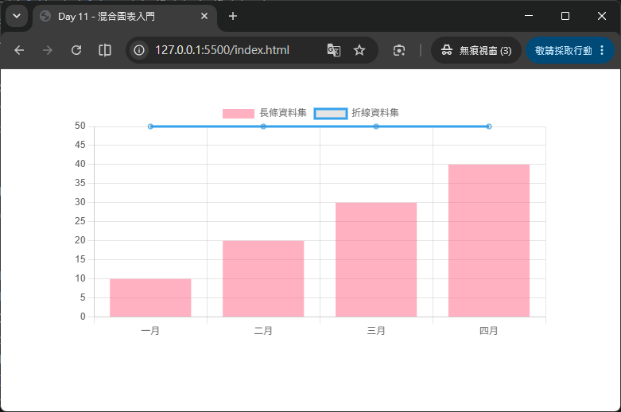
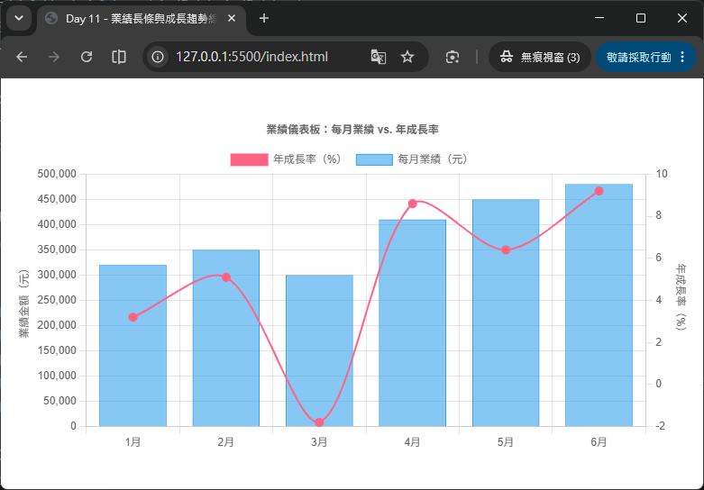

# Day 11 - 30 天手把手學會 Chart.js｜混合圖表（Mixed Chart Types）

> 昨天（Day 10）我們在散佈圖範例的最後，預告了一個做法：把「線性迴歸趨勢線」用折線圖疊加在散佈圖上面。今天就要正式介紹這個技巧背後的完整概念——**混合圖表（Mixed Chart Types）**。Chart.js 允許我們在「同一張畫布、同一個 Chart 實例」中，讓不同的 dataset 各自使用不同的圖表類型，最常見的組合就是「長條圖 + 折線圖」，非常適合用來呈現「業績長條 + 成長趨勢線」這類商業儀表板中常見的複合式圖表。

## 一、什麼是混合圖表？

在前面幾天的教學裡，我們畫的圖表都是「整張圖只有一種類型」：Day 6 的長條圖、Day 7 的折線圖、Day 8 的雷達圖……每次 `new Chart()` 的 `type` 只設定一次，所有 dataset 都遵循同一種畫法。

但實務上經常會遇到「一張圖需要同時呈現兩種不同性質的資料」，例如：

- 每月「業績金額」（適合用長條圖呈現絕對數值高低）搭配「年成長率」（適合用折線圖呈現趨勢走向）。
- 每日「網站流量」（長條）搭配「轉換率」（折線）。
- 「實際銷售量」（長條）搭配「銷售目標線」（折線，通常是一條水平參考線）。

這類需求的共同特徵是：**兩組資料的性質不同、適合的視覺呈現方式也不同，但又需要放在同一張圖、共用同一個 x 軸，方便讀者對照比較**。這正是混合圖表要解決的問題。

Chart.js 官方文件開宗明義地說明：

> With Chart.js, it is possible to create mixed charts that are a combination of two or more different chart types. A common example is a bar chart that also includes a line dataset.

也就是說，混合圖表並不是一種全新的圖表類型，而是**把 `type` 的設定從「整張圖表」下放到「每一個 dataset」**，讓每組資料自由選擇最適合的呈現方式。

## 二、核心觀念：`type` 從「圖表層級」下放到「資料集層級」

在前面學過的單一類型圖表中，`type` 是寫在 `new Chart()` 的最外層：

```js
new Chart(ctx, {
  type: 'bar', // 整張圖表都是長條圖
  data: { /* ... */ },
  options: { /* ... */ }
});
```

要畫混合圖表時，做法是：

1. **最外層的 `type` 依然要寫**，這個值會作為「預設圖表類型」，同時也決定了整體共用的 scale（座標軸）行為基礎。
2. **在需要跟預設類型不同的 dataset 上，個別加上 `type` 屬性**，Chart.js 就會針對這個 dataset 套用對應的 controller（控制器）來繪製。

```js
const mixedChart = new Chart(ctx, {
  data: {
    labels: ['January', 'February', 'March', 'April'],
    datasets: [
      {
        type: 'bar',
        label: 'Bar Dataset',
        data: [10, 20, 30, 40]
      },
      {
        type: 'line',
        label: 'Line Dataset',
        data: [50, 50, 50, 50]
      }
    ]
  },
  options: options
});
```

> 💡 官方文件特別提醒一個容易忽略的細節：**在混合圖表中，各圖表類型的「預設樣式選項」只會在 dataset 層級生效，不會合併到圖表層級**。也就是說，長條圖預設的 `backgroundColor`、折線圖預設的 `borderColor` 等樣式，都要各自明確設定在對應的 dataset 裡，不能期待「整張圖表」有一套通用的樣式會自動套用到所有類型上。

## 三、最小可執行範例：長條圖 + 折線圖

HTML 版面內容如下：
```html
<div style="width: 600px; margin: 40px auto;">
  <canvas id="basicMixed"></canvas>
</div>
<script src="https://cdn.jsdelivr.net/npm/chart.js@4.5.1"></script>
```

JavaScript 程式碼內容如下：
```js
new Chart(document.getElementById('basicMixed'), {
  type: 'bar', // 預設類型（也是圖表最外層使用的座標軸行為基礎）
  data: {
    labels: ['一月', '二月', '三月', '四月'],
    datasets: [
      {
        type: 'bar',
        label: '長條資料集',
        data: [10, 20, 30, 40],
        backgroundColor: 'rgba(255, 99, 132, 0.5)',
        borderColor: 'rgb(255, 99, 132)'
      },
      {
        type: 'line',
        label: '折線資料集',
        data: [50, 50, 50, 50],
        borderColor: 'rgb(54, 162, 235)',
        fill: false
      }
    ]
  },
  options: {
    scales: {
      y: {
        beginAtZero: true
      }
    }
  }
});
```



執行後畫面上會同時出現四根長條（顯示 10、20、30、40）和一條水平直線（穩定在 50 的位置），兩者共用同一個 x 軸（一月～四月）與同一個 y 軸，非常方便對照。

### 重點解說

- **最外層的 `type: 'bar'`**：作為整體預設類型，實務上通常會把「資料量較多、作為主角的類型」放在最外層當預設值。
- **每個 dataset 各自的 `type`**：即使最外層已經設定為 `'bar'`，只要 dataset 裡明確寫了 `type: 'line'`，這組資料依然會用折線圖的方式繪製，兩者互不影響。
- **`fill: false`**：折線圖預設可能會把線下方區域填滿顏色，在混合圖表中通常會關閉這個效果（設為 `false`），避免遮住下方的長條圖。

## 四、繪製順序（Drawing Order）：`order` 屬性

當長條圖跟折線圖畫在同一張圖上時，常見的需求是「希望折線圖畫在長條圖的上面（前景），而不是被長條擋住」。Chart.js 預設的繪製規則是：

> By default, datasets are drawn such that the first one is top-most.

也就是說，**預設狀態下，`datasets` 陣列裡「排在前面」的資料集，會畫在「最上層」**。如果你把長條圖排在折線圖前面，折線圖反而會被長條圖蓋住一部分。

要控制繪製順序，可以幫每個 dataset 加上 `order` 屬性：

```js
datasets: [
  {
    label: '長條資料集',
    type: 'bar',
    data: [10, 20, 30, 40],
    order: 2 // 數字較大，較晚被畫出來 → 畫在下層
  },
  {
    label: '折線資料集',
    type: 'line',
    data: [10, 10, 10, 10],
    order: 1 // 數字較小，較早被畫出來 → 畫在上層
  }
]
```

`order` 的行為可以理解成一種「權重」：**數字越小，優先權越高，會越早被畫出來，因此會被畫在越上層**；數字越大，代表越晚畫，會被其他 dataset 蓋在下面。`order` 沒有設定時預設為 `0`。

> ⚠️ 特別注意：`order` 影響的不只是畫面上的堆疊順序，**還會連帶影響堆疊圖（stacking）、圖例（legend）的排列順序，以及 tooltip 裡資料出現的先後順序**，本質上等同於直接調整 `datasets` 陣列的排列方式，只是不需要真的搬動陣列元素。

## 五、完整範例：業績長條 + 成長趨勢線

接下來實作一個貼近業務場景的混合圖表：某公司想同時呈現「每月業績金額」（長條圖，看絕對數字）以及「年成長率」（折線圖，看趨勢走向），兩者的數值範圍差異很大（業績是幾十萬、成長率是百分比），所以還會搭配 Day 3 學過的「多 Y 軸」技巧，讓兩組資料各自使用獨立的座標軸。

HTML 版面內容如下：
```html
<div style="width: 750px; margin: 40px auto;">
  <canvas id="salesMixedChart"></canvas>
</div>
<script src="https://cdn.jsdelivr.net/npm/chart.js@4.5.1"></script>
```

JavaScript 程式碼內容如下：
```js
const months = ['1月', '2月', '3月', '4月', '5月', '6月'];
const salesAmount = [320000, 350000, 300000, 410000, 450000, 480000]; // 每月業績（元）
const growthRate = [3.2, 5.1, -1.8, 8.6, 6.4, 9.2]; // 年成長率（%）

new Chart(document.getElementById('salesMixedChart'), {
  type: 'bar',
  data: {
    labels: months,
    datasets: [
      {
        type: 'bar',
        label: '每月業績（元）',
        data: salesAmount,
        backgroundColor: 'rgba(54, 162, 235, 0.6)',
        borderColor: 'rgb(54, 162, 235)',
        borderWidth: 1,
        yAxisID: 'yAmount',
        order: 2 // 畫在下層
      },
      {
        type: 'line',
        label: '年成長率（%）',
        data: growthRate,
        borderColor: 'rgb(255, 99, 132)',
        backgroundColor: 'rgb(255, 99, 132)',
        borderWidth: 2,
        pointRadius: 4,
        fill: false,
        tension: 0.3,
        yAxisID: 'yPercent',
        order: 1 // 畫在上層，確保折線不會被長條擋住
      }
    ]
  },
  options: {
    responsive: true,
    plugins: {
      title: {
        display: true,
        text: '業績儀表板：每月業績 vs. 年成長率'
      },
      tooltip: {
        callbacks: {
          label: (context) => {
            const label = context.dataset.label;
            const value = context.raw;
            if (context.dataset.yAxisID === 'yAmount') {
              return `${label}：NT$ ${value.toLocaleString()}`;
            }
            return `${label}：${value}%`;
          }
        }
      }
    },
    scales: {
      yAmount: {
        type: 'linear',
        position: 'left',
        title: { display: true, text: '業績金額（元）' },
        beginAtZero: true
      },
      yPercent: {
        type: 'linear',
        position: 'right',
        title: { display: true, text: '年成長率（%）' },
        grid: {
          drawOnChartArea: false // 避免右側座標軸的格線與左側重疊，畫面更乾淨
        }
      }
    }
  }
});
```



### 重點解說

- **`yAxisID` 讓兩個 dataset 各自對應不同的 y 軸**：長條圖使用 `yAmount`（業績金額，單位是元，數值範圍幾十萬），折線圖使用 `yPercent`（成長率，單位是百分比，數值範圍在 -10～10 之間）。如果兩者共用同一個 y 軸，數值差距懸殊會導致折線被壓成一條幾乎貼著 x 軸的平線，完全看不出走勢，這是多軸設定在混合圖表中最常見也最重要的應用情境。
- **`scales.yPercent.grid.drawOnChartArea: false`**：當同時存在左右兩個 y 軸時，如果兩邊都畫出格線，畫面容易顯得雜亂，通常會保留其中一個（例如左側主要座標軸）的格線，另一個設為 `false` 只顯示刻度文字，不畫格線。
- **`order` 搭配繪圖需求**：長條圖 `order: 2`（畫在下層）、折線圖 `order: 1`（畫在上層），確保代表趨勢的折線清楚顯示在長條之上，不會被遮蔽。
- **`tooltip.callbacks.label` 依據 `dataset.yAxisID` 判斷格式**：因為兩組資料的單位不同（金額 vs. 百分比），透過 `context.dataset.yAxisID` 判斷目前是哪一個 dataset，分別組合出「NT$ 金額」或「百分比」的文字，讓提示框顯示更貼近業務語意的內容。

## 六、混合圖表能組合哪些圖表類型？

Chart.js 的混合圖表機制原則上適用於**任何共用相同座標軸系統（cartesian，也就是直角座標系）的圖表類型**，最常見、也最建議初學者優先掌握的組合是：

| 組合 | 常見情境 |
| --- | --- |
| Bar + Line | 業績長條 + 成長趨勢線、銷售量 + 目標水平線 |
| Line + Line | 實際值 + 預測值（用不同的虛實線樣式區分） |
| Bar + Bar（不同 `stack`） | 同一 x 軸下，兩組獨立堆疊的長條（例如「營收」與「成本」分開堆疊呈現） |
| Scatter + Line | Day 10 預告的「資料點 + 線性迴歸趨勢線」 |

> ⚠️ 需要特別提醒的是：**雷達圖（Radar）、極座標圖（Polar Area）、圓餅圖 / 環狀圖（Pie / Doughnut）屬於「輻射狀座標系」，並不能跟長條圖、折線圖這類「直角座標系」的圖表混合在同一個 Chart 實例中**。混合圖表的前提，是所有 dataset 都能共用同一組 `scales`（x 軸、y 軸）配置。

---

明天（Day 12）我們將學習**圖例與提示框（Legend & Tooltip）**的深入客製化，包含自訂圖例的位置、樣式、點擊事件，以及透過 `tooltip.callbacks` 打造更豐富的提示框內容，讓今天範例中初步用到的 tooltip 客製化技巧更加完整。

## 參考資源

- [Chart.js - Mixed Chart Types](https://www.chartjs.org/docs/latest/charts/mixed.html)
- [Chart.js GitHub](https://github.com/chartjs/Chart.js)
