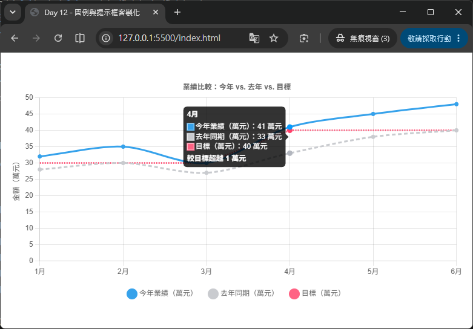

# Day 12 - 30 天手把手學會 Chart.js｜圖例與提示框（Legend & Tooltip）

> 昨天（Day 11）我們學會了混合圖表（Mixed Chart Types），範例中也初步用到了 `tooltip.callbacks.label` 來客製化提示框內容。今天要把這個主題完整展開——深入介紹 Chart.js 的兩個互動性最強的內建外掛（plugin）：**圖例（Legend）**與**提示框（Tooltip）**。學會這兩者的客製化技巧後，你就能打造出真正符合業務需求、資訊表達清楚的互動圖表。

## 一、圖例與提示框在 Chart.js 中的定位

在 Chart.js 的架構中，圖例（Legend）與提示框（Tooltip）都不是「圖表本體」的一部分，而是以**外掛（plugin）**的形式存在，分別對應到設定物件中的：

```js
options: {
  plugins: {
    legend: { /* 圖例相關設定 */ },
    tooltip: { /* 提示框相關設定 */ }
  }
}
```

也就是說，這兩個功能的設定命名空間（namespace）都是 `options.plugins.xxx`，而不是像 `scales`、`elements` 那樣屬於圖表核心設定。這個觀念很重要，因為：

- **它們預設就是啟用的**：只要建立圖表、`data.datasets` 裡有 `label`，圖例跟提示框就會自動出現，不需要額外設定就能使用。
- **它們是可以整組關閉的外掛**：如果你想要完全自己刻一套圖例或提示框 UI，可以用 `display: false` / `enabled: false` 把內建的關掉，改用其他方式呈現（本篇後段也會介紹「HTML 版」的做法）。

今天的內容會分成兩大部分：先講圖例（Legend），再講提示框（Tooltip）。

## 二、圖例（Legend）基礎設定

### 2.1 顯示與隱藏

```js
options: {
  plugins: {
    legend: {
      display: true // 預設就是 true，設為 false 可以整個隱藏圖例
    }
  }
}
```

`display: false` 適合用在「圖表已經有清楚的標題或座標軸標籤，不需要額外圖例」，或是「你打算自己做一套圖例 UI」的情境。

### 2.2 位置（`position`）

圖例可以顯示在圖表的四個方位，或是疊加在圖表繪圖區域內：

```js
options: {
  plugins: {
    legend: {
      position: 'bottom' // 'top'（預設）｜'left'｜'bottom'｜'right'｜'chartArea'
    }
  }
}
```

| 值 | 說明 |
| --- | --- |
| `'top'` | 預設值，圖例顯示在圖表上方 |
| `'bottom'` | 圖例顯示在圖表下方，適合圖例項目較多、需要橫向排列較多空間的情境 |
| `'left'` / `'right'` | 圖例顯示在左側或右側，適合圖例項目較少、圖表本身偏方形或需要保留頂部空間放標題的情境 |
| `'chartArea'` | 圖例會疊加在繪圖區域內部（目前版本固定顯示在偏左置中的位置，沒有更細緻的座標可以調整） |

### 2.3 對齊方式（`align`）

`align` 控制圖例在其所在區域內的對齊方式，預設是 `'center'`：

```js
options: {
  plugins: {
    legend: {
      position: 'top',
      align: 'end' // 'start'｜'center'（預設）｜'end'
    }
  }
}
```

例如 `position: 'top'` 搭配 `align: 'end'`，圖例就會靠右對齊在圖表上方，常用來搭配「標題靠左、圖例靠右」的排版需求。

### 2.4 圖例標籤樣式（`labels`）

圖例中每一個色塊 + 文字的組合，可以透過 `plugins.legend.labels` 進一步客製化：

```js
options: {
  plugins: {
    legend: {
      labels: {
        boxWidth: 20,       // 色塊寬度
        boxHeight: 20,      // 色塊高度
        color: '#333',      // 文字顏色
        padding: 16,        // 每個圖例項目之間的間距
        usePointStyle: true, // 改用「資料點樣式」取代色塊（例如圓形、三角形）
        pointStyle: 'circle',
        font: {
          size: 14,
          family: "'Microsoft JhengHei', sans-serif"
        }
      }
    }
  }
}
```

- **`usePointStyle: true`**：預設圖例是「色塊」呈現，開啟這個選項後會改成跟資料點（point）一樣的樣式（圓形、三角形、星形……），視覺上更活潑、也更能跟折線圖的資料點樣式呼應。
- **`font`**：可以指定圖例文字的字型、大小，中文專案常會在這裡指定慣用的中文字型。

### 2.5 圖例標題（`title`）

如果想幫整個圖例區塊加上一個說明性的標題（例如「地區別」），可以使用 `plugins.legend.title`：

```js
options: {
  plugins: {
    legend: {
      title: {
        display: true,
        text: '各地區業績',
        font: { size: 14, weight: 'bold' }
      }
    }
  }
}
```

## 三、圖例互動：點擊事件與資料篩選

Chart.js 的圖例預設就是「可以互動」的：**滑鼠點擊圖例上的任一項目，對應的 dataset 就會被切換顯示／隱藏**。這是圖例外掛內建的行為，不需要額外設定。

### 3.1 預設點擊行為

Chart.js 官方文件說明，圖例的預設點擊處理函式（click handler）大致等同於：

```js
function(e, legendItem, legend) {
  const index = legendItem.datasetIndex;
  const ci = legend.chart;
  if (ci.isDatasetVisible(index)) {
    ci.hide(index);
    legendItem.hidden = true;
  } else {
    ci.show(index);
    legendItem.hidden = false;
  }
}
```

也就是：判斷這個 dataset 目前是否顯示中，若是就呼叫 `chart.hide(index)` 隱藏，若否就呼叫 `chart.show(index)` 顯示，並同步更新圖例項目上的刪除線（strikethrough）樣式。

### 3.2 自訂 `onClick`

如果內建行為不符合需求，可以透過 `plugins.legend.onClick` 完全覆寫點擊行為。常見情境是：**點擊圖例時，不只切換單一 dataset，而是連動切換多組相關的資料**。

```js
options: {
  plugins: {
    legend: {
      onClick: (e, legendItem, legend) => {
        const index = legendItem.datasetIndex;
        const chart = legend.chart;

        // 假設 dataset 0 跟 1 是「本年」與「去年同期」，希望點擊時一起切換顯示
        if (index === 0 || index === 1) {
          [0, 1].forEach((i) => {
            const meta = chart.getDatasetMeta(i);
            meta.hidden = meta.hidden === null ? !chart.data.datasets[i].hidden : null;
          });
          chart.update();
        } else {
          // 其他 dataset 維持預設行為
          const ci = chart;
          if (ci.isDatasetVisible(index)) {
            ci.hide(index);
            legendItem.hidden = true;
          } else {
            ci.show(index);
            legendItem.hidden = false;
          }
        }
      }
    }
  }
}
```

### 3.3 `onHover` 與 `onLeave`

除了點擊，圖例也支援滑鼠懸停（hover）事件，可以用來實作「滑鼠移到圖例項目上時，把對應的資料線加粗、其餘變淡」這類強調效果：

```js
options: {
  plugins: {
    legend: {
      onHover: (e, legendItem, legend) => {
        e.native.target.style.cursor = 'pointer'; // 滑鼠移到圖例上時改變游標樣式
      },
      onLeave: (e, legendItem, legend) => {
        e.native.target.style.cursor = 'default';
      }
    }
  }
}
```

### 3.4 篩選圖例項目：`filter`

有時候某些 dataset 只是輔助用（例如平均線、目標線），並不希望它出現在圖例中被使用者切換，這時可以用 `labels.filter` 過濾：

```js
options: {
  plugins: {
    legend: {
      labels: {
        filter: (legendItem, data) => {
          // 假設想隱藏 label 叫做「目標線」的圖例項目
          return legendItem.text !== '目標線';
        }
      }
    }
  }
}
```

### 3.5 排序圖例項目：`sort`

`labels.sort` 可以自訂圖例項目的顯示順序，而不需要真的調整 `datasets` 陣列的排列：

```js
options: {
  plugins: {
    legend: {
      labels: {
        sort: (a, b) => a.text.localeCompare(b.text) // 依文字筆劃/字母順序排序
      }
    }
  }
}
```

## 四、提示框（Tooltip）基礎設定

### 4.1 顯示與觸發模式

```js
options: {
  plugins: {
    tooltip: {
      enabled: true,       // 是否啟用內建的 on-canvas 提示框
      mode: 'index',       // 決定滑鼠移動時，哪些資料項目會出現在同一個提示框中
      intersect: false     // false 表示滑鼠不需要精準停在資料點上，靠近該 x 位置就會觸發
    }
  }
}
```

- **`mode`** 常用值：`'point'`（只顯示最接近滑鼠位置的單一資料點）、`'nearest'`（顯示最接近的資料點）、`'index'`（顯示同一個 x 索引下，所有 dataset 的資料）、`'dataset'`（顯示整個 dataset 的資料）。
- **`intersect: false`** 是實務上非常常用的設定，尤其搭配 `mode: 'index'` 時，可以讓使用者只要把滑鼠移到某個月份的 x 座標範圍內，就能同時看到該月份所有 dataset 的數值，不需要精準對準資料點，操作上更直覺、更不容易「找不到提示框」。

> 💡 `mode` 與 `intersect` 其實是 `options.interaction`（互動）設定的一部分，也可以直接寫在 `options.interaction.mode` 讓「hover 效果」跟「tooltip 顯示」共用同一套規則；若只想單獨調整 tooltip 的行為，則寫在 `plugins.tooltip.mode` 即可。

### 4.2 外觀樣式

```js
options: {
  plugins: {
    tooltip: {
      backgroundColor: 'rgba(0, 0, 0, 0.85)',
      titleColor: '#fff',
      titleFont: { size: 14, weight: 'bold' },
      bodyColor: '#fff',
      bodyFont: { size: 13 },
      padding: 12,
      cornerRadius: 6,
      displayColors: true,   // 是否顯示每個 dataset 對應的顏色小方塊
      borderColor: 'rgba(255, 255, 255, 0.2)',
      borderWidth: 1
    }
  }
}
```

這些設定大多是視覺樣式，跟 CSS 的概念很接近：背景色、文字顏色、字型、內距（padding）、圓角（cornerRadius）、邊框。`displayColors: true` 是很實用的預設值，讓提示框中每一行資料前面都帶有一個對應 dataset 顏色的小方塊，方便使用者快速對照。

## 五、Tooltip 內容客製化：`callbacks`

`plugins.tooltip.callbacks` 是提示框客製化中最強大、也最常被使用的部分，它讓你可以完全掌控提示框中「標題」「內文每一行」「頁尾」要顯示什麼文字。

### 5.1 常用的 callback 一覽

| Callback | 說明 |
| --- | --- |
| `title(tooltipItems)` | 回傳提示框的標題文字（通常是 x 軸的標籤，例如「3月」） |
| `label(tooltipItem)` | 回傳單一資料項目的內文文字，**這是最常客製化的一個** |
| `beforeLabel(tooltipItem)` / `afterLabel(tooltipItem)` | 在某一行內文的前面／後面插入額外文字 |
| `footer(tooltipItems)` | 回傳提示框的頁尾文字，例如可以放「總計」 |
| `labelColor(tooltipItem)` | 自訂該行資料前面色塊的顏色與邊框樣式 |

### 5.2 `label` callback：格式化數值

延續昨天（Day 11）業績儀表板的例子，我們可以用 `label` callback 把數字格式化成「NT$ 千分位金額」或「百分比」：

```js
options: {
  plugins: {
    tooltip: {
      callbacks: {
        label: (context) => {
          let label = context.dataset.label || '';
          if (label) {
            label += '：';
          }

          const value = context.parsed.y;
          if (value === null || value === undefined) {
            return label;
          }

          // 依照 dataset 的 yAxisID 判斷是金額還是百分比
          if (context.dataset.yAxisID === 'yAmount') {
            label += `NT$ ${value.toLocaleString()}`;
          } else {
            label += `${value}%`;
          }
          return label;
        }
      }
    }
  }
}
```

`context` 參數即是「tooltip item context」，其中常用的屬性有：

- `context.dataset`：目前這行資料所屬的 dataset 設定物件（可以取得 `label`、`yAxisID` 等自訂欄位）。
- `context.parsed`：已經解析過的數值（例如折線圖、長條圖會是 `{ x, y }`）。
- `context.raw`：原始傳入 `data` 的值（在散佈圖、氣泡圖中常會是 `{x, y, r}` 物件）。
- `context.label`：對應到的 x 軸標籤文字。
- `context.formattedValue`：Chart.js 預設格式化後的字串。

### 5.3 `title` callback：客製化標題

```js
options: {
  plugins: {
    tooltip: {
      callbacks: {
        title: (tooltipItems) => {
          // tooltipItems 是陣列（同一個 x 索引下，所有 dataset 的資料項目）
          return `${tooltipItems[0].label} 業績概況`;
        }
      }
    }
  }
}
```

### 5.4 `footer` callback：顯示加總或補充說明

```js
options: {
  plugins: {
    tooltip: {
      callbacks: {
        footer: (tooltipItems) => {
          const total = tooltipItems.reduce((sum, item) => sum + item.parsed.y, 0);
          return `合計：NT$ ${total.toLocaleString()}`;
        }
      }
    }
  }
}
```

`footer` 拿到的參數跟 `title` 一樣是**整組 tooltip 項目的陣列**，很適合用來計算「同一個 x 座標下，多組資料的加總、平均」等彙整資訊。

## 六、顯示多筆資料於同一個提示框

當一張圖表有多個 dataset（例如多條折線、長條 + 折線混合），並且希望使用者「滑鼠移到某個月份，就能一次看到所有資料的數值」，關鍵就是前面提過的 `mode: 'index'` 搭配 `intersect: false`：

```js
options: {
  interaction: {
    mode: 'index',
    intersect: false
  },
  plugins: {
    tooltip: {
      mode: 'index',
      intersect: false
    }
  }
}
```

以下是一個「三組資料同時顯示在同一個提示框」的完整範例：某公司想比較「今年」「去年」「目標」三條業績折線，滑鼠移到任一個月份時，提示框要同時列出三者的數值，並在頁尾顯示與目標的差距。

HTML 版面內容如下：
```html
<div style="width: 750px; margin: 40px auto;">
  <canvas id="legendTooltipChart"></canvas>
</div>
<script src="https://cdn.jsdelivr.net/npm/chart.js@4.5.1"></script>
```

JavaScript 程式碼內容如下：
```js
const months = ['1月', '2月', '3月', '4月', '5月', '6月'];
const thisYear = [32, 35, 30, 41, 45, 48];
const lastYear = [28, 30, 27, 33, 38, 40];
const target = [30, 30, 30, 40, 40, 40];

new Chart(document.getElementById('legendTooltipChart'), {
  type: 'line',
  data: {
    labels: months,
    datasets: [
      {
        label: '今年業績（萬元）',
        data: thisYear,
        borderColor: 'rgb(54, 162, 235)',
        backgroundColor: 'rgb(54, 162, 235)',
        tension: 0.3
      },
      {
        label: '去年同期（萬元）',
        data: lastYear,
        borderColor: 'rgb(201, 203, 207)',
        backgroundColor: 'rgb(201, 203, 207)',
        borderDash: [6, 4], // 虛線，區隔「參考資料」與「主要資料」
        tension: 0.3
      },
      {
        label: '目標（萬元）',
        data: target,
        borderColor: 'rgb(255, 99, 132)',
        backgroundColor: 'rgb(255, 99, 132)',
        borderDash: [2, 2],
        pointRadius: 0, // 目標線不需要顯示資料點
        tension: 0
      }
    ]
  },
  options: {
    responsive: true,
    interaction: {
      mode: 'index',
      intersect: false
    },
    plugins: {
      title: {
        display: true,
        text: '業績比較：今年 vs. 去年 vs. 目標'
      },
      legend: {
        position: 'bottom',
        labels: {
          usePointStyle: true,
          padding: 20
        },
        onClick: (e, legendItem, legend) => {
          // 使用預設行為：切換該 dataset 的顯示/隱藏
          const index = legendItem.datasetIndex;
          const chart = legend.chart;
          if (chart.isDatasetVisible(index)) {
            chart.hide(index);
            legendItem.hidden = true;
          } else {
            chart.show(index);
            legendItem.hidden = false;
          }
        }
      },
      tooltip: {
        mode: 'index',
        intersect: false,
        callbacks: {
          label: (context) => {
            const label = context.dataset.label || '';
            const value = context.parsed.y;
            return `${label}：${value} 萬元`;
          },
          footer: (tooltipItems) => {
            // 找出「今年」與「目標」這兩筆資料，計算達成差距
            const current = tooltipItems.find((item) => item.dataset.label.includes('今年'));
            const goal = tooltipItems.find((item) => item.dataset.label.includes('目標'));
            if (!current || !goal) return '';
            const diff = current.parsed.y - goal.parsed.y;
            const sign = diff >= 0 ? '超越' : '落後';
            return `較目標${sign} ${Math.abs(diff)} 萬元`;
          }
        }
      }
    },
    scales: {
      y: {
        beginAtZero: true,
        title: { display: true, text: '金額（萬元）' }
      }
    }
  }
});
```



### 重點解說

- **`interaction.mode: 'index'` + `intersect: false`**：這組設定讓滑鼠移到任一個月份的 x 座標範圍時，「今年」「去年」「目標」三筆資料會**同時出現在同一個提示框裡**，不需要精準對準某個資料點。
- **`legend.onClick` 維持預設行為，但明確寫出來**：這裡示範了完整改寫預設點擊邏輯的寫法，實務上如果只是要沿用預設行為，其實不需要覆寫 `onClick`；但了解這段邏輯，是進一步客製化（例如前面 3.2 節「連動切換」）的基礎。
- **`tooltip.callbacks.footer` 動態計算差距**：透過 `tooltipItems.find()` 從陣列中找出「今年」與「目標」兩筆資料，計算差距並在頁尾顯示「超越／落後 N 萬元」，讓提示框不只是單純條列數字，還能提供有意義的分析結論。
- **`pointRadius: 0`**：目標線通常只是參考輔助線，不需要在每個月份上都顯示資料點圓圈，設為 `0` 可以讓畫面更簡潔。
- **`borderDash`**：用虛線樣式（`[6, 4]`、`[2, 2]`）區分「參考資料（去年）」與「輔助線（目標）」跟「主要資料（今年）」，是常見的視覺慣例。

## 七、進階：HTML 版圖例與提示框

如果內建的 canvas 繪製的圖例/提示框無法滿足視覺設計需求（例如想要圖例做成卡片式排版、提示框想要有複雜的表格），Chart.js 允許你**關閉內建繪製，改用 HTML + CSS 自行實作**：

### 7.1 HTML 圖例（概念示意）

```js
options: {
  plugins: {
    legend: {
      display: false // 關閉內建圖例，改用 HTML 自行渲染
    },
    htmlLegend: {
      containerID: 'legend-container' // 搭配自訂 plugin，把圖例畫到指定的 DOM 容器
    }
  }
}
```

做法上通常會撰寫一個自訂 Chart.js 外掛（plugin），在 `afterUpdate` 生命週期中讀取 `chart.data.datasets`，動態產生對應的 HTML 元素（例如 `<ul><li>` 清單），並綁定 `click` 事件呼叫 `chart.setDatasetVisibility()` 等 API 來實現跟內建圖例相同的互動效果。

### 7.2 HTML 提示框（`external`）

```js
options: {
  plugins: {
    tooltip: {
      enabled: false, // 關閉內建的 on-canvas 提示框
      external: (context) => {
        // context.tooltip 內含目前提示框應該顯示的所有資料
        // 可以在這裡動態建立/更新一個絕對定位的 <div>，取代預設的畫布繪製
      }
    }
  }
}
```

HTML 版提示框最大的好處是：**可以使用完整的 HTML/CSS 排版能力**（例如放圖片、複雜表格、動畫效果），缺點是需要自行處理定位（跟隨滑鼠移動）、樣式、以及在圖表縮放或資料更新時同步更新內容，複雜度比內建版本高出許多。這個做法適合對提示框視覺呈現有特殊需求的進階場景，初學階段建議先熟悉內建的 `callbacks` 客製化即可應付大多數需求。

---

明天（Day 13）我們將學習**動畫效果（Animations）**，包含 `animation` 設定中的 `duration`、`easing` 等參數、如何做出「逐步顯示資料」的漸進式動畫效果，以及使用 `chart.update()` 搭配資料異動，實作圖表資料動態更新時的流暢過場動畫。

## 參考資源

- [Chart.js](https://www.chartjs.org/)
- [Chart.js GitHub](https://github.com/chartjs/Chart.js)
