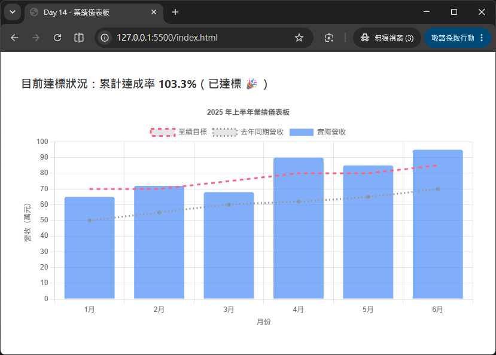

# Day 14 - 30 天手把手學會 Chart.js｜第二週總複習與小專案

> 第二週的六天，我們把 Chart.js 「常用圖表類型」補齊了一大塊：從多維度比較的雷達圖、極座標圖，到帶有第三維度資訊的氣泡圖／散佈圖，再到能把不同圖表類型疊在同一張畫布上的混合圖表，最後深入研究了圖例（Legend）、提示框（Tooltip）與動畫（Animation）這三個「讓圖表活起來」的關鍵設定。今天不學新的圖表類型，而是把這六天的知識點重新梳理一次，並透過一個更貼近實務的小專案——**「業績儀表板」混合圖表（長條 + 折線 + 圖例互動）**——把所學整合起來，做出一張真正「能拿來簡報」的圖表。

## 一、第二週學了什麼？快速回顧

在動手做小專案之前，先用一張表回顧這六天的重點，確認每個觀念都還記得：

| Day | 主題 | 核心重點 |
| --- | --- | --- |
| Day 8 | 雷達圖（Radar Chart） | 多維度資料比較（如能力值分析）、`scales.r` 的 `angleLines`／`pointLabels` 樣式調整 |
| Day 9 | 極座標圖（Polar Area Chart） | 與 Pie Chart 的差異（保留半徑資訊、扇形角度相等）、適合「同時比較數量與佔比」的資料情境 |
| Day 10 | 氣泡圖與散佈圖（Bubble / Scatter） | `{x, y, r}` 三維資料呈現、適合相關性分析與分布觀察，`Scatter` 沒有 `r`（半徑）維度 |
| Day 11 | 混合圖表（Mixed Chart Types） | 在 `data.datasets[i]` 層級個別指定 `type`，讓長條圖與折線圖疊在同一張畫布 |
| Day 12 | 圖例與提示框（Legend & Tooltip） | `plugins.legend`／`plugins.tooltip` 的顯示、位置、`onClick` 互動與 `callbacks` 客製化內容 |
| Day 13 | 動畫效果（Animations） | `animation`／`animations`／`transitions` 三層設定、逐步顯示（`delay`）、`chart.update(mode)` 動態更新 |

如果表格中有任何一項覺得「好像有點模糊」，建議先回頭翻閱對應的 Day 內容，再繼續往下閱讀，這樣今天的總複習與實作才會更有感覺。

## 二、總複習一：多維度資料圖表（雷達圖 / 極座標圖）

雷達圖與極座標圖都使用**放射狀座標軸（radial scale）**，設定命名空間是 `options.scales.r`，這點與折線圖／長條圖慣用的 `scales.x`／`scales.y` 不同：

```js
new Chart(ctx, {
  type: 'radar',
  data: {
    labels: ['攻擊力', '防禦力', '速度', '智力', '體力'],
    datasets: [
      {
        label: '角色 A',
        data: [80, 60, 90, 70, 65],
        borderColor: 'rgb(255, 99, 132)',
        backgroundColor: 'rgba(255, 99, 132, 0.3)'
      }
    ]
  },
  options: {
    scales: {
      r: {
        angleLines: { display: true },     // 中心到各頂點的放射線
        pointLabels: { font: { size: 12 } }, // 每個維度的文字標籤
        suggestedMin: 0,
        suggestedMax: 100
      }
    }
  }
});
```

**雷達圖 vs 極座標圖**的差異，是這兩天最容易搞混的地方，整理成一張表：

| 比較項目 | 雷達圖（Radar） | 極座標圖（Polar Area） |
| --- | --- | --- |
| 適合情境 | 多維度「能力值」比較（同一個對象在不同維度的表現） | 單一維度的多個類別，同時比較「數量」與「佔比」 |
| 視覺呈現 | 用多邊形連線呈現，可疊多組資料比較 | 用扇形面積呈現，扇形角度相等、半徑代表數值 |
| 與 Pie Chart 差異 | 沒有直接對應 | Pie Chart 只看角度（佔比），Polar Area 角度相等但半徑會依數值變化，多保留了「數值大小」的資訊 |

## 三、總複習二：氣泡圖與散佈圖（第三維度資料）

Day 10 學到的氣泡圖（Bubble）與散佈圖（Scatter），資料格式不再是單純的數字陣列，而是**物件陣列**：

```js
data: {
  datasets: [
    {
      label: '各分店營收與滿意度',
      data: [
        { x: 10, y: 20, r: 15 }, // x: 來客數, y: 滿意度, r: 營收（決定圓點大小）
        { x: 15, y: 10, r: 8 },
        { x: 20, y: 25, r: 20 }
      ],
      backgroundColor: 'rgba(75, 192, 192, 0.6)'
    }
  ]
}
```

- **散佈圖（Scatter）**：只有 `{x, y}` 兩個維度，適合觀察兩個變數之間「有沒有關聯」（相關性分析）。
- **氣泡圖（Bubble）**：在散佈圖的基礎上多了 `r`（半徑），可以在同一張圖表裡同時呈現「三個維度」的資訊，例如「來客數（x）、滿意度（y）、營收（圓點大小 r）」。
- 兩者的 `x`／`y` 軸預設都是 `linear` 座標軸類型，這點與長條圖慣用的 `category` 軸不同，使用前要特別留意軸的型別設定是否正確。

## 四、總複習三：混合圖表（Mixed Chart Types）

Day 11 的重點是：Chart.js 的 `type` 除了寫在最外層，也可以「下放」到每一個 dataset 自己身上，讓不同資料集用不同圖表類型呈現，畫在同一張畫布：

```js
new Chart(ctx, {
  data: {
    labels: ['1月', '2月', '3月', '4月', '5月'],
    datasets: [
      {
        type: 'bar',
        label: '月營收（萬元）',
        data: [65, 72, 68, 80, 75],
        backgroundColor: 'rgba(75, 139, 245, 0.7)'
      },
      {
        type: 'line',
        label: '成長趨勢',
        data: [60, 65, 70, 74, 78],
        borderColor: 'rgb(255, 99, 132)',
        tension: 0.3,
        fill: false
      }
    ]
  },
  options: { responsive: true }
});
```

重點提醒：

- 最外層的 `type` 可以省略不寫，改由每個 dataset 自行決定要用哪種圖表類型繪製。
- 不同類型的 dataset 仍然共用同一組 `labels`，因此彼此的資料點會對齊在相同的 x 軸位置上。
- 常見組合是「長條圖（呈現絕對數值）+ 折線圖（呈現趨勢或參考線）」，這正是今天小專案「業績儀表板」的核心技巧。

## 五、總複習四：圖例與提示框客製化

Day 12 學到的圖例（Legend）與提示框（Tooltip），命名空間都在 `options.plugins` 底下：

```js
options: {
  plugins: {
    legend: {
      position: 'top',
      onClick: (event, legendItem, legend) => {
        // 客製化圖例點擊行為，例如同時切換兩組相關的 dataset
        const chart = legend.chart;
        const index = legendItem.datasetIndex;
        const meta = chart.getDatasetMeta(index);
        meta.hidden = meta.hidden === null ? !chart.data.datasets[index].hidden : null;
        chart.update();
      }
    },
    tooltip: {
      callbacks: {
        label: (context) => {
          const value = context.parsed.y;
          return `${context.dataset.label}：${value}`;
        }
      }
    }
  }
}
```

- **圖例的預設行為**就是「點擊後切換該 dataset 的顯示/隱藏」，這是內建的 `onClick` 已經幫我們做好的功能；如果想要「點一個圖例，連動切換兩組資料」，就需要覆寫 `onClick`，自己控制多個 dataset 的 `hidden` 狀態。
- **Tooltip 的 `callbacks`** 讓我們能完全控制提示框顯示的文字內容，`callbacks.label` 是最常用的一個，可以把原始數字加工成更容易閱讀的文字（例如加上單位、百分比符號）。
- 這兩個外掛的客製化能力，正是「業績儀表板」能不能做得專業、好懂的關鍵。

## 六、總複習五：動畫與資料更新

Day 13 學到，Chart.js 的動畫由 `animation`／`animations`／`transitions` 三層設定組成，而**資料更新後的動畫**則靠呼叫 `chart.update(mode)` 觸發：

```js
// 修改資料
myChart.data.datasets[0].data[2] = 90;

// 觸發更新並套用動畫
myChart.update();

// 不使用動畫的更新（例如切換篩選條件時想要「立即」呈現）
myChart.update('none');
```

在「業績儀表板」這類商業報表情境中，動畫不只是裝飾——當使用者切換月份、篩選店別時，**平滑的動畫轉場**能讓人清楚感受到「資料變了、變去哪裡」，是提升儀表板專業感的重要細節。

## 七、小專案：業績儀表板（混合圖表 + 圖例互動）

### 需求說明

設計一張「業績儀表板」圖表，模擬公司每月的營運報表，需求如下：

1. 用**長條圖**呈現每月「實際營收」，用**折線圖**呈現每月「業績目標」，兩者疊在同一張畫布上比較「達標狀況」。
2. 加入第三組資料——**「去年同期營收」**的折線，方便做年度成長比較，三組資料要能各自透過圖例開關顯示/隱藏。
3. 自訂圖例點擊行為：點擊「實際營收」圖例時，同時切換「達標／未達標」的圖表標題提示文字（示範圖例互動不只是切換顯示，還能連動其他 UI）。
4. Tooltip 要能同時顯示「實際營收」與「業績目標」的達成率（自訂計算欄位）。

### 完整程式碼

HTML 版面內容如下：
```html
<div style="width: 760px; margin: 40px auto;">
  <h3 id="statusText">目前達標狀況：計算中...</h3>
  <canvas id="dashboardChart"></canvas>
</div>
<script src="https://cdn.jsdelivr.net/npm/chart.js@4.5.1"></script>
```

JavaScript 程式碼內容如下：
```js
const labels = ['1月', '2月', '3月', '4月', '5月', '6月'];
const actualRevenue = [65, 72, 68, 90, 85, 95];   // 實際營收（萬元）
const targetRevenue = [70, 70, 75, 80, 80, 85];   // 業績目標（萬元）
const lastYearRevenue = [50, 55, 60, 62, 65, 70]; // 去年同期營收（萬元）

/**
 * 更新頁面上顯示的達標狀態文字
 * @param {Chart} chart - Chart.js 的圖表實例
 */
function updateStatusText(chart) {
  const meta = chart.getDatasetMeta(0); // 實際營收 dataset
  const el = document.getElementById('statusText');
  if (meta.hidden) {
    el.textContent = '目前達標狀況：已隱藏「實際營收」資料，無法判斷';
    return;
  }
  const totalActual = actualRevenue.reduce((a, b) => a + b, 0);
  const totalTarget = targetRevenue.reduce((a, b) => a + b, 0);
  const rate = ((totalActual / totalTarget) * 100).toFixed(1);
  el.textContent = `目前達標狀況：累計達成率 ${rate}%（${rate >= 100 ? '已達標 🎉' : '尚未達標'}）`;
}

const config = {
  data: {
    labels,
    datasets: [
      {
        type: 'bar',
        label: '實際營收',
        data: actualRevenue,
        backgroundColor: 'rgba(75, 139, 245, 0.7)',
        borderColor: 'rgb(75, 139, 245)',
        borderRadius: 4,
        order: 2
      },
      {
        type: 'line',
        label: '業績目標',
        data: targetRevenue,
        borderColor: 'rgb(255, 99, 132)',
        borderDash: [6, 6],
        pointRadius: 0,
        fill: false,
        tension: 0,
        order: 1
      },
      {
        type: 'line',
        label: '去年同期營收',
        data: lastYearRevenue,
        borderColor: 'rgb(153, 153, 153)',
        borderDash: [2, 4],
        pointRadius: 3,
        fill: false,
        tension: 0.3,
        order: 1
      }
    ]
  },
  options: {
    responsive: true,
    animation: {
      duration: 800,
      easing: 'easeOutQuart'
    },
    // 依 X 軸索引比對，讓同一月份的三個 dataset 同時顯示在 Tooltip
    interaction: {
      mode: 'index',
      intersect: false
    },
    plugins: {
      title: {
        display: true,
        text: '2025 年上半年業績儀表板'
      },
      legend: {
        position: 'top',
        onClick: (event, legendItem, legend) => {
          // 沿用 Chart.js 預設的圖例切換邏輯
          const index = legendItem.datasetIndex;
          const chart = legend.chart;
          const meta = chart.getDatasetMeta(index);
          meta.hidden = meta.hidden === null ? !chart.data.datasets[index].hidden : null;
          chart.update();
          // 客製化：切換「實際營收」時，同步更新頁面上的達標狀態文字
          if (index === 0) {
            updateStatusText(chart);
          }
        }
      },
      tooltip: {
        callbacks: {
          label: (context) => {
            const label = context.dataset.label;
            const value = context.parsed.y;
            if (label === '實際營收') {
              const target = targetRevenue[context.dataIndex];
              const rate = ((value / target) * 100).toFixed(1);
              return `${label}：${value} 萬元（達成率 ${rate}%）`;
            }
            return `${label}：${value} 萬元`;
          }
        }
      }
    },
    scales: {
      y: {
        beginAtZero: true,
        title: { display: true, text: '營收（萬元）' }
      },
      x: {
        title: { display: true, text: '月份' }
      }
    }
  }
};

const chart = new Chart(document.getElementById('dashboardChart'), config);
updateStatusText(chart);
```



> 💡 範例中的 `order` 屬性（設定在 dataset 上）可以控制圖層繪製的先後順序，數字越小越晚繪製、會蓋在越上層，讓折線能清楚疊在長條圖上方，避免視覺上被長條蓋住。

### 重點對照

這個小專案把第二週複習的五個知識點全部串起來：

- **混合圖表（Day 11）**：`type: 'bar'` 與 `type: 'line'` 分別設定在不同 dataset，疊在同一張畫布上，並用 `order` 控制繪製順序。
- **圖例互動（Day 12）**：覆寫 `plugins.legend.onClick`，除了沿用預設的顯示/隱藏切換，還額外連動更新頁面上的「達標狀況」文字。
- **Tooltip 客製化（Day 12）**：`callbacks.label` 針對「實際營收」這組資料，額外計算並顯示「達成率」。
- **動畫（Day 13）**：`animation.duration`／`easing` 讓長條與折線的進場動畫更平滑，點擊圖例切換顯示/隱藏時，也會自動套用淡入淡出動畫。
- **座標軸與樣式（第一週延伸）**：`y.beginAtZero`、`x`／`y` 的 `title`，確保營收軸不失真、單位清楚標示。

## 八、本週重點總結

- 雷達圖與極座標圖使用放射狀座標軸 `scales.r`，適合「多維度比較」與「保留數值大小的佔比呈現」；氣泡圖與散佈圖則用 `{x, y, r}` 物件格式，呈現二到三個維度的相關性資料。
- 混合圖表的核心技巧，是把 `type` 下放到 dataset 層級，讓不同圖表類型共用同一組 `labels`，並可透過 `order` 控制圖層堆疊順序。
- 圖例（Legend）與提示框（Tooltip）都是 `options.plugins` 底下的外掛設定，`legend.onClick` 與 `tooltip.callbacks.label` 是最常被客製化的兩個入口，能讓圖表的互動與資訊呈現更貼近實際業務需求。
- 動畫由 `animation`／`animations`／`transitions` 三層組成，資料異動後呼叫 `chart.update(mode)` 即可觸發對應的動畫效果，是讓儀表板「有感」的重要細節。
- 本週的小專案「業績儀表板」證明了：只要靈活組合這幾個基礎能力，就能做出貼近真實工作場景、資訊清楚、互動友善的圖表。

---

明天（Day 15）我們將進入第三週：**資料處理與互動功能**，第一站是學習如何串接靜態 JSON 資料——透過 `fetch` API 讀取本地 JSON 檔案，並學會將 JSON 格式轉換成 Chart.js 所需的 `labels`／`datasets` 結構，正式從「手刻假資料」邁向「串接真實資料」的第一步。
