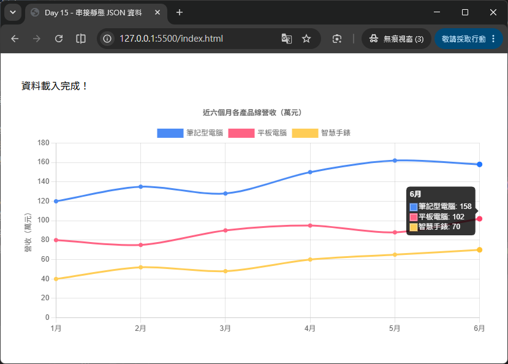

# Day 15 - 30 天手把手學會 Chart.js｜串接靜態 JSON 資料

> 恭喜完成第二週的總複習與「業績儀表板」小專案！過去兩週我們用的資料，幾乎都是直接寫死在 JavaScript 陣列裡的假資料（例如 `[65, 72, 68, 90, 85, 95]`）。但實務上，圖表的資料通常來自後端 API、資料庫匯出的檔案，或是團隊共用的設定檔，很少會直接寫死在程式碼裡。從今天開始，我們正式進入第三週：**資料處理與互動功能**，第一站要學會用瀏覽器內建的 `fetch` API 讀取一份「本地端的靜態 JSON 檔案」，並將讀到的 JSON 資料轉換成 Chart.js 認得的 `labels` / `datasets` 格式，畫出圖表。

## 一、為什麼要學「串接 JSON」？

在正式寫程式之前，先想清楚「為什麼不繼續手刻假資料就好？」：

- **資料與畫圖邏輯分離**：把資料放進獨立的 `.json` 檔案，圖表的程式碼（`options`、`type` 等設定）就不需要跟著資料一起修改，維護上更乾淨。
- **貼近真實情境**：無論是後端 API 回傳的資料，還是後續要學的 CSV、即時資料流，格式最終都會被瀏覽器解析成 JavaScript 物件（也就是 JSON 的結構），今天學的「JSON → Chart.js 格式」轉換技巧是共通的基礎。
- **方便團隊協作**：資料人員或後端工程師可以只負責提供一份格式固定的 JSON，前端工程師專心處理視覺呈現，兩邊互不干擾。

今天的目標拆成兩個步驟：

1. 用 `fetch` API **讀取**本地的 JSON 檔案。
2. 把讀到的 JSON **轉換**成 Chart.js 需要的 `{ labels, datasets }` 格式，畫出圖表。

## 二、認識 `fetch` API

`fetch` 是瀏覽器原生提供的網路請求函式，不需要額外安裝任何套件即可使用。它的基本用法如下：

```js
fetch('data/sales.json')
  .then((response) => response.json()) // 把回應內容解析成 JavaScript 物件
  .then((data) => {
    console.log(data); // 這裡就能拿到 JSON 檔案的內容
  })
  .catch((error) => {
    console.error('讀取資料失敗：', error);
  });
```

拆解這段程式碼在做什麼：

| 步驟 | 說明 |
| --- | --- |
| `fetch('data/sales.json')` | 發送一個 HTTP GET 請求，去讀取指定路徑的檔案，回傳一個 [`Promise`](https://developer.mozilla.org/zh-TW/docs/Web/JavaScript/Reference/Global_Objects/Promise)（非同步結果的容器）。 |
| `.then((response) => response.json())` | `fetch` 拿到的第一層結果只是「回應物件（Response）」，還不是實際內容，要呼叫 `response.json()` 才會把內容解析成 JavaScript 物件，這個方法本身也是非同步的，所以還要再包一層 `.then`。 |
| `.then((data) => {...})` | 這裡的 `data` 才是真正解析好的 JSON 內容，可以直接當成一般的 JavaScript 物件／陣列使用。 |
| `.catch((error) => {...})` | 如果檔案路徑錯誤、伺服器沒回應等情況發生錯誤，會被這裡攔截並處理，避免整個網頁沒有任何提示就當掉。 |

### 2.1 使用 `async` / `await` 改寫（更推薦的寫法）

`.then().then().catch()` 的鏈式寫法在邏輯簡單時還算好讀，但一旦步驟變多，巢狀結構容易讓程式碼變得雜亂。改用 `async` / `await` 可以讓非同步程式碼「看起來像同步執行」，是目前業界更推薦的寫法：

```js
async function loadSalesData() {
  try {
    const response = await fetch('data/sales.json');
    const data = await response.json();
    console.log(data);
    return data;
  } catch (error) {
    console.error('讀取資料失敗：', error);
  }
}
```

- `async function` 宣告一個「非同步函式」，函式內部才能使用 `await` 關鍵字。
- `await fetch(...)` 會讓程式「暫停在這一行」，直到請求真正完成才繼續往下執行，但**不會卡住整個瀏覽器**（因為底層還是非同步機制）。
- `try / catch` 取代了 `.catch()`，錯誤處理的邏輯更貼近一般同步程式的寫法。

> 💡 **小提醒**：`fetch` 只有在伺服器回傳「網路層級的錯誤」（例如連線失敗、CORS 被擋）時才會讓 `Promise` 進入 rejected 狀態並觸發 `catch`。如果伺服器有回應，但狀態碼是 `404` 或 `500`，`fetch` 並**不會自動當作錯誤**。

## 三、準備一份靜態 JSON 資料

假設我們要做一張「某公司近六個月各產品線營收」的折線圖，先準備一份 `data/sales.json`：

```json
{
  "months": ["1月", "2月", "3月", "4月", "5月", "6月"],
  "products": [
    {
      "name": "筆記型電腦",
      "revenue": [120, 135, 128, 150, 162, 158]
    },
    {
      "name": "平板電腦",
      "revenue": [80, 75, 90, 95, 88, 102]
    },
    {
      "name": "智慧手錶",
      "revenue": [40, 52, 48, 60, 65, 70]
    }
  ]
}
```

這份 JSON 檔案本身跟 Chart.js 完全無關——它只是很單純地描述「資料的內容」，這正是我們前面提到「資料與畫圖邏輯分離」的意義。接下來的重點，就是把這種「業務上自然的資料結構」轉換成 Chart.js 看得懂的格式。

## 四、Chart.js 需要的資料格式長什麼樣子？

無論資料從哪裡來，最終都要轉換成 `data` 這個物件底下的兩個核心欄位：

```js
data: {
  labels: [],   // 陣列，對應 x 軸（或圓餅圖的每個扇形）的類別名稱
  datasets: []  // 陣列，每個元素是一組資料系列，包含 label、data、顏色等設定
}
```

以第三節的 JSON 為例，我們希望轉換成：

```js
{
  labels: ['1月', '2月', '3月', '4月', '5月', '6月'],
  datasets: [
    { label: '筆記型電腦', data: [120, 135, 128, 150, 162, 158], borderColor: '...', ... },
    { label: '平板電腦',   data: [80, 75, 90, 95, 88, 102],      borderColor: '...', ... },
    { label: '智慧手錶',   data: [40, 52, 48, 60, 65, 70],       borderColor: '...', ... }
  ]
}
```

可以觀察到一個規律：**JSON 裡的 `months` 對應 `labels`；`products` 陣列裡的每一個項目，剛好對應 `datasets` 陣列裡的每一個元素**。這種「一對一」的對應關係，正是資料轉換的關鍵。

## 五、動手轉換：`map()` 是最好的朋友

JavaScript 陣列的 `map()` 方法，可以把一個陣列的「每一個元素」都轉換成另一種形式，並組成一個新的陣列——這正是我們需要的工具：

```js
// 事先準備好一組顏色，讓每個 dataset 有不同的顏色
const colorPalette = [
  'rgb(75, 139, 245)',
  'rgb(255, 99, 132)',
  'rgb(255, 205, 86)'
];

function transformToChartData(json) {
  return {
    labels: json.months,
    datasets: json.products.map((product, index) => ({
      label: product.name,
      data: product.revenue,
      borderColor: colorPalette[index % colorPalette.length],
      backgroundColor: colorPalette[index % colorPalette.length],
      tension: 0.3,
      fill: false
    }))
  };
}
```

- `json.products.map((product, index) => ({...}))`：把 `products` 陣列裡的每個產品物件，轉換成 Chart.js 認得的 dataset 物件。
- `product.name` → `label`：JSON 裡的商品名稱，變成圖例（Legend）顯示的文字。
- `product.revenue` → `data`：JSON 裡的營收陣列，直接就是 Chart.js 要畫的數值陣列。
- `colorPalette[index % colorPalette.length]`：用 `index`（目前是第幾個產品）去對應顏色陣列，`% colorPalette.length` 是為了避免產品數量超過顏色數量時發生 `undefined`（超過範圍會自動從頭循環使用顏色）。

> 💡 **小技巧**：把「JSON → Chart.js 格式」的轉換邏輯獨立寫成一個函式（像上面的 `transformToChartData`），可以讓「讀取資料」與「畫圖表」的職責分開，日後如果資料來源換成 API，只需要修改這個轉換函式即可，畫圖表的程式碼完全不用動。

## 六、完整範例：讀取 JSON 並畫出折線圖

把前面幾節的內容整合起來，完整流程如下：

HTML 版面內容如下：
```html
<div style="width: 760px; margin: 40px auto;">
  <p id="statusText">資料載入中...</p>
  <canvas id="salesChart"></canvas>
</div>
<script src="https://cdn.jsdelivr.net/npm/chart.js@4.5.1"></script>
```

JavaScript 程式碼內容如下：
```js
const colorPalette = [
  'rgb(75, 139, 245)',
  'rgb(255, 99, 132)',
  'rgb(255, 205, 86)'
];

// 步驟一：轉換函式，把 JSON 結構轉成 Chart.js 需要的格式
/**
 * @param {Object} json - JSON 資料
 * @returns {Object} Chart.js 所需的資料格式
 */
function transformToChartData(json) {
  return {
    labels: json.months,
    datasets: json.products.map((product, index) => ({
      label: product.name,
      data: product.revenue,
      borderColor: colorPalette[index % colorPalette.length],
      backgroundColor: colorPalette[index % colorPalette.length],
      tension: 0.3,
      fill: false
    }))
  };
}

// 步驟二：讀取 JSON 並畫圖
async function initChart() {
  const statusText = document.getElementById('statusText');
  try {
    const response = await fetch('data/sales.json');

    // fetch 不會自動把 404 / 500 當成錯誤，要自己檢查 response.ok
    if (!response.ok) {
      throw new Error(`HTTP 錯誤狀態碼：${response.status}`);
    }

    const json = await response.json();
    const chartData = transformToChartData(json);

    new Chart(document.getElementById('salesChart'), {
      type: 'line',
      data: chartData,
      options: {
        responsive: true,
        // interaction 設定 mode: 'index' 讓同一 X 軸座標的所有資料集提示框同時顯示
        interaction: {
          mode: 'index',
          intersect: false
        },
        plugins: {
          title: { display: true, text: '近六個月各產品線營收（萬元）' },
          tooltip: {
            mode: 'index',
            intersect: false
          }
        },
        scales: {
          y: { beginAtZero: true, title: { display: true, text: '營收（萬元）' } }
        }
      }
    });

    statusText.textContent = '資料載入完成！';
  } catch (error) {
    console.error('讀取資料失敗：', error);
    statusText.textContent = '資料載入失敗，請確認 JSON 檔案路徑是否正確。';
  }
}

initChart();
```



執行結果會先短暫顯示「資料載入中...」，等 `fetch` 完成後，才會出現折線圖，並把狀態文字改成「資料載入完成！」。這種「先顯示 Loading 狀態，資料準備好才畫圖」的流程，正是串接真實資料時的標準做法（Day 16 會針對 Loading 狀態做更完整的處理）。

## 七、透過本地伺服器開啟範例（重要！）

如果你直接用瀏覽器「雙擊開啟」`index.html`（網址列會看到 `file://` 開頭），`fetch` 讀取本地 JSON 檔案通常會失敗，並在主控台（Console）看到類似這樣的錯誤：

```
Access to fetch at 'file:///.../data/sales.json' from origin 'null' has been blocked by CORS policy
```

這是因為瀏覽器基於安全性考量，限制了 `file://` 協定下的 `fetch` 請求。解決方法是**啟動一個本地端的簡易伺服器**，用 `http://localhost` 的方式開啟頁面，常見做法：

```bash
# 方法一：使用 VS Code 的 Live Server 套件（推薦，初學者最簡單）
# 安裝套件後，在 index.html 上按右鍵 → Open with Live Server

# 方法二：如果有安裝 Node.js，可以用 http-server
npx http-server ./example -p 8080

# 方法三：如果有安裝 Python 3
python -m http.server 8080
```

啟動後，改用瀏覽器開啟 `http://localhost:8080`，`fetch` 才能正常讀取到本地的 JSON 檔案。

## 八、常見誤區與注意事項

1. **以為 `fetch` 對 404 / 500 也會自動丟出錯誤**：這是最常見的誤解。`fetch` 只有在「網路層級失敗」（例如斷線、網址格式錯誤、CORS 被擋）時才會讓 `Promise` 變成 rejected。如果伺服器確實有回應（即使是 404 Not Found），`fetch` 仍視為「請求成功」，只是 `response.ok` 會是 `false`、`response.status` 會是 `404`。**務必自己檢查 `response.ok`**，並在不符合預期時手動 `throw new Error(...)`，才能讓 `catch` 正確攔截到。
2. **忘記用本地伺服器開啟，直接雙擊 HTML 檔案**：如同第七節說明，`file://` 協定下 `fetch` 本地檔案常會被瀏覽器封鎖，務必透過 Live Server 或簡易 HTTP 伺服器開啟頁面。
3. **JSON 檔案內容有語法錯誤**：JSON 格式非常嚴格（例如所有的 key 都必須用雙引號、最後一個元素後面不能有多餘的逗號），只要有一個小錯字，`response.json()` 就會直接拋出解析錯誤。建議先用線上工具（例如 [JSONLint](https://jsonlint.com/)）或編輯器內建的格式化功能檢查過。
4. **`data` 陣列的長度與 `labels` 不一致**：Chart.js 會依照索引把 `labels[i]` 對應到每個 dataset 的 `data[i]`，如果轉換過程中資料筆數對不齊（例如某個產品少填一個月的營收），畫出來的圖表座標會整個位移錯亂，且不一定會跳出錯誤訊息，需要特別留意資料完整性。
5. **忘記處理錯誤畫面**：如果 `fetch` 失敗卻沒有妥善處理（例如沒有 `try/catch` 或忘記更新畫面文字），使用者只會看到一片空白的 `<canvas>`，不知道發生了什麼事。務必在錯誤發生時，明確地告訴使用者「資料載入失敗」，而不是讓頁面靜悄悄地失敗。

---

明天（Day 16）我們會延續今天的 `fetch` 基礎，正式串接**後端 RESTful API**，學習如何處理遠端資料的非同步載入、Loading 狀態顯示，以及當網路較慢或發生錯誤時，該如何設計更完整的使用者體驗。

## 參考資源

- [Chart.js](https://www.chartjs.org/)
- [Chart.js GitHub](https://github.com/chartjs/Chart.js)
