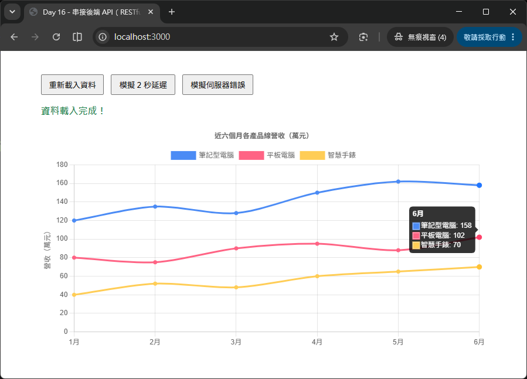

# Day 16 - 30 天手把手學會 Chart.js｜串接後端 API（RESTful）

> 昨天（Day 15）我們學會用 `fetch` 讀取「本地端的靜態 JSON 檔案」，並把資料轉換成 Chart.js 需要的格式。但實務上的圖表資料，幾乎不會是一份放在前端專案裡、寫死不變的 JSON 檔——它通常來自一支「後端 API」，可能是資料庫查詢的結果、即時計算出來的統計數字，甚至是串接第三方服務的資料。今天我們要往前跨一步：**自己動手用 Node.js 的 Express 框架寫一支簡單的 RESTful API**，再讓前端頁面透過 `fetch`／`axios` 呼叫這支 API，把資料畫成圖表。過程中會特別著重「非同步資料載入」該有的完整使用者體驗：Loading 狀態、錯誤處理、以及一些容易被忽略的小陷阱。

## 一、今天要達成的目標

今天的內容分成「後端」與「前端」兩大部分：

1. **後端**：使用 Express 建立一支簡單的 RESTful API（`GET /api/sales`），回傳銷售資料的 JSON，並學會設定 CORS，讓前端網頁可以跨來源呼叫這支 API。
2. **前端**：延續 Day 15 的 `fetch` 技巧，改成呼叫「遠端的後端 API」，並補齊真實專案該有的三種畫面狀態——**載入中（Loading）**、**載入成功**、**載入失敗（Error）**，讓使用者隨時知道畫面現在發生了什麼事。

同時也會介紹另一個很常見的 HTTP 請求套件 **axios**，比較它跟瀏覽器內建 `fetch` 的差異，讓你依專案需求選擇適合的工具。

## 二、什麼是 RESTful API？

在動手寫程式前，先快速建立觀念。**RESTful API** 是一種設計網路 API 的「慣例」，核心精神是：把每一種資料（例如「銷售資料」、「使用者」、「商品」）都當作一個「資源（Resource）」，並用標準的 HTTP 方法（Method）來表示對這個資源要做什麼操作：

| HTTP 方法 | 意義 | 範例 |
| --- | --- | --- |
| `GET` | 讀取資源（今天主要會用到） | `GET /api/sales` => 取得銷售資料 |
| `POST` | 新增資源 | `POST /api/sales` => 新增一筆銷售紀錄 |
| `PUT` / `PATCH` | 更新資源 | `PUT /api/sales/1` => 更新編號 1 的銷售紀錄 |
| `DELETE` | 刪除資源 | `DELETE /api/sales/1` → 刪除編號 1 的銷售紀錄 |

今天要做的圖表功能只需要「讀取資料」，所以會專注在 `GET` 方法上；`POST` / `PUT` / `DELETE` 通常用在「儀表板同時具備編輯功能」的進階場景，未來如果需要讓使用者上傳或修改圖表資料，就會用到。

> 💡 **小提醒**：RESTful 只是「慣例」而非強制規範，不同專案的實作細節可能略有差異，但只要掌握「資源 + HTTP 方法」這個核心概念，就能快速讀懂大部分後端 API 的設計。

## 三、動手建立後端：Express 入門

[Express](https://expressjs.com/) 是 Node.js 生態圈中最受歡迎的後端 Web 框架之一，只需要幾行程式碼就能架起一支 API 伺服器。

### 3.1 初始化專案

```bash
mkdir day16-api-demo
cd day16-api-demo
npm init -y
npm install express cors
```

- `express`：核心的 Web 框架，負責處理 HTTP 請求與路由。
- `cors`（Cross-Origin Resource Sharing，跨來源資源共享）：預設情況下，瀏覽器會擋下「網頁的來源」與「API 伺服器的來源」不同時的請求（例如網頁在 `http://localhost:5500`，API 在 `http://localhost:3000`），這個套件可以讓後端明確告訴瀏覽器「這個來源可以放行」。

### 3.2 撰寫最簡單的 API

建立 `server.js`：

```js
// server.js
const express = require('express');
const cors = require('cors');

const app = express();
const PORT = 3000;

// 允許前端頁面（不同來源）呼叫這支 API
app.use(cors());

// 模擬資料庫裡的「近六個月各產品線營收」資料
const salesData = {
  months: ['1月', '2月', '3月', '4月', '5月', '6月'],
  products: [
    { name: '筆記型電腦', revenue: [120, 135, 128, 150, 162, 158] },
    { name: '平板電腦', revenue: [80, 75, 90, 95, 88, 102] },
    { name: '智慧手錶', revenue: [40, 52, 48, 60, 65, 70] }
  ]
};

// GET /api/sales：回傳銷售資料
app.get('/api/sales', (req, res) => {
  res.json(salesData);
});

app.listen(PORT, () => {
  console.log(`Express 伺服器已啟動：http://localhost:${PORT}`);
});
```

執行 `node server.js` 後，開啟瀏覽器輸入 `http://localhost:3000/api/sales`，就能直接看到這支 API 回傳的 JSON 內容。

### 3.3 拆解程式碼在做什麼

| 程式碼 | 說明 |
| --- | --- |
| `const app = express();` | 建立一個 Express 應用程式實體，之後所有的路由、中介軟體（Middleware）都掛在這個 `app` 上。 |
| `app.use(cors());` | 套用 CORS 中介軟體，讓所有路由都允許跨來源請求（正式環境建議設定白名單，只允許特定網域，稍後會補充）。 |
| `app.get('/api/sales', (req, res) => {...})` | 定義一支「路由（Route）」：當有人發送 `GET` 請求到 `/api/sales` 這個路徑時，執行這個回呼函式。`req`（request）代表請求內容，`res`（response）代表要回傳給前端的內容。 |
| `res.json(salesData)` | 把 JavaScript 物件轉換成 JSON 格式，並設定好正確的回應標頭（`Content-Type: application/json`），回傳給呼叫端。 |
| `app.listen(PORT, ...)` | 讓伺服器開始監聽指定的埠號，等待前端送來的請求。 |

### 3.4 模擬延遲與錯誤（方便練習非同步處理）

真實世界的 API 不會每次都「秒回」，也可能會出錯。為了讓等一下的前端範例更真實，我們幫這支 API 加上兩個測試用的 query string 參數：

```js
app.get('/api/sales', (req, res) => {
  const delay = Number(req.query.delay) || 0;      // 模擬網路延遲（毫秒）
  const shouldError = req.query.error === '1';       // 故意回傳錯誤

  setTimeout(() => {
    if (shouldError) {
      return res.status(500).json({ message: '伺服器發生錯誤，請稍後再試。' });
    }
    res.json(salesData);
  }, delay);
});
```

- 呼叫 `GET /api/sales?delay=2000`：會刻意等 2 秒才回應，方便測試 Loading 畫面。
- 呼叫 `GET /api/sales?error=1`：會回傳 HTTP 狀態碼 `500` 與一段錯誤訊息，方便測試錯誤處理畫面。
- `res.status(500).json({...})`：先設定 HTTP 狀態碼，再回傳 JSON 內容，這是 Express 常見的鏈式（Chaining）寫法。

### 3.5 順便讓 Express 提供前端靜態檔案

為了讓範例可以「一鍵啟動」，`server.js` 額外加了一行：

```js
// 提供 public 資料夾內的靜態檔案（index.html、CSS 等）
app.use(express.static('public'));
```

有了這一行，前端頁面（`public/index.html`）會被 Express 一併提供出來，只要伺服器有啟動，直接用瀏覽器開啟 `http://localhost:3000`，就能看到完整畫面與圖表，**不一定需要另外開 Live Server**。這種「前後端同一個來源（origin）」的部署方式，因為網頁與 API 都是 `http://localhost:3000`，其實並不會觸發 CORS 限制；範例仍然保留 `app.use(cors())`，是為了讓你也能練習「前端另外用 Live Server（例如 `http://localhost:5500`）開啟、呼叫不同來源 API」這種前後端分離、較貼近真實團隊分工的情境（詳見第六節）。

#### 完整可執行的後端程式碼

server.js
```js
const express = require('express');
const cors = require('cors');

const app = express();
const PORT = 3000;

// 允許前端頁面（不同來源）呼叫這支 API，避免 CORS 問題
app.use(cors());

// 模擬資料庫裡的「近六個月各產品線營收」資料
const salesData = {
  months: ['1月', '2月', '3月', '4月', '5月', '6月'],
  products: [
    { name: '筆記型電腦', revenue: [120, 135, 128, 150, 162, 158] },
    { name: '平板電腦', revenue: [80, 75, 90, 95, 88, 102] },
    { name: '智慧手錶', revenue: [40, 52, 48, 60, 65, 70] }
  ]
};

/**
 * GET /api/sales
 * 回傳銷售資料，並支援兩個測試用的 query string：
 *   - delay：模擬網路延遲（毫秒），例如 /api/sales?delay=2000
 *   - error=1：故意回傳 500 錯誤，方便練習錯誤處理，例如 /api/sales?error=1
 */
app.get('/api/sales', (req, res) => {
  const delay = Number(req.query.delay) || 0;
  const shouldError = req.query.error === '1';

  setTimeout(() => {
    if (shouldError) {
      return res.status(500).json({ message: '伺服器發生錯誤，請稍後再試。' });
    }
    res.json(salesData);
  }, delay);
});

// 提供 public 資料夾內的靜態檔案（index.html、CSS 等）
app.use(express.static('public'));

app.listen(PORT, () => {
  console.log(`Express 伺服器已啟動：http://localhost:${PORT}`);
});
```

package.json
```json
{
  "name": "day16-express-api-demo",
  "version": "1.0.0",
  "description": "Day 16｜串接後端 API（RESTful）範例：Express 後端 + Chart.js 前端",
  "main": "server.js",
  "scripts": {
    "start": "node server.js",
    "dev": "node --watch server.js"
  },
  "license": "MIT",
  "dependencies": {
    "cors": "^2.8.5",
    "express": "^4.19.2"
  }
}
```

> 💡 `package.json` 也提供了 `npm run dev` 指令（`node --watch server.js`），開發時可以用它啟動伺服器，修改 `server.js` 存檔後會自動重新啟動，不用每次都手動 `Ctrl+C` 再重新執行。

### 3.6 範例專案架構

```
day16-express-api-demo/
├── package.json       # 專案設定檔：記錄相依套件（express、cors）與啟動指令
├── package-lock.json  # 鎖定相依套件的實際安裝版本，由 npm 自動產生，不需手動編輯
├── server.js          # 後端主程式：Express 伺服器、/api/sales 路由、CORS 設定
└── public/            # 前端靜態資源，會被 server.js 用 express.static 對外提供
    └── index.html     # 前端頁面：fetch 呼叫 API、用 Chart.js 畫圖、處理 Loading/Error 狀態
```

## 四、前端串接：從「本地 JSON」升級成「呼叫 API」

有了後端 API，接下來前端的改動其實不大——把 Day 15 `fetch('data/sales.json')` 的路徑，換成後端 API 的網址即可：

```js
const API_BASE_URL = 'http://localhost:3000';

async function loadSalesData() {
  const response = await fetch(`${API_BASE_URL}/api/sales`);
  // ...後續處理跟 Day 15 完全相同
}
```

但既然資料現在真的來自「網路請求」，就必須認真面對兩件 Day 15 範例還沒處理好的事：**畫面要不要有 Loading 提示？** 以及 **請求失敗時，使用者看到的是什麼？**

### 4.1 設計三種畫面狀態

一個完整的資料載入流程，通常會經歷三種狀態：

```
Loading（載入中） => Success（載入成功） 或 Error（載入失敗）
```

我們可以用一個小函式，統一管理狀態文字與樣式：

```js
const statusText = document.getElementById('statusText');

function setStatus(text, type) {
  statusText.textContent = text;
  statusText.className = type; // 'loading' | 'success' | 'error'
}
```

搭配簡單的 CSS，就能讓使用者一眼看出目前狀態：

```css
#statusText.loading { color: #f0a500; } /* 橘色：載入中 */
#statusText.success { color: #2e8b57; } /* 綠色：成功 */
#statusText.error   { color: #e04b4b; } /* 紅色：失敗 */
```

### 4.2 完整的資料載入流程

```js
async function loadSalesData() {
  setStatus('資料載入中...', 'loading');

  try {
    const response = await fetch(`${API_BASE_URL}/api/sales`);

    if (!response.ok) {
      // 後端回傳的錯誤內容，通常也會是一段 JSON（例如 { message: '...' }）
      const errorBody = await response.json().catch(() => ({}));
      throw new Error(errorBody.message || `HTTP 錯誤狀態碼：${response.status}`);
    }

    const json = await response.json();
    const chartData = transformToChartData(json);
    renderChart(chartData);
    setStatus('資料載入完成！', 'success');
  } catch (error) {
    console.error('讀取資料失敗：', error);
    setStatus(`資料載入失敗：${error.message}`, 'error');
  }
}
```

這裡有兩個比 Day 15 更完整的地方：

1. **`errorBody.message`**：後端如果有回傳明確的錯誤訊息（像我們範例中設計的 `{ message: '伺服器發生錯誤，請稍後再試。' }`），就直接把這段訊息顯示給使用者，而不是只顯示冷冰冰的狀態碼。
2. **`renderChart` 需要能被重複呼叫**：因為使用者可能會多次觸發資料載入（例如按下「重新整理」按鈕），如果每次都 `new Chart(...)`，畫布上會疊出好幾張圖。解決方式是在畫新圖之前，先呼叫 `chartInstance.destroy()` 銷毀舊圖：

```js
let chartInstance = null;

function renderChart(chartData) {
  if (chartInstance) {
    chartInstance.destroy();
  }
  chartInstance = new Chart(document.getElementById('salesChart'), {
    type: 'line',
    data: chartData,
    options: { /* ... */ }
  });
}
```

完整可執行的前端頁面。

### 4.3 完整的前端頁面程式碼

`public/index.html`，裡面額外提供三顆按鈕，方便直接測試「重新載入」「模擬 2 秒延遲」「模擬伺服器錯誤」三種情境。

CSS 樣式內容如下：
```css
body { font-family: 'Microsoft JhengHei', sans-serif; }
.container { width: 760px; margin: 40px auto; }
.toolbar { margin-bottom: 16px; }
button { margin-right: 8px; padding: 6px 12px; cursor: pointer; }
#statusText { font-weight: bold; }
#statusText.loading { color: #f0a500; }
#statusText.error { color: #e04b4b; }
#statusText.success { color: #2e8b57; }
```

HTML 版面內容如下：
```html
<div class="container">
  <div class="toolbar">
    <button id="btnLoad">重新載入資料</button>
    <button id="btnDelay">模擬 2 秒延遲</button>
    <button id="btnError">模擬伺服器錯誤</button>
  </div>
  <p id="statusText">資料載入中...</p>
  <canvas id="salesChart"></canvas>
</div>
<script src="https://cdn.jsdelivr.net/npm/chart.js@4.5.1"></script>
```

JavaScript 程式碼內容如下：
```js
const API_BASE_URL = 'http://localhost:3000';
const colorPalette = ['rgb(75, 139, 245)', 'rgb(255, 99, 132)', 'rgb(255, 205, 86)'];

const statusText = document.getElementById('statusText');
let chartInstance = null;

// 把 API 回傳的 JSON 轉換成 Chart.js 需要的格式
function transformToChartData(json) {
  return {
    labels: json.months,
    datasets: json.products.map((product, index) => ({
      label: product.name,
      data: product.revenue,
      borderColor: colorPalette[index % colorPalette.length],
      backgroundColor: colorPalette[index % colorPalette.length],
      tension: 0.3,
      fill: false
    }))
  };
}

function setStatus(text, type) {
  statusText.textContent = text;
  statusText.className = type || '';
}

function renderChart(chartData) {
  if (chartInstance) {
    // 資料重新載入時，先銷毀舊圖表，避免畫面上疊出多張圖
    chartInstance.destroy();
  }
  chartInstance = new Chart(document.getElementById('salesChart'), {
    type: 'line',
    data: chartData,
    options: {
      responsive: true,
      plugins: { title: { display: true, text: '近六個月各產品線營收（萬元）' } },
      scales: { y: { beginAtZero: true, title: { display: true, text: '營收（萬元）' } } }
    }
  });
}

/**
 * 呼叫後端 RESTful API 取得銷售資料
 * @param {Object} options
 * @param {number} [options.delay] - 模擬延遲毫秒數
 * @param {boolean} [options.forceError] - 是否故意觸發伺服器錯誤
 */
async function loadSalesData({ delay = 0, forceError = false } = {}) {
  setStatus('資料載入中...', 'loading');

  const params = new URLSearchParams();
  if (delay) params.set('delay', String(delay));
  if (forceError) params.set('error', '1');

  try {
    const response = await fetch(`${API_BASE_URL}/api/sales?${params.toString()}`);

    // fetch 不會自動把 4xx / 5xx 當成錯誤，務必自行檢查 response.ok
    if (!response.ok) {
      const errorBody = await response.json().catch(() => ({}));
      throw new Error(errorBody.message || `HTTP 錯誤狀態碼：${response.status}`);
    }

    const json = await response.json();
    const chartData = transformToChartData(json);
    renderChart(chartData);
    setStatus('資料載入完成！', 'success');
  } catch (error) {
    console.error('讀取資料失敗：', error);
    setStatus(`資料載入失敗：${error.message}`, 'error');
  }
}

document.getElementById('btnLoad').addEventListener('click', () => loadSalesData());
document.getElementById('btnDelay').addEventListener('click', () => loadSalesData({ delay: 2000 }));
document.getElementById('btnError').addEventListener('click', () => loadSalesData({ forceError: true }));

loadSalesData();
```



## 五、認識 axios：另一種常見的 HTTP 請求工具

除了瀏覽器內建的 `fetch`，業界另一個非常常見的選擇是 [axios](https://axios-http.com/)——一個需要額外安裝的第三方套件。先看看用 axios 改寫上面的請求會長什麼樣子：

```html
<script src="https://cdn.jsdelivr.net/npm/axios@1.18.1"></script>
<script>
  async function loadSalesData() {
    setStatus('資料載入中...', 'loading');
    try {
      const response = await axios.get(`${API_BASE_URL}/api/sales`);
      const chartData = transformToChartData(response.data); // axios 已經自動解析好 JSON
      renderChart(chartData);
      setStatus('資料載入完成！', 'success');
    } catch (error) {
      // axios 遇到 4xx / 5xx 狀態碼，會自動丟出錯誤，不用手動檢查 response.ok
      const message = error.response?.data?.message || error.message;
      setStatus(`資料載入失敗：${message}`, 'error');
    }
  }
</script>
```

### 5.1 fetch 與 axios 的差異比較

| 比較項目 | `fetch`（瀏覽器內建） | `axios`（第三方套件） |
| --- | --- | --- |
| 安裝方式 | 不需安裝，瀏覽器原生支援 | 需要 `npm install axios` 或引入 CDN |
| 自動解析 JSON | 需要自己呼叫 `response.json()` | 自動解析好，直接用 `response.data` |
| HTTP 錯誤狀態碼（4xx / 5xx） | **不會**自動視為錯誤，要自己檢查 `response.ok` | **會**自動丟出錯誤，可直接用 `catch` 攔截 |
| 請求逾時（Timeout） | 需要自行搭配 `AbortController` 實作 | 內建 `timeout` 設定選項，直接使用 |
| 攔截器（Interceptor） | 沒有內建，需要自己封裝 | 內建 Request / Response Interceptor，方便統一加上 Token、記錄 Log 等 |
| 瀏覽器支援度 | 現代瀏覽器皆支援 | 依賴套件本身，相容性由套件維護者處理 |

> 💡 **怎麼選？** 如果專案很單純、不想額外增加套件依賴，`fetch` 已經足夠應付大部分情境；如果專案規模較大，需要統一管理逾時設定、自動附加驗證 Token、或是想要更簡潔的錯誤處理邏輯，`axios` 的 Interceptor 機制會讓程式碼更好維護。兩者並沒有絕對的優劣，依團隊習慣與專案需求選擇即可。

## 六、CORS 是什麼？為什麼會擋住我的請求？

當你把前端頁面（例如透過 Live Server 開啟的 `http://localhost:5500`）與後端 API（`http://localhost:3000`）分開執行時，瀏覽器會發現「網頁的來源」與「API 的來源」不一致（Port 不同也算不同來源），基於安全性考量，預設會擋下這種跨來源請求，並在主控台顯示類似這樣的錯誤：

```
Access to fetch at 'http://localhost:3000/api/sales' from origin 'http://localhost:5500'
has been blocked by CORS policy: No 'Access-Control-Allow-Origin' header is present
on the requested resource.
```

解決方法是在**後端**明確告訴瀏覽器「這個來源是被允許的」，也就是我們前面加上的 `app.use(cors())`。這一行程式碼預設會允許「所有來源」呼叫這支 API，方便開發階段測試；正式上線時，建議改成只允許特定網域：

```js
app.use(cors({
  origin: 'https://your-frontend-domain.com' // 只允許指定的前端網域呼叫
}));
```

> ⚠️ **切記**：CORS 是「瀏覽器端」的安全機制，必須由**後端**設定回應標頭才能解決，前端程式碼本身無法繞過這個限制（也不應該嘗試繞過，這是保護使用者的重要機制）。

## 七、常見誤區與注意事項

1. **忘記啟動後端伺服器，只顧著開前端頁面**：無論前端是要開啟 `http://localhost:3000`（由 Express 用 `express.static` 直接提供），還是改用 Live Server 開在別的網址，都必須先執行 `node server.js`（或 `npm run dev`）啟動 API 伺服器，否則 `fetch` 一定會失敗。
2. **CORS 錯誤誤以為是前端寫錯**：看到主控台出現 CORS 相關錯誤時，很多初學者會一直檢查前端的 `fetch` 語法，但其實問題出在**後端沒有設定允許的來源**，請優先確認後端是否已經套用 `cors()` 中介軟體。
3. **只顧著處理成功情境，沒有設計 Loading／Error 畫面**：如同第四節提到的，網路請求一定有機會延遲或失敗，若沒有明確的畫面回饋，使用者只會看到卡住的空白畫面，不知道系統是「還在跑」還是「已經壞了」。
4. **重複呼叫 API 時忘記銷毀舊圖表**：每次呼叫 `new Chart(...)` 都會在畫布上建立一個新的圖表實體，如果沒有先呼叫舊實體的 `destroy()` 方法，畫面會出現圖表疊圖、甚至效能變差的問題。
5. **`axios` 沒有安裝就直接使用**：透過 CDN 引入時，`<script>` 標籤要放在你自己的程式碼**之前**，確保 `axios` 這個全域變數已經存在；若使用 `npm install axios`，則需要透過打包工具（如 Vite、Webpack）匯入後才能使用，這部分會在後續框架整合的章節詳細說明。
6. **API 網址寫死、忘記依環境切換**：範例中的 `API_BASE_URL` 目前寫死為 `http://localhost:3000`，實務上通常會依「開發環境」「正式環境」設定不同的網址，這部分之後接觸打包工具的環境變數（Environment Variables）時會再深入介紹。

---

明天（Day 17）我們會繼續延伸「串接真實資料」的主題，改成串接 **CSV 格式**的資料——學習使用 PapaParse 套件解析 CSV 檔案，並透過 `filter`、`map`、`reduce` 等陣列方法，把原始的表格資料清洗、轉換成 Chart.js 可以使用的格式。
