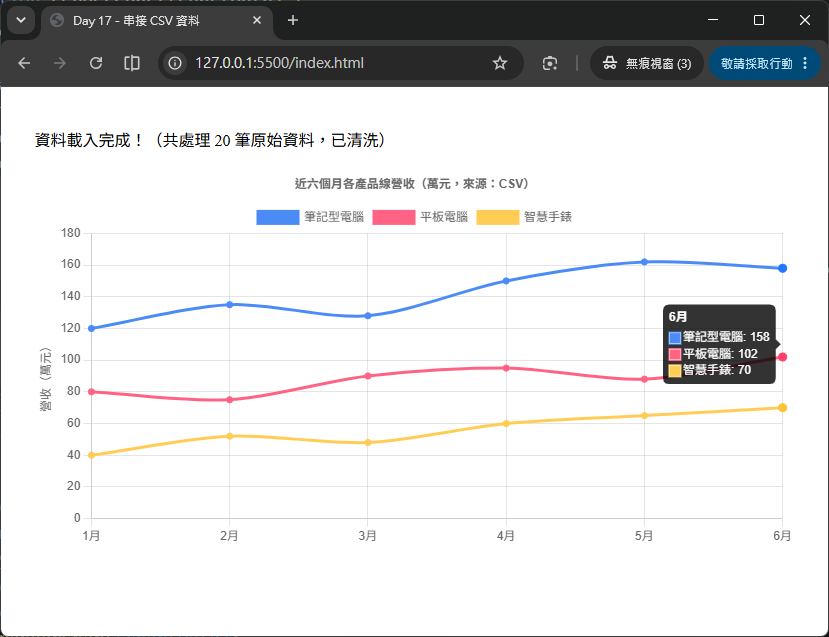

# Day 17 - 30 天手把手學會 Chart.js｜串接 CSV 資料

> 這兩天我們分別學會了串接「本地 JSON」（Day 15）與「後端 RESTful API」（Day 16），兩者的共通點是：資料本身已經是結構完整、格式乾淨的 JSON。但在真實世界裡，還有一種資料格式非常常見——**CSV（Comma-Separated Values，逗號分隔值）**。舉凡從 Excel／Google Sheets 匯出的報表、資料庫的匯出檔、甚至政府開放資料平台提供的資料集，十之八九都是 CSV 格式。今天我們要學習使用 **PapaParse** 這個套件把 CSV 檔案解析成 JavaScript 可以使用的資料，並學會用 `filter`、`map`、`reduce` 這三個陣列方法，把「原始、可能帶有髒資料」的表格內容，清洗、轉換成 Chart.js 需要的格式。

## 一、為什麼 CSV 需要額外的套件處理？

先看看 CSV 檔案長什麼樣子。假設我們有一份「近六個月各產品線營收」的資料，存成 `sales.csv`：

```text
month,product,revenue,region
1月,筆記型電腦,120,北區
1月,平板電腦,80,北區
2月,筆記型電腦,135,北區
2月,平板電腦,75,北區
```

CSV 本質上就是一份「純文字檔」，每一行代表一筆資料，欄位之間用逗號分隔，第一行通常是欄位名稱（Header）。它看起來很單純，為什麼不能像 JSON 一樣直接用 `JSON.parse()` 讀取，反而需要額外安裝 PapaParse 這個套件呢？主要原因有幾個：

- **CSV 沒有標準的資料型別**：JSON 裡的數字 `120` 就是 `number`，字串 `"120"` 就是 `string`，兩者一看就分得清楚。但 CSV 檔案裡的每一格都只是「一段文字」，`120` 這個文字到底該被當成數字還是字串，需要額外判斷與轉換。
- **換行、逗號、引號的例外規則很多**：如果某個欄位的內容本身就包含逗號（例如地址「台北市, 中正區」），標準的 CSV 格式會用雙引號把整個欄位包起來（`"台北市, 中正區"`），但如果自己手刻字串分割邏輯（例如簡單地用 `split(',')`），很容易在這種情況下解析出錯。
- **編碼（Encoding）問題**：CSV 檔案有可能是 UTF-8 編碼，也可能是早期 Windows 系統常用的 Big5 編碼，讀取時如果編碼判斷錯誤，中文字會變成亂碼（例如「??????」或「�ǫ~�q��」）。
- **不一定乾淨**：CSV 檔案很常見「某些儲存格是空的」「數字前後多了空白」「甚至打錯字」等髒資料，需要額外的清洗步驟。

**PapaParse** 正是為了解決上述這些「CSV 解析的眉眉角角」而生的專用套件，是目前 JavaScript 生態圈中最受歡迎的 CSV 解析工具之一。今天我們會用它來取代自己手刻的字串處理邏輯。

## 二、認識 PapaParse

[PapaParse](https://www.papaparse.com/) 是一個純 JavaScript 撰寫的 CSV 解析套件，不依賴任何其他框架，可以在瀏覽器或 Node.js 環境使用。

### 2.1 安裝／引入方式

跟 Chart.js 一樣，最簡單的方式是透過 CDN 直接引入 `<script>` 標籤：

```html
<script src="https://cdn.jsdelivr.net/npm/papaparse@5.5.4/papaparse.min.js"></script>
```

如果專案使用 npm 管理套件（例如搭配 Vite、Webpack），則可以：

```bash
npm install papaparse@5.5.4
```

```js
import Papa from 'papaparse';
```

今天的範例先使用 CDN 方式，之後接觸打包工具的章節，會再示範 npm 安裝的完整流程。

### 2.2 最基本的用法

PapaParse 的核心 API 是 `Papa.parse()`，可以直接解析「一段 CSV 文字」：

```js
const csvText = `month,product,revenue
1月,筆記型電腦,120
1月,平板電腦,80`;

const result = Papa.parse(csvText, {
  header: true // 第一行當成欄位名稱，把每一列轉成物件而不是陣列
});

console.log(result.data);
// [
//   { month: '1月', product: '筆記型電腦', revenue: '120' },
//   { month: '1月', product: '平板電腦', revenue: '80' }
// ]
```

留意這裡的 `revenue` 目前還是字串 `'120'`，而不是數字 `120`——這正是前面提到「CSV 沒有標準資料型別」的問題，稍後會介紹 `dynamicTyping` 選項來解決。

### 2.3 常用設定選項（config）

`Papa.parse(input, config)` 的第二個參數是設定物件，今天會用到的常用選項：

| 選項 | 說明 |
| --- | --- |
| `header: true` | 把第一列當成欄位名稱，解析結果會是「物件陣列」而不是「陣列的陣列」，強烈建議搭配使用，可讀性大幅提升。 |
| `dynamicTyping: true` | 自動判斷並轉換每一格的型別，數字字串會變成 `number`，`"true"` / `"false"` 會變成布林值。 |
| `skipEmptyLines: true` | 自動忽略檔案中的空白行（例如 Excel 匯出時常見的檔案結尾空行）。 |
| `download: true` | 讓 `input` 參數直接是一個「網址或檔案路徑」，PapaParse 會自動幫你發送請求下載檔案內容再解析，不需要自己先呼叫 `fetch`。 |
| `complete: (results) => {...}` | 解析完成時呼叫的回呼函式，`results.data` 就是解析好的資料陣列。 |
| `error: (error) => {...}` | 解析發生錯誤時呼叫的回呼函式。 |
| `encoding: 'UTF-8'` | 指定檔案編碼，若讀取到中文字亂碼，通常就是編碼設定不正確。 |

## 三、讀取 CSV 檔案：兩種常見情境

實務上讀取 CSV 資料主要有兩種情境：**讀取伺服器上（或專案內）固定路徑的 CSV 檔案**，以及**讓使用者自行上傳 CSV 檔案**。

### 3.1 情境一：讀取固定路徑的 CSV 檔案

搭配 `download: true`，可以直接把檔案路徑或網址傳給 `Papa.parse()`：

```js
Papa.parse('data/sales.csv', {
  download: true,
  header: true,
  dynamicTyping: true,
  skipEmptyLines: true,
  complete: (results) => {
    console.log(results.data);
  }
});
```

由於 `Papa.parse` 預設是「回呼函式（Callback）」風格，如果想搭配今天前兩天習慣的 `async` / `await` 寫法，可以用 `Promise` 包裝一層：

```js
function parseCsv(url) {
  return new Promise((resolve, reject) => {
    Papa.parse(url, {
      download: true,
      header: true,
      dynamicTyping: true,
      skipEmptyLines: true,
      complete: (results) => resolve(results.data),
      error: (error) => reject(error)
    });
  });
}

async function initChart() {
  try {
    const rows = await parseCsv('data/sales.csv');
    console.log(rows);
  } catch (error) {
    console.error('讀取 CSV 失敗：', error);
  }
}
```

> 💡 **小提醒**：跟 Day 15 讀取本地 JSON 一樣，`download: true` 底層也是透過 HTTP 請求讀取檔案，因此同樣需要透過本地伺服器（如 Live Server）開啟頁面，直接雙擊開啟 `index.html`（`file://` 協定）一樣可能會遇到 CORS 相關的限制。

### 3.2 情境二：讓使用者自行上傳 CSV 檔案

另一種常見情境，是讓使用者透過 `<input type="file">` 上傳自己的 CSV 檔案（例如自行匯出的報表）。這時候 `Papa.parse()` 可以直接接受瀏覽器的 `File` 物件：

HTML 版面內容如下：
```html
<input type="file" id="csvFileInput" accept=".csv" />
```

JavaScript 程式碼內容如下：
```js
const fileInput = document.getElementById('csvFileInput');

fileInput.addEventListener('change', (event) => {
  const file = event.target.files[0]; // 使用者選擇的檔案（File 物件）
  if (!file) return;

  Papa.parse(file, {
    header: true,
    dynamicTyping: true,
    skipEmptyLines: true,
    complete: (results) => {
      console.log('解析完成：', results.data);
    }
  });
});
```

這種寫法完全不需要 `download: true`（因為檔案已經在使用者的瀏覽器記憶體裡，不需要額外發送網路請求），是打造「讓使用者自行上傳資料來畫圖表」這類工具型網頁時非常實用的技巧。

## 四、資料清洗與轉換：`filter`、`map`、`reduce`

PapaParse 幫我們把 CSV 轉成了「物件陣列」，但這份資料距離 Chart.js 需要的 `{ labels, datasets }` 格式還有一段差距，而且真實世界的 CSV 資料，通常還夾雜著一些「髒資料」。這時候就要靠 JavaScript 陣列的三個好夥伴：`filter`、`map`、`reduce`。

先看看今天範例中，`sales.csv` 解析出來的原始資料大概長這樣（`dynamicTyping: true` 已經把數字欄位轉換好）：

```js
[
  { month: '1月', product: '筆記型電腦', revenue: 120, region: '北區' },
  { month: '1月', product: '平板電腦',   revenue: 80,  region: '北區' },
  // ...中略
  { month: '1月', product: '筆記型電腦', revenue: null, region: '南區' }, // 空值（髒資料）
  { month: '2月', product: '平板電腦',   revenue: -5,   region: '南區' }  // 不合理的負數（髒資料）
]
```

### 4.1 `filter()`：篩掉不合理的髒資料

`filter()` 會保留「符合條件」的元素，組成新陣列，很適合用來篩掉空值、負數等異常資料：

```js
const cleanRows = rows.filter((row) => {
  return typeof row.revenue === 'number' && row.revenue >= 0;
});
```

- `typeof row.revenue === 'number'`：排除 CSV 裡沒有填寫、被解析成 `null` 的資料列。
- `row.revenue >= 0`：排除營收是負數這種明顯不合理的異常值。

### 4.2 `map()`：轉換每一筆資料的形狀

`map()` 會把陣列中「每一個元素」轉換成另一種形式。這裡可以用來取出不重複的月份清單，做為圖表的 `labels`：

```js
// 用 Set 去除重複的月份，再展開成陣列
const months = [...new Set(cleanRows.map((row) => row.month))];
// ['1月', '2月', '3月', '4月', '5月', '6月']
```

### 4.3 `reduce()`：把多筆資料彙總、分組

CSV 資料常常是「一列代表一筆最細節的紀錄」（例如某月、某產品、某地區的營收），但圖表通常需要「依產品分組、加總各月營收」的彙總結果。這正是 `reduce()` 最擅長的工作——把整個陣列「濃縮」成一個累加後的結果：

```js
const grouped = cleanRows.reduce((acc, row) => {
  if (!acc[row.product]) {
    acc[row.product] = {};
  }
  // 同一產品、同一月份可能有多筆（例如不同地區），用累加的方式合併
  acc[row.product][row.month] = (acc[row.product][row.month] || 0) + row.revenue;
  return acc;
}, {});

// 結果類似：
// {
//   筆記型電腦: { '1月': 120, '2月': 135, ... },
//   平板電腦:   { '1月': 80,  '2月': 75,  ... }
// }
```

拆解 `reduce()` 的用法：

| 部分 | 說明 |
| --- | --- |
| 第一個參數（回呼函式） | `(acc, row) => {...}`，`acc`（accumulator，累加器）是目前累加到的結果，`row` 是目前正在處理的這一筆資料。 |
| 第二個參數 `{}` | 累加器的「初始值」，這裡從一個空物件開始累加。 |
| `return acc;` | 每次處理完一筆資料，都要把更新後的累加器 `return` 出去，交給下一輪繼續使用，這是新手最容易忘記的地方。 |

### 4.4 把清洗、彙總後的結果轉成 Chart.js 格式

最後再用一次 `map()`，把 `grouped` 物件轉換成 Chart.js 的 `datasets` 陣列：

```js
const colorPalette = ['rgb(75, 139, 245)', 'rgb(255, 99, 132)', 'rgb(255, 205, 86)'];

const datasets = Object.keys(grouped).map((productName, index) => ({
  label: productName,
  data: months.map((month) => grouped[productName][month] || 0), // 沒有資料的月份補 0
  borderColor: colorPalette[index % colorPalette.length],
  backgroundColor: colorPalette[index % colorPalette.length],
  tension: 0.3,
  fill: false
}));
```

- `Object.keys(grouped)`：取出所有產品名稱（`grouped` 物件的 key）。
- `months.map((month) => grouped[productName][month] || 0)`：依照第 4.2 節整理好的月份順序，一一取出該產品在每個月的營收；如果某個月剛好沒有資料，用 `|| 0` 補上預設值 `0`，避免圖表出現 `undefined` 造成的斷點或錯誤。

整個流程走一遍，就是：

```
CSV 原始文字
  → Papa.parse()：解析成物件陣列
  → filter()：篩掉空值、負數等髒資料
  → reduce()：依產品分組、依月份加總
  → map()：轉換成 Chart.js 的 labels / datasets 格式
  → new Chart(...)：畫出圖表
```

## 五、完整範例：讀取 CSV 並畫出折線圖

HTML 版面內容如下：
```html
<div style="width: 760px; margin: 40px auto;">
  <p id="statusText">資料載入中...</p>
  <canvas id="salesChart"></canvas>
</div>

<script src="https://cdn.jsdelivr.net/npm/chart.js@4.5.1"></script>
<script src="https://cdn.jsdelivr.net/npm/papaparse@5.5.4/papaparse.min.js"></script>
```

JavaScript 程式碼內容如下：
```js
const colorPalette = ['rgb(75, 139, 245)', 'rgb(255, 99, 132)', 'rgb(255, 205, 86)'];

function parseCsv(url) {
  return new Promise((resolve, reject) => {
    Papa.parse(url, {
      download: true,
      header: true,
      dynamicTyping: true,
      skipEmptyLines: true,
      complete: (results) => resolve(results.data),
      error: (error) => reject(error)
    });
  });
}

function transformToChartData(rows) {
  const cleanRows = rows.filter((row) => typeof row.revenue === 'number' && row.revenue >= 0);
  const months = [...new Set(cleanRows.map((row) => row.month))];
  const grouped = cleanRows.reduce((acc, row) => {
    if (!acc[row.product]) acc[row.product] = {};
    acc[row.product][row.month] = (acc[row.product][row.month] || 0) + row.revenue;
    return acc;
  }, {});
  const datasets = Object.keys(grouped).map((name, index) => ({
    label: name,
    data: months.map((month) => grouped[name][month] || 0),
    borderColor: colorPalette[index % colorPalette.length],
    backgroundColor: colorPalette[index % colorPalette.length],
    tension: 0.3,
    fill: false
  }));
  return { labels: months, datasets };
}

let chartInstance = null;

function renderChart(chartData) {
  if (chartInstance) {
    chartInstance.destroy();
  }
  chartInstance = new Chart(document.getElementById('salesChart'), {
    type: 'line',
    data: chartData,
    options: {
      responsive: true,
      interaction: { mode: 'index', intersect: false },
      plugins: {
        title: { display: true, text: '近六個月各產品線營收（萬元，來源：CSV）' }, tooltip: { mode: 'index', intersect: false }},
      scales: {
        y: { beginAtZero: true, title: { display: true, text: '營收（萬元）' } }
      }
    }
  });
}

async function initChart() {
  const statusText = document.getElementById('statusText');
  try {
    const rows = await parseCsv('data/sales.csv');
    const chartData = transformToChartData(rows);
    renderChart(chartData);
    statusText.textContent = `資料載入完成！（共處理 ${rows.length} 筆原始資料，已清洗）`;
  } catch (error) {
    console.error('讀取 CSV 失敗：', error);
    statusText.textContent = '資料載入失敗，請確認 CSV 檔案路徑是否正確。';
  }
}

initChart();
```



## 六、實用小技巧：一次看懂資料清洗的三兄弟

初學者常常搞混 `filter`、`map`、`reduce` 三者的用途，這裡用一張表快速釐清：

| 方法 | 輸入 → 輸出 | 適合用途 | 今天範例中的用法 |
| --- | --- | --- | --- |
| `filter()` | 陣列 → **元素數量較少或相同**的陣列 | 篩選、去除不要的資料 | 篩掉 `revenue` 是空值或負數的髒資料 |
| `map()` | 陣列 → **元素數量相同**的陣列（形狀改變） | 轉換每個元素的樣子 | 取出不重複的月份、把分組結果轉成 `datasets` |
| `reduce()` | 陣列 → **任意型別**的單一結果（物件、數字、陣列都可以） | 彙總、分組、加總 | 把每一列資料依「產品」分組、依「月份」加總 |

三者都不會修改原本的陣列（不會有「副作用」），而是回傳一個新的結果，這是撰寫資料轉換邏輯時很重要的觀念——**原始資料保持不變，每一步轉換都是產生新的資料**，可以避免後續程式碼互相干擾、難以除錯的問題。

---

明天（Day 18）我們會把資料的「即時性」再往前推一步，學習如何讓圖表**動態更新**——透過 `setInterval` 搭配 Chart.js 的 `update()` 方法，模擬股價走勢、感測器數據等即時資料流不斷更新畫面的效果。

## 參考資源

- [Chart.js](https://www.chartjs.org/)
- [Chart.js GitHub](https://github.com/chartjs/Chart.js)
- [PapaParse 官方文件](https://www.papaparse.com/docs)
