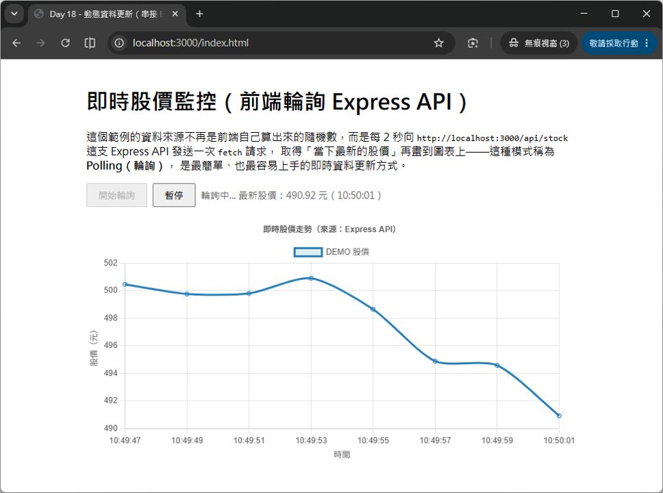

# Day 18 - 30 天手把手學會 Chart.js｜動態資料更新

> 過去三天（Day 15 ~ Day 17）我們陸續學會了把「本地 JSON」「後端 RESTful API」「CSV 檔案」轉換成 Chart.js 需要的資料格式，但這些資料都有一個共通點：**畫面畫出來之後，資料就固定不動了**。可是在真實世界裡，很多圖表是需要「持續更新」的——證券交易平台的股價走勢圖每秒都在跳動、工廠儀表板上的感測器溫度即時波動、網站流量監控圖每隔幾秒就多一筆新資料。今天我們要學習 Chart.js 動態更新資料的核心技巧：善用 `chart.update()` 搭配 `setInterval`，並實作兩種常見情境——**前端自行模擬即時資料流**，以及**定時向後端 API 拉取最新資料**。

## 一、複習：Chart.js 更新資料的核心觀念

Chart.js 的圖表資料存放在 `chart.data` 這個物件裡，結構跟建立圖表時傳入的 `data` 完全一樣：

```js
console.log(chart.data);
// {
//   labels: ['1s', '2s', '3s'],
//   datasets: [
//     { label: '溫度', data: [25.1, 25.4, 25.0], borderColor: '#e67e22' }
//   ]
// }
```

**只要直接修改 `chart.data.labels` 或 `chart.data.datasets[i].data` 這兩個陣列的內容，再呼叫 `chart.update()`，Chart.js 就會自動重新計算座標軸範圍、重新繪製圖表，並且在新舊數值之間補上一段平滑的動畫效果。** 這是 Chart.js「動態更新」最核心也最重要的觀念——你不需要（也不應該）銷毀舊圖表再重新 `new Chart(...)` 一次，那樣做不但效能差，也會讓原本的動畫、互動狀態全部重置。

### 1.1 新增一筆資料

```js
function addData(chart, label, newValue) {
  chart.data.labels.push(label);
  chart.data.datasets[0].data.push(newValue);
  chart.update(); // 重新渲染圖表
}
```

### 2.2 移除一筆資料

```js
function removeOldestData(chart) {
  chart.data.labels.shift();          // 移除最舊的標籤
  chart.data.datasets[0].data.shift(); // 移除最舊的數值
  chart.update();
}
```

`push()` 用來在陣列「尾端」新增資料（最新的一筆），`shift()` 用來移除陣列「開頭」的資料（最舊的一筆）。這一組「一邊 `push` 一邊 `shift`」的搭配，正是等一下要介紹的「滑動視窗」技巧的基礎。

> 💡 **小提醒**：如果同時要修改多個 dataset（例如折線圖有兩條線），別忘了用 `chart.data.datasets.forEach(...)` 把每個 dataset 都更新到，否則資料筆數會對不齊，導致圖表出現錯位或報錯。

## 二、setInterval：建立「定時更新」的骨架

JavaScript 內建的 `setInterval(callback, intervalMs)` 可以讓瀏覽器每隔一段時間（毫秒）就自動執行一次 `callback` 函式，是實作「定時更新圖表」最簡單直覺的方式。

```js
// 每 1000 毫秒（1 秒）執行一次 tick 函式
const timerId = setInterval(tick, 1000);

// 想要停止定時更新時，一定要記得呼叫 clearInterval
clearInterval(timerId);
```

### 2.1 為什麼一定要 `clearInterval`？

`setInterval` 一旦啟動，就會**無限期**持續執行下去，即使使用者離開了頁面上的這個區塊、切換到別的分頁、甚至元件已經從畫面上移除，只要沒有呼叫 `clearInterval()`，計時器仍然會在背景默默地執行，持續耗用 CPU 資源、持續呼叫 API，這就是常見的「記憶體洩漏（Memory Leak）」與「殭屍計時器」問題。因此撰寫定時更新功能時，務必掌握以下原則：

- **保留 `setInterval()` 回傳的 `timerId`**，之後才能透過 `clearInterval(timerId)` 精準關閉它。
- **提供明確的「開始／暫停」按鈕**，讓使用者可以主動控制，而不是頁面一載入就無限期執行。
- **避免重複建立計時器**：呼叫「開始」前，先檢查是否已經有一個計時器在跑（例如 `if (timerId) return;`），否則使用者連續點兩次「開始」，畫面上就會同時存在兩個計時器，資料更新速度會變成兩倍快。
- 如果是在框架（React / Vue / Angular）中使用，之後會學到要在元件卸載（unmount）的生命週期中呼叫 `clearInterval`，這裡先建立好觀念，未來銜接框架時會更容易理解。

### 2.2 監聽分頁可見狀態，進一步節省資源

一個更細緻的優化技巧，是搭配瀏覽器的 `visibilitychange` 事件，偵測使用者是否切到別的分頁：

```js
document.addEventListener('visibilitychange', () => {
  if (document.hidden) {
    clearInterval(timerId); // 分頁不可見時，暫停更新，節省資源
  }
});
```

這對「使用者根本沒在看」的背景分頁特別有幫助，可以避免不必要的運算與網路請求。

## 三、滑動視窗（Sliding Window）：讓圖表資料量維持固定

如果只是單純不斷 `push()` 新資料卻從不移除舊資料，圖表的資料點會隨著時間無限增加，衍生兩個問題：

1. **效能持續下降**：資料點越多，Chart.js 每次 `update()` 需要計算與繪製的內容就越多，長時間執行後畫面會越來越卡頓。
2. **圖表可讀性變差**：x 軸標籤會越擠越密，使用者反而看不清楚「最近」的趨勢變化。

解決方法就是「滑動視窗」：固定只保留最新的 N 筆資料，每次新增一筆資料時，如果超過上限，就把最舊的一筆移除：

```js
const MAX_POINTS = 20; // 只保留最新 20 筆資料

function pushData(chart, label, value) {
  chart.data.labels.push(label);
  chart.data.datasets[0].data.push(value);

  if (chart.data.labels.length > MAX_POINTS) {
    chart.data.labels.shift();
    chart.data.datasets[0].data.shift();
  }

  chart.update();
}
```

這種效果就像看到圖表「由右往左緩慢捲動」——最新的資料不斷從右側加入，最舊的資料從左側被推出畫面，是即時資料圖表最常見的呈現方式（例如心電圖、股價走勢圖）。

## 四、實作：「輪詢（Polling）」串接後端 API

實務上，即時資料通常來自後端伺服器（例如證交所的股價資料庫、感測器蒐集的最新讀數），前端沒辦法憑空生成，而是需要**定時向後端 API 詢問「現在最新的資料是什麼」**，這種模式稱為 **Polling（輪詢）**。它的運作方式很單純：每隔固定的時間間隔（例如 2 秒），就用 `fetch` 呼叫一次 API，拿到最新資料後更新圖表。

### 4.1 後端：用 Express 建立即時股價模擬 API

延續 Day 16 學過的 Express 用法，這次讓伺服器在記憶體中維護一個「目前股價」的狀態，每次收到請求時，就用隨機漫步的方式往前推進一步，模擬股價持續變動的效果：

server.js
```js
const express = require('express');
const cors = require('cors');

const app = express();
const PORT = 3000;

app.use(cors());
app.use(express.static('public')); // 直接開啟 http://localhost:3000/index.html 也能測試前端頁面

let currentPrice = 500; // 伺服器端維護的目前股價

function nextPrice() {
  const delta = (Math.random() - 0.5) * 8;
  currentPrice = Math.max(50, currentPrice + delta);
  return Number(currentPrice.toFixed(2));
}

// 每次呼叫這支 API，都會回傳「當下最新」的一筆股價
app.get('/api/stock', (req, res) => {
  res.json({
    symbol: 'DEMO',
    price: nextPrice(),
    timestamp: Date.now()
  });
});

app.listen(3000, () => {
  console.log('API 已啟動：http://localhost:3000/api/stock');
});
```

啟動方式：

```bash
npm install
npm start
```

### 4.2 前端：用 setInterval 定時輪詢

```js
const API_URL = 'http://localhost:3000/api/stock';
const POLLING_INTERVAL_MS = 2000;
let timerId = null;

async function fetchLatestPrice() {
  try {
    const response = await fetch(API_URL);
    if (!response.ok) throw new Error(`HTTP ${response.status}`);

    const result = await response.json();
    const time = new Date(result.timestamp).toLocaleTimeString('zh-TW', { hour12: false });
    pushData(time, result.price); // 沿用前面介紹的滑動視窗邏輯
  } catch (error) {
    console.error('取得股價失敗：', error);
    stop(); // 連續失敗時自動停止輪詢，避免無限重試造成大量錯誤請求
  }
}

function start() {
  if (timerId) return;
  fetchLatestPrice(); // 先立即取得一次，不需要等待第一次 interval 觸發
  timerId = setInterval(fetchLatestPrice, POLLING_INTERVAL_MS);
}

function stop() {
  clearInterval(timerId);
  timerId = null;
}
```

完整前後端程式碼（`server.js` 為後端、`public/index.html` 為前端頁面）。這個範例把 Day 16 的「非同步資料載入」與今天的「定時更新」結合在一起，是最貼近真實專案的做法。

> 💡 **Polling 的取捨**：輪詢的優點是實作簡單、相容性好（任何後端框架都能輕鬆支援），缺點是「即使資料沒有變化，前端仍然會固定發送請求」，會造成一定程度的網路與伺服器負擔。如果需要「伺服器主動推播」且更新頻率非常高的場景（例如毫秒等級的高頻交易），業界通常會改用 **WebSocket** 或 **Server-Sent Events（SSE）** 技術，讓伺服器有新資料時才主動通知前端，這部分屬於進階主題，有興趣可以參考本篇最後的延伸閱讀。

### 4.3 前端完整程式碼

CSS 樣式內容如下：
```css
body { font-family: "Microsoft JhengHei", sans-serif; max-width: 720px; margin: 40px auto; }
.toolbar { margin-bottom: 16px; display: flex; gap: 8px; align-items: center; }
button { padding: 6px 16px; cursor: pointer; }
#status { color: #666; font-size: 14px; }
canvas { max-height: 400px; }
```

HTML 版面內容如下：
```html
<div class="toolbar">
  <button id="startBtn">開始輪詢</button>
  <button id="stopBtn" disabled>暫停</button>
  <span id="status">尚未開始</span>
</div>
<canvas id="stockChart"></canvas>
<script src="https://cdn.jsdelivr.net/npm/chart.js@4.5.1"></script>
```

JavaScript 程式碼內容如下：
```js
const API_URL = 'http://localhost:3000/api/stock';
const MAX_POINTS = 15;
const POLLING_INTERVAL_MS = 2000;

let timerId = null;

const ctx = document.getElementById('stockChart');
const statusText = document.getElementById('status');
const startBtn = document.getElementById('startBtn');
const stopBtn = document.getElementById('stopBtn');

const chart = new Chart(ctx, {
  type: 'line',
  data: {
    labels: [],
    datasets: [{
      label: 'DEMO 股價',
      data: [],
      borderColor: '#2980b9',
      backgroundColor: 'rgba(41, 128, 185, 0.15)',
      tension: 0.25,
      pointRadius: 3
    }]
  },
  options: {
    responsive: true,
    animation: { duration: 300 },
    scales: {
      y: { title: { display: true, text: '股價（元）' } },
      x: { title: { display: true, text: '時間' } }
    },
    plugins: {
      title: { display: true, text: '即時股價走勢（來源：Express API）' }
    }
  }
});

function pushData(label, value) {
  chart.data.labels.push(label);
  chart.data.datasets[0].data.push(value);
  if (chart.data.labels.length > MAX_POINTS) {
    chart.data.labels.shift();
    chart.data.datasets[0].data.shift();
  }
  // 高頻率更新時，改用 'none' 模式關閉動畫，避免動畫堆疊造成畫面卡頓
  chart.update('none');
}

async function fetchLatestPrice() {
  try {
    const response = await fetch(API_URL);
    if (!response.ok) {
      throw new Error(`HTTP ${response.status}`);
    }
    const result = await response.json();
    const time = new Date(result.timestamp).toLocaleTimeString('zh-TW', { hour12: false });
    pushData(time, result.price);
    statusText.textContent = `輪詢中... 最新股價：${result.price} 元（${time}）`;
  } catch (error) {
    console.error('取得股價失敗：', error);
    statusText.textContent = '取得資料失敗，請確認後端伺服器（node server.js）是否已啟動。';
    stop(); // 連續失敗時自動停止輪詢，避免持續噴錯
  }
}

function start() {
  if (timerId) return;
  fetchLatestPrice(); // 立即先取得一次，不用等第一個 interval
  timerId = setInterval(fetchLatestPrice, POLLING_INTERVAL_MS);
  startBtn.disabled = true;
  stopBtn.disabled = false;
}

function stop() {
  clearInterval(timerId);
  timerId = null;
  startBtn.disabled = false;
  stopBtn.disabled = true;
}

startBtn.addEventListener('click', start);
stopBtn.addEventListener('click', stop);
```



## 五、更新頻率高時的效能考量

如果圖表需要非常頻繁地更新（例如每 100 毫秒更新一次），預設的動畫效果反而會造成負擔——因為每次 `update()` 都會觸發一段動畫（預設約 1 秒），高頻率更新時，前一次動畫可能都還沒播完，下一次更新就又來了，導致動畫互相干擾、畫面反而卡頓。

Chart.js 提供了 `update('none')` 這個用法，可以讓「這一次」的更新直接跳過動畫，瞬間套用新資料：

```js
chart.update('none'); // 這次更新不要播放動畫，直接切換到新資料
```

也可以在建立圖表時，直接把整體動畫時間縮短，兩種方式可以視情境搭配使用：

```js
new Chart(ctx, {
  // ...
  options: {
    animation: { duration: 300 } // 全域動畫時間縮短為 300 毫秒
  }
});
```

---

明天（Day 19）我們會進一步學習圖表的**互動事件處理**——如何綁定 `onClick`、`onHover` 事件、使用 `getElementsAtEventForMode` 取得使用者點擊到的確切資料點，並實作「點擊 A 圖表、更新 B 圖表」的圖表連動效果，讓圖表不再只是靜態展示，而能真正回應使用者的操作。

## 參考資源

- [Chart.js](https://www.chartjs.org/)
- [Chart.js GitHub](https://github.com/chartjs/Chart.js)
