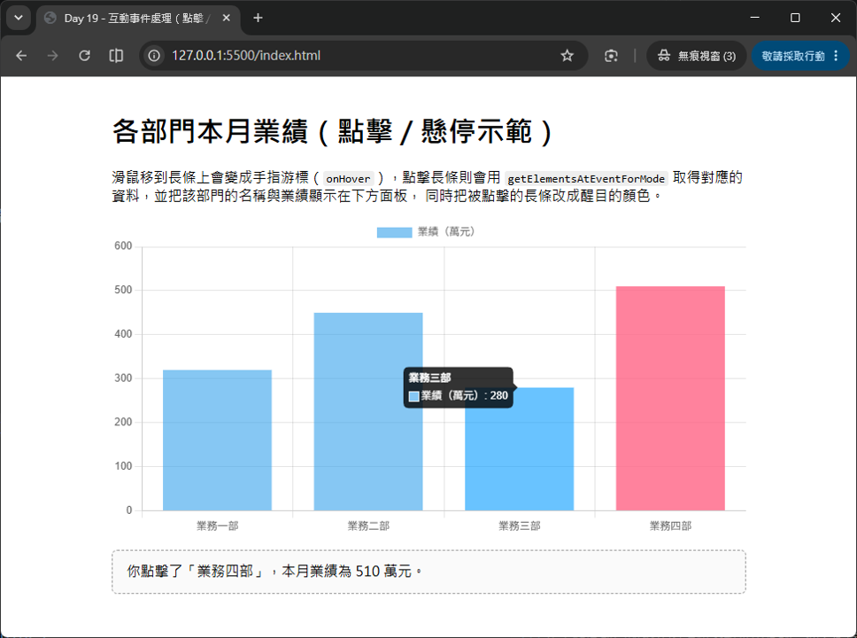

# Day 19 - 30 天手把手學會 Chart.js｜互動事件處理

> Day 18 我們讓圖表「動」了起來——資料會隨著時間自動更新。今天要讓圖表「聽得懂」使用者的操作：當使用者把滑鼠移到某個資料點上，圖表能不能給予回饋？當使用者點擊某一根長條、某一個扇形時，我們能不能知道「使用者點的到底是哪一筆資料」？甚至，能不能讓「點擊 A 圖表」這個動作，直接觸發「更新 B 圖表」？這些都屬於 Chart.js 的**互動事件處理（Interaction / Events）**範疇。學會這一天的內容之後，圖表就不再只是靜態或自動播放的畫面，而是能真正「回應使用者操作」的互動元件——這也是儀表板（Dashboard）、資料探索工具最核心的能力之一。

## 一、Chart.js 的事件系統：`events`、`onClick`、`onHover`

Chart.js 的圖表其實就是畫在 `<canvas>` 上的一張圖片，瀏覽器原生並不知道「這個像素位置對應到第幾筆資料」。因此 Chart.js 在底層幫我們做了一層轉換：它會監聽 canvas 上的滑鼠 / 觸控事件，計算出滑鼠位置與各個資料點、長條、扇形之間的距離，判斷「使用者現在互動的是哪些圖表元素（elements）」，再把結果透過 `onClick`、`onHover` 這些回呼函式（callback）傳給我們使用。

### 1.1 `options.events`：決定要監聽哪些瀏覽器事件

```javascript
const chart = new Chart(ctx, {
  type: 'bar',
  data: data,
  options: {
    // 預設值就是這幾個事件，這裡列出來方便對照
    events: ['mousemove', 'mouseout', 'click', 'touchstart', 'touchmove']
  }
});
```

如果圖表完全不需要互動（例如只是展示用的縮圖），可以把 `events` 設為空陣列 `[]`，減少不必要的事件監聽與運算負擔。反過來，如果只想要回應點擊、不想要 hover 效果，可以只保留 `events: ['click']`。

### 1.2 `onClick`：使用者點擊圖表時觸發

```javascript
const chart = new Chart(ctx, {
  type: 'bar',
  data: data,
  options: {
    onClick: (event, activeElements, chartInstance) => {
      console.log('點擊事件：', event);
      console.log('目前作用中的元素：', activeElements);
      console.log('圖表實體：', chartInstance);
    }
  }
});
```

`onClick` 在使用者點擊（`click`）、放開滑鼠（`mouseup`）或按右鍵（`contextmenu`）且事件發生在 `chartArea`（圖表繪製區域）內時觸發，會傳入三個參數：

- `event`：原生事件物件（透過 `event.native` 可以取得瀏覽器原生的 `MouseEvent`）。
- `activeElements`：目前判定為「作用中」的圖表元素陣列（依照 `options.interaction` 的設定判斷）。
- `chart`：圖表實體本身，方便在回呼函式內直接操作圖表。

### 1.3 `onHover`：滑鼠移動、觸碰到資料時觸發

```javascript
const chart = new Chart(ctx, {
  type: 'bar',
  data: data,
  options: {
    onHover: (event, activeElements) => {
      // 常見用法：滑鼠移到資料上時，把游標從箭頭變成手指，提示這裡「可以點擊」
      event.native.target.style.cursor = activeElements.length > 0 ? 'pointer' : 'default';
    }
  }
});
```

`onHover` 的參數結構跟 `onClick` 幾乎一樣，差別只在於觸發時機——只要滑鼠在 `chartArea` 內移動（或手指觸碰、滑動），就會不斷觸發，非常適合用來做「即時提示」，例如改變游標樣式、或是讓滑過的長條變亮一點。

> 💡 **小提醒**：`onHover` 每次滑鼠移動都會觸發一次，如果在裡面做太複雜的運算（例如重新請求 API），會嚴重拖慢畫面效能。`onHover` 適合做「輕量」的即時回饋，真正「查詢資料、更新其他圖表」這種較重的操作，通常會放在 `onClick` 裡處理，這樣使用者才需要「明確點擊」才會觸發。

## 二、互動模式（Interaction Modes）與 `getElementsAtEventForMode`

當一張圖表上有很多資料點、很多 dataset 重疊在一起時（例如折線圖有三條線），「滑鼠現在指到的到底是哪一個點」其實是一個需要演算法判斷的問題。Chart.js 把這個判斷邏輯抽象成「互動模式（mode）」，讓我們可以依照圖表類型、使用情境挑選最合適的判斷方式。

### 2.1 常用的 mode 一覽

| mode | 說明 |
| ---- | ---- |
| `point` | 只有滑鼠「精準疊在」某個資料點正上方時，才會判定命中。 |
| `nearest` | 找出**距離滑鼠最近**的資料元素（依照該元素中心點計算距離），是最直覺、最常用的模式。 |
| `index` | 找出「相同 x 軸位置（相同 index）」的所有資料，常用於「同時比較多條線在同一個時間點的數值」，例如 Tooltip 預設就是這個模式。 |
| `dataset` | 找出「同一個 dataset」內的所有資料元素，適合用在「點擊圖例、整條線」這類情境。 |
| `x` | 只依照滑鼠的 X 座標判斷，常用於實作「垂直游標線」。 |
| `y` | 只依照滑鼠的 Y 座標判斷，常用於水平長條圖等情境。 |

搭配 `intersect` 選項（預設 `true`）可以進一步微調：`intersect: true` 表示「滑鼠必須真的疊在圖表元素上」才會命中；`intersect: false` 則是「只要在合理範圍內，即使沒有精準疊在元素上也會命中」，對使用者來說互動體驗會比較寬鬆、好點擊。

```javascript
options: {
  interaction: {
    mode: 'nearest', // 全域互動模式，同時影響 hover 與 tooltip
    intersect: true
  }
}
```

### 2.2 `getElementsAtEventForMode()`：手動查詢「這次事件命中了哪些資料」

除了透過 `options.interaction` 設定「全域」的互動行為之外，Chart.js 也提供了 `chart.getElementsAtEventForMode(event, mode, options, useFinalPosition)` 這支 API，讓我們可以在 `onClick`、`onHover` 的回呼函式裡，**針對這一次事件**，自行指定要用哪一種模式去查詢。

```javascript
function clickHandler(event, activeElements, chart) {
  const points = chart.getElementsAtEventForMode(
    event,        // 事件物件
    'nearest',    // 互動模式
    { intersect: true }, // 額外選項，與 options.interaction 的選項相同
    true          // useFinalPosition：是否使用動畫「結束後」的最終位置計算（通常設為 true）
  );

  if (points.length > 0) {
    const point = points[0];
    const datasetIndex = point.datasetIndex; // 第幾個 dataset
    const index = point.index;               // 該 dataset 中的第幾筆資料

    const label = chart.data.labels[index];
    const value = chart.data.datasets[datasetIndex].data[index];

    console.log(`使用者點擊了「${label}」，數值為 ${value}`);
  }
}
```

回傳的 `points` 是一個陣列，陣列中每個元素都包含 `datasetIndex`（屬於第幾個資料集）與 `index`（在該資料集中的第幾筆），只要有了這兩個數字，就可以回頭從 `chart.data.labels` 與 `chart.data.datasets[...].data` 精準取出「使用者點到的到底是哪一筆原始資料」。這是所有「點擊互動」功能的核心：**先找出點到的元素座標（datasetIndex、index），再回頭查原始資料**。

> 💡 **`activeElements` vs `getElementsAtEventForMode`**：`onClick` 回呼函式的第二個參數 `activeElements`，其實就是 Chart.js 依照 `options.interaction` 的全域設定，「自動」算好的結果，效果類似直接呼叫一次 `getElementsAtEventForMode`。如果全域設定已經符合需求，直接使用 `activeElements` 即可；如果想要「針對這次點擊，臨時使用跟全域設定不同的模式」，才需要手動呼叫 `getElementsAtEventForMode`。

## 三、實作：點擊長條圖，取得對應資料並醒目提示

第一個範例聚焦在最基本、最常用的情境：畫一張長條圖（各部門本月業績），滑鼠移到長條上時游標變成手指形狀（`onHover`），點擊長條時，取得該部門的名稱與數值，顯示在下方面板，並把被點擊的長條改成不同顏色，讓使用者清楚知道「目前選取的是哪一根」。

```javascript
const baseColor = 'rgba(54, 162, 235, 0.6)';
const activeColor = 'rgba(255, 99, 132, 0.8)';

const chart = new Chart(ctx, {
  type: 'bar',
  data: {
    labels: ['業務一部', '業務二部', '業務三部', '業務四部'],
    datasets: [{
      label: '業績（萬元）',
      data: [320, 450, 280, 510],
      backgroundColor: ['業務一部', '業務二部', '業務三部', '業務四部'].map(() => baseColor)
    }]
  },
  options: {
    onHover: (event, activeElements) => {
      event.native.target.style.cursor = activeElements.length > 0 ? 'pointer' : 'default';
    },
    onClick: (event, activeElements, chartInstance) => {
      const points = chartInstance.getElementsAtEventForMode(event, 'nearest', { intersect: true }, true);
      if (!points.length) return;

      const point = points[0];
      const label = chartInstance.data.labels[point.index];
      const value = chartInstance.data.datasets[point.datasetIndex].data[point.index];

      // 把被點擊的長條改成醒目顏色，其餘長條恢復預設顏色
      const colors = chartInstance.data.labels.map((_, i) => (i === point.index ? activeColor : baseColor));
      chartInstance.data.datasets[0].backgroundColor = colors;
      chartInstance.update();

      // 這裡示範用 console.log，實際專案中可以改成更新畫面上的面板文字
      console.log(`你點擊了「${label}」，本月業績為 ${value} 萬元。`);
    }
  }
});
```



## 四、事件座標轉換為資料數值：`getRelativePosition`

有些情境並不是要「點到某個資料點」，而是想知道「使用者點擊的位置，換算成圖表的資料座標是多少」，例如在圖表上點一下，想知道當下滑鼠位置對應到 X 軸的哪個時間點、Y 軸的哪個數值（這種手法常用於「自訂十字游標」「手動標註資料」等進階功能）。這時候可以使用 `Chart.helpers.getRelativePosition()` 搭配座標軸的 `getValueForPixel()`：

```javascript
options: {
  onClick: (event) => {
    // 取得滑鼠點擊位置相對於 canvas 的座標（像素）
    const canvasPosition = Chart.helpers.getRelativePosition(event, chart);

    // 把像素座標換算成 x 軸、y 軸實際的資料數值
    const dataX = chart.scales.x.getValueForPixel(canvasPosition.x);
    const dataY = chart.scales.y.getValueForPixel(canvasPosition.y);

    console.log(`點擊位置對應的資料座標：x = ${dataX}, y = ${dataY}`);
  }
}
```

> 💡 若專案是透過 npm 安裝、使用 bundler（如 Vite、Webpack）引入 Chart.js，`getRelativePosition` 需要額外從 `chart.js/helpers` 這個子路徑匯入：`import { getRelativePosition } from 'chart.js/helpers';`，而不是直接掛在 `Chart` 物件底下。

這個技巧跟「找出被點擊的資料元素」是互補的兩種手法：`getElementsAtEventForMode` 適合「使用者點的剛好是既有的資料點／長條」，`getRelativePosition` 則適合「使用者點的是圖表上任意一個空白位置，我們想知道那個位置對應的數值」。

## 五、`onHover` 的實務應用：游標樣式與視覺回饋

除了範例一示範的「改變游標樣式」之外，`onHover` 也很適合用來做「輕量的視覺提示」，讓使用者在點擊之前，就能感受到「這裡是可以互動的」。常見的搭配技巧：

```javascript
options: {
  onHover: (event, activeElements) => {
    const target = event.native.target;
    // 有作用中的元素（滑鼠正指著某個資料）時，游標變成手指；否則恢復預設箭頭
    target.style.cursor = activeElements.length > 0 ? 'pointer' : 'default';
  }
}
```

如果想要「滑過長條時，長條顏色稍微變亮」這類效果，Chart.js 本身針對長條圖、圓餅圖等元素，已經內建了 `hoverBackgroundColor`、`hoverBorderWidth` 等樣式選項，不需要自己在 `onHover` 裡手動改顏色：

```javascript
datasets: [{
  data: [320, 450, 280, 510],
  backgroundColor: 'rgba(54, 162, 235, 0.6)',
  hoverBackgroundColor: 'rgba(54, 162, 235, 0.9)', // 滑鼠移過去時自動套用的顏色
  hoverBorderWidth: 2
}]
```

這種「內建 hover 樣式」與「`onHover` 回呼函式手動處理」的差異在於：內建樣式只能改變外觀（顏色、邊框等），如果需要「同時更新畫面上其他區域的文字、觸發其他邏輯」，就必須透過 `onHover` 回呼函式自行撰寫。

---

明天（Day 20）我們會進入**響應式設計（Responsive）**：學習 `responsive` 與 `maintainAspectRatio` 這兩個關鍵選項，了解圖表在不同裝置、不同容器尺寸下該如何正確縮放，並認識常見的 RWD（響應式網頁設計）版面搭配技巧，讓圖表在手機、平板、桌機上都能維持良好的呈現效果。

## 參考資源

- [Chart.js](https://www.chartjs.org/)
- [Chart.js GitHub](https://github.com/chartjs/Chart.js)
