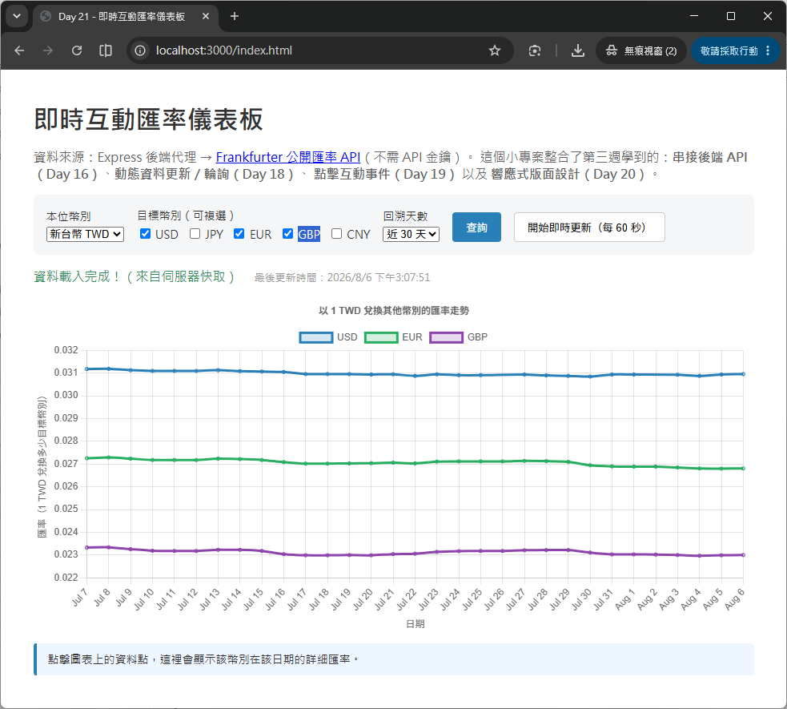

# Day 21 - 30 天手把手學會 Chart.js｜第三週總複習與小專案

> 第三週的六天，我們把 Chart.js 從「只會畫假資料」升級成「能夠串接真實世界資料」的實戰能力：從讀取本地 JSON、串接 Express 後端 API、解析 CSV 檔案，到動態資料更新（輪詢）、點擊互動事件、最後學會讓圖表在各種裝置上都能正確縮放的響應式設計。今天不學新的技巧，而是把這六天的知識點重新梳理一次，並透過一個更貼近真實情境的小專案——**串接公開匯率 API，打造「即時互動匯率儀表板」**——把所學整合起來，做出一個從「後端呼叫外部 API」到「前端互動圖表」完整串接的小型應用程式。

## 一、第三週學了什麼？快速回顧

在動手做小專案之前，先用一張表回顧這六天的重點，確認每個觀念都還記得：

| Day | 主題 | 核心重點 |
| --- | --- | --- |
| Day 15 | 串接靜態 JSON 資料 | `fetch` API 讀取本地 JSON、`async`/`await` 改寫非同步流程、把 JSON 轉換成 `{ labels, datasets }` 格式 |
| Day 16 | 串接後端 API（RESTful） | 使用 Express 建立 `GET /api/...` 路由、`cors` 套件解決跨來源請求、Loading／Success／Error 三種畫面狀態、`fetch` 與 `axios` 的差異、重複建圖前要先 `destroy()` |
| Day 17 | 串接 CSV 資料 | 使用 PapaParse 解析 CSV、`filter`／`map`／`reduce` 做資料清洗與轉換 |
| Day 18 | 動態資料更新 | `setInterval` + `chart.update()` 做輪詢（Polling）、滑動視窗（Sliding Window）維持固定資料量、高頻更新時用 `update('none')` 關閉動畫 |
| Day 19 | 互動事件處理 | `onClick`／`onHover` 事件、`getElementsAtEventForMode` 取得點擊的資料、圖表連動（點擊 A 圖表更新 B 圖表） |
| Day 20 | 響應式設計（Responsive） | `responsive`／`maintainAspectRatio`／`aspectRatio`、專屬容器（Dedicated Container）規則、Flexbox／Grid 版面下的 `min-width: 0` 陷阱、`onResize`／`resizeDelay` |

如果表格中有任何一項覺得「好像有點模糊」，建議先回頭翻閱對應的 Day 內容，再繼續往下閱讀，這樣今天的總複習與實作才會更有感覺。

## 二、複習一：資料來源的三種形式（JSON、API、CSV）

第三週前三天，其實都在解決同一個問題：「資料從哪裡來、要怎麼轉換成 Chart.js 認得的格式？」只是資料的「原始形式」不同：

```js
// Day 15：本地端的靜態 JSON 檔案
const response = await fetch('data/sales.json');
const json = await response.json();

// Day 16：遠端的後端 RESTful API（今天的小專案會延伸這個技巧）
const response = await fetch('http://localhost:3000/api/sales');
const json = await response.json();

// Day 17：CSV 檔案，需要額外的套件（PapaParse）解析成 JavaScript 陣列
Papa.parse('data/sales.csv', {
  download: true,
  header: true,
  complete: (result) => {
    const rows = result.data; // 陣列中每個元素是一列資料（物件）
  }
});
```

- **`fetch`**：瀏覽器內建，不需要安裝任何套件，讀取本地 JSON 或呼叫遠端 API 都用同一套 API。
- **PapaParse**：CSV 不是 JSON 格式，瀏覽器無法直接解析，需要額外安裝套件把「逗號分隔的文字」解析成陣列。
- **`filter`／`map`／`reduce`**：資料清洗三兄弟——`filter` 篩選符合條件的資料、`map` 轉換每一筆資料的格式、`reduce` 把整個陣列彙整成單一數值（例如加總、平均）。這三個方法在處理 API 回傳的原始資料時同樣好用，今天的小專案也會用到。

## 三、複習二：後端 API 與非同步資料載入

實務上的圖表資料通常來自「一支後端 API」，我們用 **Node.js 的 Express 框架** 建立了一支最簡單的 RESTful API：

```js
// server.js（Day 16 的骨架）
const express = require('express');
const cors = require('cors');

const app = express();
app.use(cors()); // 讓前端網頁可以跨來源呼叫這支 API

app.get('/api/sales', (req, res) => {
  res.json(salesData); // 回傳 JSON 給前端
});

app.listen(3000);
```

搭配前端的三種畫面狀態管理，是打造任何「串接真實資料」專案時都不可或缺的基本功：

```js
async function loadData() {
  setStatus('資料載入中...', 'loading');
  try {
    const response = await fetch(API_URL);
    if (!response.ok) {
      throw new Error(`HTTP 錯誤狀態碼：${response.status}`);
    }
    const json = await response.json();
    renderChart(json);
    setStatus('資料載入完成！', 'success');
  } catch (error) {
    setStatus(`資料載入失敗：${error.message}`, 'error');
  }
}
```

- **`cors`**：瀏覽器基於安全性，預設會擋下「網頁來源」與「API 來源」不一致的請求，必須在**後端**明確設定允許的來源。
- **Loading／Success／Error**：讓使用者隨時知道畫面目前的狀態，是所有網路請求都該具備的基本使用者體驗。
- **`chartInstance.destroy()`**：重複呼叫 API 更新圖表時，要先銷毀舊圖表實體，避免畫面疊圖。

今天的小專案會延伸這套「Express 後端 + fetch 前端」的架構，差別在於：**這次後端呼叫的不是自己編造的假資料，而是真正的外部公開 API**。

## 四、複習三：動態資料更新與輪詢（Polling）

讓圖表「動起來」最簡單的方式就是 `setInterval` 搭配 `chart.update()`：

```js
function pushData(label, value) {
  chart.data.labels.push(label);
  chart.data.datasets[0].data.push(value);

  // 滑動視窗：資料量超過上限時，把最舊的資料丟掉，維持圖表資料量固定
  if (chart.data.labels.length > MAX_POINTS) {
    chart.data.labels.shift();
    chart.data.datasets[0].data.shift();
  }

  chart.update('none'); // 高頻率更新時關閉動畫，避免動畫堆疊造成畫面卡頓
}

const timerId = setInterval(fetchLatestData, 2000); // 每 2 秒輪詢一次
clearInterval(timerId); // 停止輪詢
```

- **輪詢（Polling）**：前端主動、定時地重複呼叫 API，是最簡單、最容易上手的「即時資料」實作方式，缺點是資料更新頻率受限於輪詢間隔，且會產生額外的網路請求。
- **滑動視窗（Sliding Window）**：搭配 `shift()` 移除最舊的資料，避免圖表資料量無限增長導致效能變差。
- 今天的小專案會把輪詢間隔設定得比較長（60 秒），因為匯率資料本來就不是每秒都在變動，這也呼應 Day 18 提到的「更新頻率應該貼合資料本身的變動速度」這個觀念。

## 五、複習四：互動事件處理（onClick）

`onClick` 搭配 Chart.js 提供的 `elements` 陣列，可以取得使用者點擊的是「哪一組資料集（dataset）」「第幾筆資料（index）」：

```js
options: {
  onClick: (event, elements) => {
    if (!elements.length) return; // 沒有點到任何資料點就不處理

    const { datasetIndex, index } = elements[0];
    const dataset = chart.data.datasets[datasetIndex];
    const value = dataset.data[index];

    console.log(`點擊了「${dataset.label}」的第 ${index} 筆資料：${value}`);
  }
}
```

- `elements` 是一個陣列，代表滑鼠點擊位置附近符合互動模式（`interaction.mode`）的所有資料點。
- `datasetIndex`／`index` 是定位資料的座標，透過它們可以回頭查到 `chart.data.datasets` 裡對應的原始資料。
- 常見應用：點擊資料點顯示詳細說明、圖表連動（點擊 A 圖表更新 B 圖表）。今天的小專案會用這個技巧，讓使用者點擊匯率折線圖上的任一點，就能在下方看到該日期、該幣別的詳細數值。

## 六、複習五：響應式設計（Responsive）

Chart.js 圖表要在各種裝置上正確顯示，關鍵在於「canvas 的渲染尺寸」要跟著「容器的顯示尺寸」變動，而不是寫死固定的寬高：

```html
<!-- 專屬容器（Dedicated Container）：把 canvas 包在一個有明確尺寸的 div 裡 -->
<div style="position: relative; width: 100%; height: 420px;">
  <canvas id="myChart"></canvas>
</div>
```

```js
options: {
  responsive: true,          // 圖表自動跟著容器寬度縮放
  maintainAspectRatio: false // 不強制維持長寬比，讓容器的高度設定生效
}
```

- **`responsive: true`**：Chart.js 預設值，讓圖表寬度隨容器自動調整。
- **`maintainAspectRatio: false`**：關閉「固定長寬比」，改由外層容器的 CSS（例如固定 `height`）決定圖表高度，這是儀表板類型版面最常用的組合。
- **專屬容器規則**：canvas 不能直接放在 `body` 或沒有明確尺寸的容器裡，否則在 Flexbox／Grid 版面下容易發生尺寸計算錯誤或無限放大的問題。

## 七、小專案：即時互動匯率儀表板

### 7.1 專案目標

今天的小專案會用 CSS 的 Media Query，讓圖表在手機、桌機上都有恰當的顯示高度。

串接一個**免費、不需要 API 金鑰**的公開匯率 API——[Frankfurter](https://frankfurter.dev)（資料來源涵蓋多國央行），打造一個具備下列功能的匯率儀表板：

1. 使用者可以選擇「本位幣別」（例如新台幣 TWD）以及要比較的「目標幣別」（例如美元、日圓、歐元，可複選）。
2. 圖表用折線圖呈現一段期間（近 7／30／90 天）的匯率走勢，多條線同時比較不同幣別。
3. 點擊圖表上的任一資料點，畫面下方要顯示該幣別、該日期的詳細匯率數值。
4. 提供「開始即時更新」按鈕，每 60 秒重新查詢一次最新資料，模擬「即時」的效果。
5. 圖表在桌機、手機上都要能正確縮放顯示。

整體架構延續 Day 16 的「前後端分離」精神：

```
瀏覽器（Chart.js 前端頁面）
    │  fetch('/api/rates?...')
    ▼
Express 後端伺服器（本機 3000 埠）
    │  fetch('https://api.frankfurter.dev/...')
    ▼
Frankfurter 公開匯率 API（外部服務）
```

> 💡 **為什麼要多一層自己的 Express 後端，而不是前端直接呼叫 Frankfurter？**
> 1. **統一管理跨來源請求**：前端不需要處理不同外部 API 各自的 CORS 政策，一律呼叫「自己家」的 API 即可。
> 2. **資料格式轉換**：外部 API 回傳的原始格式往往不是 Chart.js 直接能用的樣子，放在後端統一轉換，前端程式碼會更單純。
> 3. **快取（Cache）**：外部 API 可能有呼叫頻率限制，或單純不希望短時間內重複打相同的請求，後端可以加上快取機制減少對外部服務的依賴。
> 4. 未來如果要換一個資料來源（例如從 Frankfurter 換成其他匯率服務），只需要修改後端，前端完全不用改動——這正是「前後端分離」架構的核心價值。

### 7.2 認識 Frankfurter 匯率 API

Frankfurter 是一個開源、免費、**不需要申請 API 金鑰**的公開匯率 API，很適合拿來練習「串接第三方公開資料」。它的時間序列查詢端點長這樣：

```
GET https://api.frankfurter.dev/v2/rates?base=TWD&quotes=USD,JPY&from=2026-08-01
```

- `base`：本位幣別（1 單位這個幣別，要換算成其他幣別）。
- `quotes`：要查詢的目標幣別，可用逗號分隔多個。
- `from`：查詢的起始日期，不指定 `to` 的話預設查到今天為止。

回傳的資料格式是「一列一筆」，每一筆代表「某一天、某個幣別」的匯率：

```json
[
  { "date": "2026-08-01", "base": "TWD", "quote": "EUR", "rate": 0.02689 },
  { "date": "2026-08-01", "base": "TWD", "quote": "GBP", "rate": 0.02303 },
  { "date": "2026-08-01", "base": "TWD", "quote": "USD", "rate": 0.03094 },
  ...
]
```

這種格式如果直接拿去畫圖並不方便——Chart.js 的折線圖比較適合「同一個日期陣列，搭配多組幣別各自的數值陣列」。因此後端的其中一項工作，就是把這種「一列一筆」的格式，轉換成「按幣別分組」的結構，這也是第三節提到的資料清洗技巧的實際應用。

### 7.3 後端：Express 代理伺服器

打開終端機（Terminal 或命令提示字元）。建立並進入新資料夾：
```bash
mkdir my-express-app
cd my-express-app
```

建立預設的 package.json 設定檔：
```bash
npm init -y
```

在終端機輸入指令安裝 Express 套件：
```bash
npm install express cors
```

在專案根目錄建立 `server.js` 檔案，程式碼內容如下：
```js
const express = require('express');
const cors = require('cors');

const app = express();
const PORT = 3000;

app.use(cors());
app.use(express.static('public')); // 直接開啟 http://localhost:3000/index.html 也能測試前端頁面

// Frankfurter 是一個「不需要 API 金鑰」的免費公開匯率 API，資料來源為多國央行
const FRANKFURTER_URL = 'https://api.frankfurter.dev/v2/rates';

// 簡單的記憶體快取：key -> { data, expireAt }
// 因為匯率資料一天內不會頻繁變動，快取 5 分鐘可以大幅減少外部 API 的呼叫次數
const CACHE_TTL_MS = 5 * 60 * 1000;
const cache = new Map();

function toDateString(date) {
  return date.toISOString().slice(0, 10); // 轉成 'YYYY-MM-DD'
}

// GET /api/rates?base=TWD&quotes=USD,JPY,EUR&days=30
app.get('/api/rates', async (req, res) => {
  const base = String(req.query.base || 'TWD').toUpperCase();
  const quotes = String(req.query.quotes || 'USD,JPY,EUR').toUpperCase();
  const days = Math.min(Number(req.query.days) || 30, 90); // 最多查 90 天，避免單次請求過大

  const cacheKey = `${base}|${quotes}|${days}`;
  const cached = cache.get(cacheKey);
  if (cached && cached.expireAt > Date.now()) {
    return res.json({ ...cached.data, fromCache: true });
  }

  const today = new Date();
  const fromDate = new Date();
  fromDate.setDate(today.getDate() - days);

  const url = `${FRANKFURTER_URL}?base=${base}&quotes=${quotes}&from=${toDateString(fromDate)}`;

  try {
    const response = await fetch(url); // Node.js 18+ 內建 fetch，不需要額外安裝套件
    if (!response.ok) {
      const errorBody = await response.json().catch(() => ({}));
      throw new Error(errorBody.message || `外部匯率 API 回應錯誤（HTTP ${response.status}）`);
    }

    // Frankfurter 回傳的原始格式是「一列一筆」：
    // [{ date: '2025-06-01', base: 'TWD', quote: 'USD', rate: 0.03349 }, ...]
    const rows = await response.json();

    // 把資料轉換成「同一天、多個幣別」的結構，方便前端一次畫出多條折線
    const dates = [...new Set(rows.map((row) => row.date))].sort();
    const quoteList = quotes.split(',');
    const series = {};
    quoteList.forEach((quote) => {
      const rateByDate = new Map(
        rows.filter((row) => row.quote === quote).map((row) => [row.date, row.rate])
      );
      series[quote] = dates.map((date) => rateByDate.get(date) ?? null);
    });

    const payload = { base, dates, series, updatedAt: new Date().toISOString() };
    cache.set(cacheKey, { data: payload, expireAt: Date.now() + CACHE_TTL_MS });
    res.json({ ...payload, fromCache: false });
  } catch (error) {
    console.error('取得匯率資料失敗：', error.message);
    res.status(502).json({ message: `無法取得匯率資料：${error.message}` });
  }
});

app.listen(PORT, () => {
  console.log(`Day21 匯率儀表板 API 已啟動：http://localhost:${PORT}`);
});
```

拆解這支 API 做了哪些事：

| 步驟                                        | 對應到第三週哪個觀念                                         |
|---------------------------------------------|--------------------------------------------------------------|
| `app.use(cors())`                           | Day 16：讓前端頁面可以跨來源呼叫這支 API                     |
| 記憶體快取（`cache` Map + `CACHE_TTL_MS`）  | Day 18：控制資料更新頻率，避免短時間內重複呼叫外部服務       |
| `rows.filter(...)`／`rows.map(...)`         | Day 17：資料清洗三兄弟的實際應用，把原始資料轉換成需要的結構 |
| `try / catch` + `res.status(502).json(...)` | Day 16：非同步資料載入的錯誤處理，讓前端能收到明確的錯誤訊息 |

> 💡 **關於 `days` 參數的上限**：程式碼用 `Math.min(Number(req.query.days) || 30, 90)` 限制最多只查 90 天，這是為了避免使用者傳入異常大的數字（例如 `days=99999`），導致單次請求查詢的區間過大、拖慢外部 API 回應速度，這也是後端 API 設計時常見的「輸入驗證」細節。

### 7.4 前端：互動式匯率折線圖

在專案根目錄建立 `public/index.html` 檔案，HTML 版面內容如下：
```html
<form class="toolbar" id="controlForm">
  <div class="field">
    <label for="baseSelect">本位幣別</label>
    <select id="baseSelect">
      <option value="TWD" selected>新台幣 TWD</option>
      <option value="USD">美元 USD</option>
      <option value="EUR">歐元 EUR</option>
      <option value="JPY">日圓 JPY</option>
    </select>
  </div>

  <div class="field">
    <label>目標幣別（可複選）</label>
    <div class="checkbox-group">
      <label><input type="checkbox" name="quote" value="USD" checked /> USD</label>
      <label><input type="checkbox" name="quote" value="JPY" /> JPY</label>
      <label><input type="checkbox" name="quote" value="EUR" checked /> EUR</label>
      <label><input type="checkbox" name="quote" value="GBP" checked /> GBP</label>
      <label><input type="checkbox" name="quote" value="CNY" /> CNY</label>
    </div>
  </div>

  <div class="field">
    <label for="daysSelect">回溯天數</label>
    <select id="daysSelect">
      <option value="7">近 7 天</option>
      <option value="30" selected>近 30 天</option>
      <option value="90">近 90 天</option>
    </select>
  </div>

  <button type="submit" class="primary">查詢</button>
  <button type="button" id="pollBtn">開始即時更新（每 60 秒）</button>
</form>

<p>
  <span id="statusText">尚未載入資料</span>　
  <span id="updatedAtText"></span>
</p>

<!-- Day 20：專屬容器 + 固定高度，搭配 maintainAspectRatio: false -->
<div class="chart-wrapper">
  <canvas id="rateChart"></canvas>
</div>

<div id="detailBox">點擊圖表上的資料點，這裡會顯示該幣別在該日期的詳細匯率。</div>

<script src="https://cdn.jsdelivr.net/npm/chart.js@4.5.1"></script>
<script src="https://cdn.jsdelivr.net/npm/date-fns@3/cdn.min.js"></script>
<script src="https://cdn.jsdelivr.net/npm/chartjs-adapter-date-fns@3"></script>
<script src="https://cdn.jsdelivr.net/npm/chartjs-plugin-zoom@2"></script>
```

JavaScript 程式碼內容如下：
```js
const API_BASE_URL = 'http://localhost:3000';
let chart = null;
let pollTimerId = null;

function renderChart(base, dates, series) {
  const datasets = Object.keys(series).map((quote) => ({
    label: quote,
    data: dates.map((date, i) => ({ x: date, y: series[quote][i] })),
    spanGaps: true // 遇到 null（無資料）時，線條直接跳過連接下一點
  }));

  if (chart) chart.destroy(); // Day 16：先銷毀舊圖表，避免疊圖

  chart = new Chart(document.getElementById('rateChart'), {
    type: 'line',
    data: { datasets },
    options: {
      responsive: true,
      maintainAspectRatio: false, // Day 20：搭配外層固定高度的容器
      scales: {
        x: { type: 'time', time: { unit: 'day' } }, // 搭配 chartjs-adapter-date-fns
        y: { title: { display: true, text: `匯率（1 ${base} 兌換多少目標幣別）` } }
      },
      onClick: (event, elements) => { // Day 19：點擊事件
        if (!elements.length) return;
        const { datasetIndex, index } = elements[0];
        const dataset = chart.data.datasets[datasetIndex];
        const point = dataset.data[index];
        detailBox.textContent = `${dataset.label}｜${point.x}：1 ${base} = ${point.y?.toFixed(4)} ${dataset.label}`;
      }
    }
  });
}

async function loadRates() { // Day 16：非同步資料載入三種狀態
  setStatus('資料載入中...', 'loading');
  try {
    const quotes = getSelectedQuotes();
    const base = document.getElementById('baseSelect').value;
    const days = document.getElementById('daysSelect').value;
    const response = await fetch(`${API_BASE_URL}/api/rates?base=${base}&quotes=${quotes.join(',')}&days=${days}`);
    const json = await response.json();
    if (!response.ok) throw new Error(json.message);
    renderChart(json.base, json.dates, json.series);
    setStatus('資料載入完成！', 'success');
  } catch (error) {
    setStatus(`資料載入失敗：${error.message}`, 'error');
  }
}

function togglePolling() { // Day 18：輪詢（Polling）
  if (pollTimerId) {
    clearInterval(pollTimerId);
    pollTimerId = null;
    pollBtn.textContent = '開始即時更新（每 60 秒）';
  } else {
    pollTimerId = setInterval(loadRates, 60000);
    pollBtn.textContent = '停止即時更新';
  }
}
```

完整範例還額外整合了 `chartjs-adapter-date-fns`（讓 x 軸正確識別日期字串）與 `chartjs-plugin-zoom`（滑鼠滾輪縮放、拖曳平移，方便查看長區間資料的細節）。

### 7.5 動手執行

1. 在專案根目錄打開終端機（Terminal 或命令提示字元），執行 `npm install` 安裝 `express`、`cors`。
2. 執行 `node server.js` 啟動後端伺服器。
3. 開啟瀏覽器輸入 `http://localhost:3000/index.html`（後端已經用 `express.static('public')` 直接代管前端頁面，不需要另外開 Live Server）。
4. 嘗試切換本位幣別、勾選不同的目標幣別、切換回溯天數，觀察圖表如何重新繪製。
5. 點擊圖表上任一資料點，確認下方說明區塊會顯示正確的日期與數值。
6. 點擊「開始即時更新」，並觀察狀態文字與最後更新時間是否每 60 秒刷新一次。
7. 縮小瀏覽器視窗寬度（或用開發者工具切換成手機檢視模式），確認圖表能正確縮放，不會破版。



---

明天（Day 22）我們將進入第四週：**外掛開發與框架整合**，第一站是認識 Chart.js 的**外掛系統（Plugins）**——了解 `id`、`register` 與 options 之間的關係，並學習使用官方常用外掛 `chartjs-plugin-datalabels` 在圖表上直接顯示資料標籤，同時總覽 `beforeDraw`、`afterDraw`、`beforeUpdate` 等常用的生命週期 hook。
